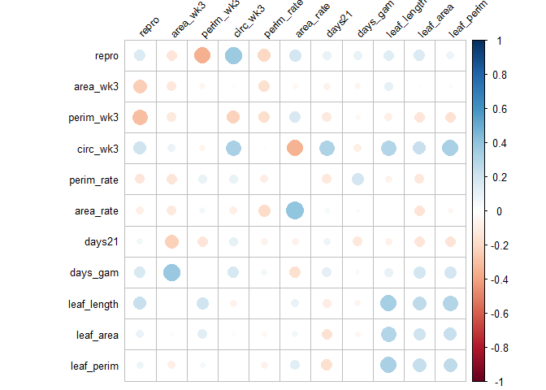
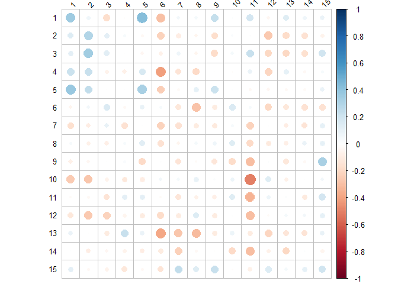

Traits and VOCs correlations
================
Javiera Rudolph
6/11/2019

``` r
library(tidyverse)
```

    ## Registered S3 methods overwritten by 'ggplot2':
    ##   method         from 
    ##   [.quosures     rlang
    ##   c.quosures     rlang
    ##   print.quosures rlang

    ## -- Attaching packages --------------------------------------- tidyverse 1.2.1 --

    ## v ggplot2 3.1.1     v purrr   0.3.2
    ## v tibble  2.1.1     v dplyr   0.8.1
    ## v tidyr   0.8.3     v stringr 1.4.0
    ## v readr   1.3.1     v forcats 0.4.0

    ## -- Conflicts ------------------------------------------ tidyverse_conflicts() --
    ## x dplyr::filter() masks stats::filter()
    ## x dplyr::lag()    masks stats::lag()

``` r
library(corrplot)
```

    ## corrplot 0.84 loaded

``` r
library(ggpubr)
```

    ## Loading required package: magrittr

    ## 
    ## Attaching package: 'magrittr'

    ## The following object is masked from 'package:purrr':
    ## 
    ##     set_names

    ## The following object is masked from 'package:tidyr':
    ## 
    ##     extract

# Traits

``` r
raw_traits <- readRDS("cleandata/traits_clean.RDS")

# Just scale the data
# Couldn't log transform: issues with zeroes, or negative numbers. It's a mess
raw_traits %>% 
  mutate_at(c(5:15), list(~ scale(.))) -> transformed_traits
```

``` r
# How does the transformed data for traits look like?

transformed_traits %>% 
  select(-c(famid, sampid, ssex, raw_repro)) %>% 
  gather(key = "trait", value = "raw_values") %>% 
  ggplot(aes(x = raw_values, y = ..density..)) +
  geom_histogram(na.rm = TRUE, fill = "#8e9998") +
  facet_wrap( ~ trait, scales = "free")
```

    ## Warning: attributes are not identical across measure variables;
    ## they will be dropped

    ## `stat_bin()` using `bins = 30`. Pick better value with `binwidth`.

<!-- -->

## MANOVA for traits

``` r
# Change the traits here to see transformed vs raw.
traits <- raw_traits

# This runs the manova
res.man <- manova(cbind(repro, area_wk3, perim_wk3, circ_wk3, perim_rate, area_rate, days21, days_gam, leaf_length, leaf_area, leaf_perim) ~ famid + ssex + famid:ssex, data = traits)
```

MANOVA results, shows sex and family to be signficant, and the
interaction is borderline significant.

``` r
summary(res.man)
```

    ##             Df   Pillai approx F num Df den Df    Pr(>F)    
    ## famid        1 0.066935   1.8782     11    288   0.04188 *  
    ## ssex         1 0.123717   3.6965     11    288 6.143e-05 ***
    ## famid:ssex   1 0.063638   1.7794     11    288   0.05708 .  
    ## Residuals  298                                              
    ## ---
    ## Signif. codes:  0 '***' 0.001 '**' 0.01 '*' 0.05 '.' 0.1 ' ' 1

Check with anova for each trait

``` r
summary.aov(res.man)
```

    ##  Response repro :
    ##              Df  Sum Sq Mean Sq F value Pr(>F)
    ## famid         1   0.130 0.12986  0.1283 0.7205
    ## ssex          1   0.046 0.04625  0.0457 0.8309
    ## famid:ssex    1   1.152 1.15179  1.1379 0.2870
    ## Residuals   298 301.626 1.01217               
    ## 
    ##  Response area_wk3 :
    ##              Df  Sum Sq Mean Sq F value    Pr(>F)    
    ## famid         1  0.1002 0.10021  1.7464 0.1873428    
    ## ssex          1  0.0021 0.00212  0.0369 0.8478503    
    ## famid:ssex    1  0.7322 0.73216 12.7592 0.0004129 ***
    ## Residuals   298 17.1001 0.05738                      
    ## ---
    ## Signif. codes:  0 '***' 0.001 '**' 0.01 '*' 0.05 '.' 0.1 ' ' 1
    ## 
    ##  Response perim_wk3 :
    ##              Df Sum Sq Mean Sq F value   Pr(>F)   
    ## famid         1   2.32  2.3219  0.9300 0.335655   
    ## ssex          1   5.51  5.5113  2.2074 0.138407   
    ## famid:ssex    1  17.56 17.5607  7.0335 0.008428 **
    ## Residuals   298 744.03  2.4967                    
    ## ---
    ## Signif. codes:  0 '***' 0.001 '**' 0.01 '*' 0.05 '.' 0.1 ' ' 1
    ## 
    ##  Response circ_wk3 :
    ##              Df Sum Sq  Mean Sq F value  Pr(>F)  
    ## famid         1 0.0035 0.003534  0.1812 0.67063  
    ## ssex          1 0.1219 0.121890  6.2504 0.01295 *
    ## famid:ssex    1 0.0042 0.004247  0.2178 0.64110  
    ## Residuals   298 5.8114 0.019501                  
    ## ---
    ## Signif. codes:  0 '***' 0.001 '**' 0.01 '*' 0.05 '.' 0.1 ' ' 1
    ## 
    ##  Response perim_rate :
    ##              Df Sum Sq Mean Sq F value Pr(>F)
    ## famid         1  0.463 0.46339  2.4265 0.1204
    ## ssex          1  0.001 0.00061  0.0032 0.9549
    ## famid:ssex    1  0.000 0.00008  0.0004 0.9840
    ## Residuals   298 56.910 0.19097               
    ## 
    ##  Response area_rate :
    ##              Df  Sum Sq Mean Sq F value  Pr(>F)  
    ## famid         1  0.6333 0.63332  6.1049 0.01404 *
    ## ssex          1  0.0001 0.00006  0.0005 0.98146  
    ## famid:ssex    1  0.0178 0.01776  0.1712 0.67935  
    ## Residuals   298 30.9147 0.10374                  
    ## ---
    ## Signif. codes:  0 '***' 0.001 '**' 0.01 '*' 0.05 '.' 0.1 ' ' 1
    ## 
    ##  Response days21 :
    ##              Df Sum Sq Mean Sq F value Pr(>F)  
    ## famid         1   54.9  54.888  3.6568 0.0568 .
    ## ssex          1    6.3   6.330  0.4218 0.5166  
    ## famid:ssex    1    4.5   4.507  0.3003 0.5841  
    ## Residuals   298 4473.0  15.010                 
    ## ---
    ## Signif. codes:  0 '***' 0.001 '**' 0.01 '*' 0.05 '.' 0.1 ' ' 1
    ## 
    ##  Response days_gam :
    ##              Df Sum Sq Mean Sq F value Pr(>F)
    ## famid         1   1883 1882.82  1.7410 0.1880
    ## ssex          1      4    3.86  0.0036 0.9524
    ## famid:ssex    1    194  194.16  0.1795 0.6721
    ## Residuals   298 322279 1081.47               
    ## 
    ##  Response leaf_length :
    ##              Df Sum Sq Mean Sq F value    Pr(>F)    
    ## famid         1  0.023  0.0234  0.1706    0.6799    
    ## ssex          1  3.699  3.6988 26.9744 3.827e-07 ***
    ## famid:ssex    1  0.235  0.2348  1.7125    0.1917    
    ## Residuals   298 40.862  0.1371                      
    ## ---
    ## Signif. codes:  0 '***' 0.001 '**' 0.01 '*' 0.05 '.' 0.1 ' ' 1
    ## 
    ##  Response leaf_area :
    ##              Df Sum Sq  Mean Sq F value    Pr(>F)    
    ## famid         1 0.0125 0.012475  0.9869    0.3213    
    ## ssex          1 0.2843 0.284259 22.4873 3.284e-06 ***
    ## famid:ssex    1 0.0095 0.009487  0.7505    0.3870    
    ## Residuals   298 3.7670 0.012641                      
    ## ---
    ## Signif. codes:  0 '***' 0.001 '**' 0.01 '*' 0.05 '.' 0.1 ' ' 1
    ## 
    ##  Response leaf_perim :
    ##              Df Sum Sq Mean Sq F value    Pr(>F)    
    ## famid         1   2.80   2.801  2.4890    0.1157    
    ## ssex          1  37.31  37.310 33.1533 2.118e-08 ***
    ## famid:ssex    1   1.78   1.783  1.5845    0.2091    
    ## Residuals   298 335.36   1.125                      
    ## ---
    ## Signif. codes:  0 '***' 0.001 '**' 0.01 '*' 0.05 '.' 0.1 ' ' 1
    ## 
    ## 44 observations deleted due to missingness

For each trait get the residuals and from here get family level means,
for all data or by sex.

``` r
res_dat <- cbind(res.man$model[,-1], res.man$residuals)

fam.means <- res_dat %>%
  group_by(famid) %>% 
  mutate_at(vars(3:13), mean) %>% 
  ungroup() %>% 
  select(-ssex) %>% 
  distinct()

fem.means <- res_dat %>% 
  filter(ssex == "f") %>% 
  group_by(famid) %>% 
  mutate_at(vars(3:13), mean) %>% 
  ungroup() %>% 
  select(-ssex) %>% 
  distinct()


male.means <- res_dat %>% 
  filter(ssex == "m") %>% 
  group_by(famid) %>% 
  mutate_at(vars(3:13), mean) %>% 
  ungroup() %>% 
  select(-ssex) %>% 
  distinct()
```

# Correlation plots

For all the data, just looking at family means

``` r
# Correlations for all 
all.corr <- fam.means %>% 
  select(-c(famid)) %>% 
  cor()
corrplot(all.corr, method = "circle", type = "upper", tl.col = "black", tl.cex = 0.8, tl.srt = 45)
```

<!-- -->

By sex, with females on the left, males on the right.

``` r
par(mfrow = c(1, 2))

# Correlations for females
fem.corr <- fem.means %>% 
  select(-c(famid)) %>% 
  cor()
corrplot(fem.corr, method = "circle", type = "upper", tl.col = "black", tl.cex = 0.8, tl.srt = 45)


# Correlations for males
male.corr <- male.means %>% 
  select(-c(famid)) %>% 
  cor()
corrplot(male.corr, method = "circle", type = "upper", tl.col = "black", tl.cex = 0.8, tl.srt = 45)
```

<!-- -->

If we compare males (x axis) and females (y axis)

``` r
# Correlations between males and females

# First make sure you are comparing the same families.
fem.means %>% 
  filter(famid %in% male.means$famid) -> new.fem.means

ssex.corr <- cor(x = male.means[,-1], y = new.fem.means[,-1])
corrplot(ssex.corr, method = "circle", tl.col = "black", tl.cex = 0.8, tl.srt = 45)
```

<!-- -->

# VOCs

``` r
voc_clust <- readRDS("cleandata/clustered_voc_data.RDS")

voc_clust %>% 
  mutate_at(c(4:18), list(~ log10(. + 1e-13))) %>% 
  mutate_at(c(4:18), list(~ scale(.))) -> transformed_vocs
```

``` r
# How does the transformed data for VOCs look like?
transformed_vocs %>% 
  select(-c(famid, sampid, ssex)) %>% 
  gather(key = "trait", value = "values") %>% 
  ggplot(aes(x = values, y = ..density..)) +
  geom_histogram(na.rm = TRUE, fill = "#8e9998") +
  facet_wrap( ~ trait, scales = "free")
```

    ## Warning: attributes are not identical across measure variables;
    ## they will be dropped

    ## `stat_bin()` using `bins = 30`. Pick better value with `binwidth`.

<!-- -->

## MANOVA for VOCs clusters

``` r
vocs <- transformed_vocs

# Run the manova
res.man.vocs <- manova(cbind(clust_01, clust_02, clust_03, clust_04, clust_05,
                        clust_06, clust_07, clust_08, clust_09, clust_10, 
                        clust_11, clust_12, clust_13, clust_14, clust_15) ~ famid + ssex + famid:ssex, data = vocs)
```

Overall results from the MANOVA, sex and family significant

``` r
summary(res.man.vocs)
```

    ##             Df  Pillai approx F num Df den Df    Pr(>F)    
    ## famid        1 0.10110   2.3768     15    317  0.002925 ** 
    ## ssex         1 0.33762  10.7716     15    317 < 2.2e-16 ***
    ## famid:ssex   1 0.04502   0.9963     15    317  0.458647    
    ## Residuals  331                                             
    ## ---
    ## Signif. codes:  0 '***' 0.001 '**' 0.01 '*' 0.05 '.' 0.1 ' ' 1

by cluster

``` r
summary.aov(res.man.vocs)
```

    ##  Response 1 :
    ##              Df  Sum Sq Mean Sq F value    Pr(>F)    
    ## famid         1   0.368   0.368  0.4197    0.5176    
    ## ssex          1  42.952  42.952 48.9462 1.465e-11 ***
    ## famid:ssex    1   0.213   0.213  0.2423    0.6229    
    ## Residuals   331 290.467   0.878                      
    ## ---
    ## Signif. codes:  0 '***' 0.001 '**' 0.01 '*' 0.05 '.' 0.1 ' ' 1
    ## 
    ##  Response 2 :
    ##              Df  Sum Sq Mean Sq F value   Pr(>F)    
    ## famid         1   0.131   0.131  0.1467   0.7020    
    ## ssex          1  37.207  37.207 41.5343 4.09e-10 ***
    ## famid:ssex    1   0.145   0.145  0.1623   0.6873    
    ## Residuals   331 296.516   0.896                     
    ## ---
    ## Signif. codes:  0 '***' 0.001 '**' 0.01 '*' 0.05 '.' 0.1 ' ' 1
    ## 
    ##  Response 3 :
    ##              Df Sum Sq Mean Sq F value Pr(>F)
    ## famid         1   0.13 0.12584  0.1252 0.7237
    ## ssex          1   0.42 0.41816  0.4161 0.5193
    ## famid:ssex    1   0.83 0.83096  0.8269 0.3638
    ## Residuals   331 332.63 1.00491               
    ## 
    ##  Response 4 :
    ##              Df  Sum Sq Mean Sq F value    Pr(>F)    
    ## famid         1   0.575  0.5754  0.6071    0.4364    
    ## ssex          1  19.715 19.7147 20.8013 7.184e-06 ***
    ## famid:ssex    1   0.001  0.0007  0.0007    0.9785    
    ## Residuals   331 313.709  0.9478                      
    ## ---
    ## Signif. codes:  0 '***' 0.001 '**' 0.01 '*' 0.05 '.' 0.1 ' ' 1
    ## 
    ##  Response 5 :
    ##              Df  Sum Sq Mean Sq F value    Pr(>F)    
    ## famid         1   5.694   5.694  6.6621   0.01028 *  
    ## ssex          1  45.376  45.376 53.0868 2.356e-12 ***
    ## famid:ssex    1   0.008   0.008  0.0093   0.92304    
    ## Residuals   331 282.922   0.855                      
    ## ---
    ## Signif. codes:  0 '***' 0.001 '**' 0.01 '*' 0.05 '.' 0.1 ' ' 1
    ## 
    ##  Response 6 :
    ##              Df  Sum Sq Mean Sq F value    Pr(>F)    
    ## famid         1  10.484 10.4843 11.0696 0.0009762 ***
    ## ssex          1   9.835  9.8347 10.3837 0.0013978 ** 
    ## famid:ssex    1   0.183  0.1825  0.1927 0.6609469    
    ## Residuals   331 313.499  0.9471                      
    ## ---
    ## Signif. codes:  0 '***' 0.001 '**' 0.01 '*' 0.05 '.' 0.1 ' ' 1
    ## 
    ##  Response 7 :
    ##              Df Sum Sq Mean Sq F value   Pr(>F)   
    ## famid         1  10.06 10.0617 10.4062 0.001381 **
    ## ssex          1   3.17  3.1724  3.2810 0.070994 . 
    ## famid:ssex    1   0.72  0.7215  0.7462 0.388307   
    ## Residuals   331 320.04  0.9669                    
    ## ---
    ## Signif. codes:  0 '***' 0.001 '**' 0.01 '*' 0.05 '.' 0.1 ' ' 1
    ## 
    ##  Response 8 :
    ##              Df  Sum Sq Mean Sq F value    Pr(>F)    
    ## famid         1   0.871  0.8711  0.9292    0.3358    
    ## ssex          1  22.762 22.7622 24.2803 1.319e-06 ***
    ## famid:ssex    1   0.062  0.0618  0.0659    0.7975    
    ## Residuals   331 310.305  0.9375                      
    ## ---
    ## Signif. codes:  0 '***' 0.001 '**' 0.01 '*' 0.05 '.' 0.1 ' ' 1
    ## 
    ##  Response 9 :
    ##              Df Sum Sq Mean Sq F value  Pr(>F)   
    ## famid         1   4.86  4.8641  5.0036 0.02596 * 
    ## ssex          1   7.36  7.3650  7.5762 0.00624 **
    ## famid:ssex    1   0.00  0.0001  0.0001 0.99428   
    ## Residuals   331 321.77  0.9721                   
    ## ---
    ## Signif. codes:  0 '***' 0.001 '**' 0.01 '*' 0.05 '.' 0.1 ' ' 1
    ## 
    ##  Response 10 :
    ##              Df  Sum Sq Mean Sq F value    Pr(>F)    
    ## famid         1  21.749 21.7488 23.1469 2.284e-06 ***
    ## ssex          1   1.074  1.0744  1.1435    0.2857    
    ## famid:ssex    1   0.170  0.1703  0.1813    0.6706    
    ## Residuals   331 311.006  0.9396                      
    ## ---
    ## Signif. codes:  0 '***' 0.001 '**' 0.01 '*' 0.05 '.' 0.1 ' ' 1
    ## 
    ##  Response 11 :
    ##              Df  Sum Sq Mean Sq F value    Pr(>F)    
    ## famid         1  10.205 10.2049 11.0843 0.0009688 ***
    ## ssex          1  15.108 15.1078 16.4096 6.362e-05 ***
    ## famid:ssex    1   3.947  3.9467  4.2868 0.0391836 *  
    ## Residuals   331 304.741  0.9207                      
    ## ---
    ## Signif. codes:  0 '***' 0.001 '**' 0.01 '*' 0.05 '.' 0.1 ' ' 1
    ## 
    ##  Response 12 :
    ##              Df  Sum Sq Mean Sq F value    Pr(>F)    
    ## famid         1   2.259  2.2588  2.4536    0.1182    
    ## ssex          1  26.932 26.9321 29.2547 1.219e-07 ***
    ## famid:ssex    1   0.088  0.0878  0.0954    0.7576    
    ## Residuals   331 304.721  0.9206                      
    ## ---
    ## Signif. codes:  0 '***' 0.001 '**' 0.01 '*' 0.05 '.' 0.1 ' ' 1
    ## 
    ##  Response 13 :
    ##              Df  Sum Sq Mean Sq F value    Pr(>F)    
    ## famid         1   4.273   4.273  4.9175   0.02726 *  
    ## ssex          1  38.334  38.334 44.1152 1.272e-10 ***
    ## famid:ssex    1   3.772   3.772  4.3405   0.03798 *  
    ## Residuals   331 287.622   0.869                      
    ## ---
    ## Signif. codes:  0 '***' 0.001 '**' 0.01 '*' 0.05 '.' 0.1 ' ' 1
    ## 
    ##  Response 14 :
    ##              Df Sum Sq Mean Sq F value  Pr(>F)   
    ## famid         1   0.33  0.3250  0.3345 0.56339   
    ## ssex          1   9.45  9.4460  9.7229 0.00198 **
    ## famid:ssex    1   2.66  2.6564  2.7342 0.09917 . 
    ## Residuals   331 321.57  0.9715                   
    ## ---
    ## Signif. codes:  0 '***' 0.001 '**' 0.01 '*' 0.05 '.' 0.1 ' ' 1
    ## 
    ##  Response 15 :
    ##              Df Sum Sq Mean Sq F value    Pr(>F)    
    ## famid         1   0.84  0.8377  0.8648 0.3530834    
    ## ssex          1  12.49 12.4869 12.8904 0.0003803 ***
    ## famid:ssex    1   0.04  0.0360  0.0372 0.8472225    
    ## Residuals   331 320.64  0.9687                      
    ## ---
    ## Signif. codes:  0 '***' 0.001 '**' 0.01 '*' 0.05 '.' 0.1 ' ' 1

``` r
res_dat.vocs <- cbind(res.man.vocs$model[,-1], res.man.vocs$residuals)

fam.means.vocs <- res_dat.vocs %>%
  group_by(famid) %>% 
  mutate_at(vars(3:17), mean) %>% 
  ungroup() %>% 
  select(-ssex) %>% 
  distinct()

fem.means.vocs <- res_dat.vocs %>% 
  filter(ssex == "f") %>% 
  group_by(famid) %>% 
  mutate_at(vars(3:17), mean) %>% 
  ungroup() %>% 
  select(-ssex) %>% 
  distinct()


male.means.vocs <- res_dat.vocs %>% 
  filter(ssex == "m") %>% 
  group_by(famid) %>% 
  mutate_at(vars(3:17), mean) %>% 
  ungroup() %>% 
  select(-ssex) %>% 
  distinct()
```

### Correlations

For all

``` r
# Correlations for all 
all.corr.vocs <- fam.means.vocs %>% 
  select(-c(famid)) %>% 
  cor()
corrplot(all.corr.vocs, method = "circle", type = "upper", tl.col = "black", tl.cex = 0.8, tl.srt = 45)
```

<!-- -->

Females on the left, males on the right

``` r
par(mfrow = c(1, 2))

# Correlations for females
fem.corr.vocs <- fem.means.vocs %>% 
  select(-c(famid)) %>% 
  cor()
corrplot(fem.corr.vocs, method = "circle", type = "upper", tl.col = "black", tl.cex = 0.8, tl.srt = 45)


# Correlations for males
male.corr.vocs <- male.means.vocs %>% 
  select(-c(famid)) %>% 
  cor()
corrplot(male.corr.vocs, method = "circle", type = "upper", tl.col = "black", tl.cex = 0.8, tl.srt = 45)
```

<!-- -->

Males on the x axis, females on the y

``` r
# Correlations between males and females

fem.means.vocs %>% 
  filter(famid %in% male.means.vocs$famid) -> new.fem.means.vocs

ssex.corr.vocs <- cor(x = male.means.vocs[,-1], y = new.fem.means.vocs[,-1])
corrplot(ssex.corr.vocs, method = "circle", tl.col = "black", tl.cex = 0.8, tl.srt = 45)
```

<!-- -->
