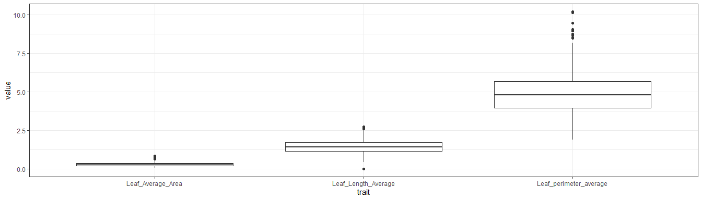
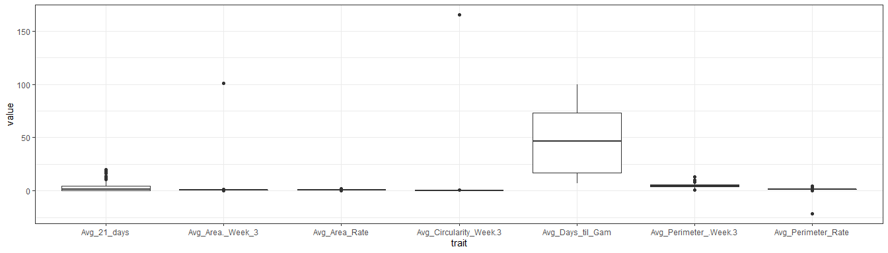
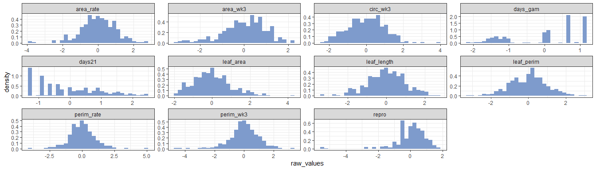
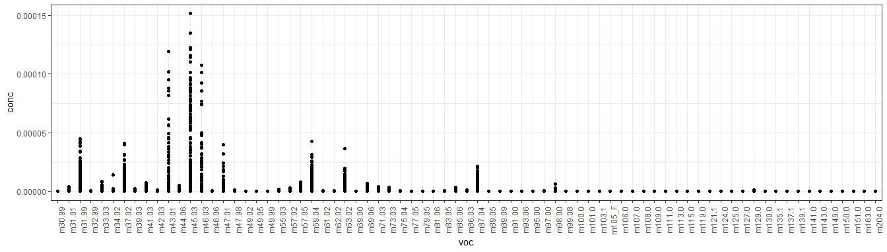
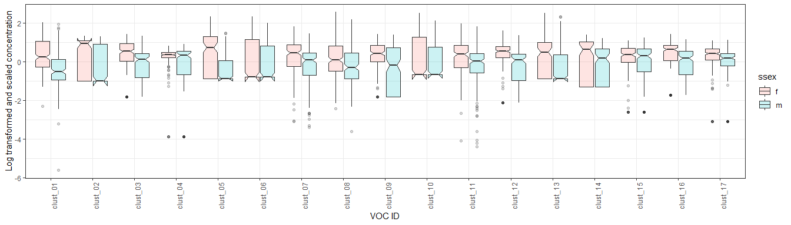

EDA and creating a clean master data file
================

  - [Introduction](#introduction)
  - [Data cleaning](#data-cleaning)
      - [Trait data](#trait-data)
          - [Leaf traits](#leaf-traits)
          - [Growth and development
            traits](#growth-and-development-traits)
          - [Reproduction variable](#reproduction-variable)
          - [Clean trait data](#clean-trait-data)
              - [Histograms raw trait data](#histograms-raw-trait-data)
              - [Histograms transformed trait
                data](#histograms-transformed-trait-data)
      - [Volatile Organic Compounds](#volatile-organic-compounds)
          - [May 30 samples](#may-30-samples)
          - [Using a 10% threshold](#using-a-10-threshold)
          - [VOC Clustering](#voc-clustering)
              - [VOC data exploration](#voc-data-exploration)
              - [Transformation and
                scaling](#transformation-and-scaling)
              - [Correlations](#correlations)
              - [Clustering](#clustering)
          - [Master dataframe](#master-dataframe)

``` r
library(tidyverse)
library(vegan)
library(plotly)
library(corrplot)
library(ggpubr)
library(Hmisc)

theme_set(theme_bw())
```

# Introduction

This document will contain pretty much everything we have done so far.
This works as a draft reference of where we are and what we have done.

# Data cleaning

Data cleaning is a really important section since lots of our functions
will throw errors with NAs, zeroes or any typos.

``` r
# Read in the raw data
rawdata <- read.csv("rawdata/LK_master.csv", stringsAsFactors = FALSE)
head(rawdata)
```

    ##   Fam.. Sample.Name Cholor. Date.PTR Sample_Sex X._Exp Avg_Male_Buds.Stem
    ## 1    28    P_22_1_3   0.698   30-May          m    100                1.8
    ## 2    45    P_9_3_10   0.695   30-May          m    100                1.0
    ## 3    33    P_24_5_6   0.679   30-May          m    100                2.2
    ## 4    32    P_22_6_2   0.687   30-May          m    100                1.6
    ## 5    23     P_2_6_2   0.704   30-May          m    100                2.3
    ## 6    26  P_21_15_22   0.715   30-May          m    100                0.6
    ##   Total._Buds Avg_Arch Avg_Area._Week_3 Avg_Perimeter_.Week.3
    ## 1          18       NA       0.85544787              4.169839
    ## 2          10       NA       0.03265805              1.304836
    ## 3          22       NA       0.36130918              2.789758
    ## 4          16       NA       0.97506034              5.156925
    ## 5          23       NA       0.73159310              4.270689
    ## 6           6       NA       0.47117626              3.516087
    ##   Avg_Circularity_Week.3 Avg_Perimeter_Rate Avg_Area_Rate Avg_21_days
    ## 1              0.6223801          1.5392009     0.9144844        5.33
    ## 2              0.2536963          1.0885653     0.2699298        0.00
    ## 3              0.4953929          0.9227125     1.3673960        4.00
    ## 4              0.4650873          1.7398040     0.9208233        3.67
    ## 5              0.5169510          1.1744625     1.0836222        2.33
    ## 6              0.4785288          1.8243515     0.7436355        4.00
    ##   Avg_Days_til_Gam Leaf_Length_Average Leaf_Average_Area
    ## 1            46.00         1.801372581       0.329442148
    ## 2           100.00          1.04538206       0.197453469
    ## 3            13.00         0.749459616       0.136656122
    ## 4            42.33         0.881005915       0.189477093
    ## 5            14.67             #DIV/0!       0.170817678
    ## 6            43.33         1.370408735       0.274641985
    ##   Leaf_perimeter_average m29.9975_FLUX m30.99783_FLUX m31.01783_FLUX
    ## 1            5.255697689  -0.000890700    1.31341e-05    1.26812e-05
    ## 2             3.58443349  -0.000708223    3.00375e-06    7.16490e-07
    ## 3            3.569276968  -0.000702247    2.62692e-06    9.46733e-06
    ## 4            3.588064101  -0.000684002    1.58991e-05    2.90570e-05
    ## 5            3.969429299  -0.000655576   -7.51451e-07   -1.32152e-06
    ## 6            4.583958911  -0.000610192    3.40584e-05    3.97774e-05
    ##   m31.9908_FLUX2 m32.99853_FLUX m33.03230_FLUX m33.98721_FLUX
    ## 1   -0.002000302    8.68056e-06    1.55873e-05   -3.77415e-06
    ## 2   -0.001791226   -1.26764e-05    7.82628e-06   -5.26345e-05
    ## 3   -0.001794632    1.84665e-05   -1.05597e-05   -2.57491e-05
    ## 4   -0.001775272   -3.44612e-05    4.60787e-05   -6.13513e-05
    ## 5   -0.001710199    6.73715e-06   -1.71797e-05   -6.73715e-06
    ## 6   -0.001506332   -3.57435e-05    4.58793e-05   -5.94873e-05
    ##   m34.02317_FLUX m37.0289_FLUX m39.0326..cluster..H2O.H3O._.18O....Conc.
    ## 1   -8.30314e-07  -0.007974789                               1.41153e-04
    ## 2   -4.05919e-06  -0.001270392                               1.28693e-04
    ## 3    5.12380e-06  -0.005061382                               5.64399e-05
    ## 4    2.34962e-06  -0.001224415                               1.84054e-04
    ## 5   -3.96455e-06  -0.004669362                               2.28545e-05
    ## 6   -2.68076e-06   0.001327614                               1.22038e-04
    ##   m41.0375_FLUX m42.0343..acetonitrile.H....Conc. m42.95810..m43_1...Conc.
    ## 1   0.000456559                       1.33605e-05                        0
    ## 2   0.000328125                       9.61750e-06                        0
    ## 3   0.000232834                       5.53995e-06                        0
    ## 4   0.000481151                       2.46972e-05                        0
    ## 5   0.000128654                      -2.07297e-06                        0
    ## 6   0.000302109                       9.34436e-06                        0
    ##   m43.01734_FLUX m44.0626_FLUX m45.0335_FLUX m45.99328_FLUX m46.03111_FLUX
    ## 1    0.000589523   1.98143e-05   0.001300951   -2.16259e-05  -1.339820e-05
    ## 2    0.000340608   7.71605e-06   0.000925650   -1.11607e-05  -4.133600e-06
    ## 3    0.000451259   1.25364e-05   0.001538702   -1.35768e-05   1.300460e-07
    ## 4    0.002377297   7.52924e-05   0.029696637   -1.81443e-04   1.474259e-03
    ## 5    0.000200301  -1.78794e-06   0.000409411   -5.36381e-06  -1.705020e-05
    ## 6    0.000862949   3.36244e-05   0.002013889   -1.26123e-05   3.865400e-05
    ##   m46.06609_FLUX m47.0128_FLUX m47.9847_FLUX m49.0239_FLUX m49.05240_FLUX
    ## 1    0.00000e+00  -8.68056e-05             0             0              0
    ## 2    0.00000e+00  -4.98787e-05             0             0              0
    ## 3    0.00000e+00  -5.04578e-05             0             0              0
    ## 4    1.03778e-05   1.04950e-04             0             0              0
    ## 5    0.00000e+00  -6.08934e-05             0             0              0
    ## 6    0.00000e+00  -2.45098e-05             0             0              0
    ##   m49.9923..chloromethane...Conc. m55.0390..cluster..H2O.2.H3O....Conc.
    ## 1                    -7.88798e-06                           7.75966e-05
    ## 2                    -2.31481e-06                           1.09237e-04
    ## 3                    -4.81169e-06                           3.45141e-05
    ## 4                    -2.01023e-06                           8.57352e-05
    ## 5                    -2.64303e-06                           7.20616e-05
    ## 6                    -1.76164e-06                           1.24974e-04
    ##   m57.02382_FLUX m57.05991..cluster..H2O.2.H3O._.18O....Conc.
    ## 1   -5.86504e-06                                  8.48053e-05
    ## 2   -2.51323e-06                                  6.47321e-05
    ## 3   -4.33573e-06                                  4.70246e-05
    ## 4    1.41421e-05                                  1.10485e-04
    ## 5   -7.35904e-06                                  3.14573e-05
    ## 6    1.25357e-06                                  6.08405e-05
    ##   m59.0439_FLUX m61.0290_FLUX m62.0294_FLUX m63.023_FLUX m69.00377_FLUX
    ## 1   0.005434028   1.22283e-04   5.61972e-06 0.0000882775   -5.81522e-06
    ## 2   0.003041226   4.73986e-05   7.86761e-06 0.0003253420    4.91071e-07
    ## 3   0.002890918   1.25624e-04   6.87682e-06 0.0002344730    9.51415e-07
    ## 4   0.006014515   1.29751e-04   3.05712e-05 0.0017532370   -9.65957e-08
    ## 5   0.001260106   6.47803e-05   2.93584e-06 0.0000378576   -2.32095e-06
    ## 6   0.008741319   1.35570e-04   9.56648e-06 0.0001397570   -2.25694e-06
    ##   m69.06994_FLUX m71.0354_FLUX m73.0376..butyraldehyde.H....Conc.
    ## 1    1.88217e-04   4.23838e-05                        0.000285326
    ## 2    1.95492e-04   2.95139e-05                        0.000269511
    ## 3    1.26743e-04   3.44361e-05                        0.000239024
    ## 4    2.79135e-04   5.32320e-05                        0.000293703
    ## 5    6.31478e-05   1.81903e-05                        0.000156250
    ## 6    1.80556e-04   3.82966e-05                        0.000496579
    ##   m75.0446_FLUX m77.0597_FLUX m79.05478_FLUX m81.0699_FLUX m83.0585_FLUX
    ## 1   8.29559e-05   2.57775e-06    2.00068e-05   3.02687e-06   6.58213e-05
    ## 2   1.10064e-04   4.18320e-06    5.90278e-06   4.23005e-06   4.78395e-05
    ## 3   1.07522e-04   7.24095e-06    1.19642e-05   1.55015e-06   3.57808e-05
    ## 4   9.90497e-05   3.83250e-06    1.04114e-05   7.50313e-06   8.04877e-05
    ## 5   1.00565e-04   5.31198e-06    8.65983e-06   2.92807e-07   3.59816e-05
    ## 6   1.58880e-04   9.03544e-06    9.03799e-06   2.99479e-06   6.48999e-05
    ##   m85.0648_FLUX m86.0362_FLUX m87.0441_FLUX
    ## 1   1.22018e-05             0   3.61262e-04
    ## 2   7.62787e-06             0   4.93441e-04
    ## 3   8.27871e-06             0   2.06981e-04
    ## 4   2.47233e-05             0   2.94382e-04
    ## 5   4.34028e-06             0   9.48124e-05
    ## 6   1.26098e-05             0   4.44904e-04
    ##   m89.05810..butyric.acid.H....Conc. m89.09610_FLUX m90.00000_FLUX
    ## 1                        9.58635e-06    9.71090e-06              0
    ## 2                        9.08840e-06    9.17383e-06              0
    ## 3                        1.28485e-05    1.28251e-05              0
    ## 4                        1.33981e-05    1.33276e-05              0
    ## 5                        7.75549e-06    7.85914e-06              0
    ## 6                        1.45987e-05    1.46063e-05              0
    ##   m91.00000_FLUX m92.00000..nominal.92...Conc. m93.0699_FLUX M94_FLUX
    ## 1    1.80556e-05                             0   1.00015e-05        0
    ## 2    2.32308e-05                             0   2.48567e-05        0
    ## 3    1.52154e-05                             0   1.42010e-05        0
    ## 4    2.61069e-05                             0   2.09900e-05        0
    ## 5    1.64283e-05                             0   1.52104e-05        0
    ## 6    3.56158e-05                             0   4.31730e-05        0
    ##   m95.00000.FLUX m97.00000_FLUX m98.00000..nominal.98...Conc.
    ## 1    2.43810e-05    5.31024e-06                             0
    ## 2    5.75948e-06    1.59088e-05                             0
    ## 3    1.67239e-05    9.01217e-06                             0
    ## 4    1.38889e-05    1.28394e-05                             0
    ## 5    1.05981e-05    4.95439e-06                             0
    ## 6    1.73100e-05    8.78013e-06                             0
    ##   m99.080..cyclohexanone.H....Conc. m100.00000_FLUX m101.00000_flux
    ## 1                      -1.65723e-05     1.04167e-06     1.73611e-06
    ## 2                      -7.93100e-06     5.45635e-07     5.64925e-06
    ## 3                      -9.99012e-06     6.24220e-07     4.62963e-06
    ## 4                      -5.68609e-06     7.75376e-07     8.51086e-06
    ## 5                      -1.16397e-05     1.42517e-07    -2.92807e-07
    ## 6                      -5.41513e-06     1.17698e-06     1.62122e-05
    ##   m103.1117_FLUX m104_FLUX m105_FLUK m106.00000_FLUX m107.0855_FLUX
    ## 1              0         0         0     4.15157e-08    2.04559e-06
    ## 2              0         0         0     6.50353e-07    6.95822e-06
    ## 3              0         0         0     3.35518e-07   -4.52559e-07
    ## 4              0         0         0     4.82978e-07    5.22400e-06
    ## 5              0         0         0    -3.31675e-07   -3.86090e-07
    ## 6              0         0         0     1.06975e-06    2.40758e-06
    ##   m108.0000_FLUX m109.00000..nominal.109...Conc. m110.00000_FLUX
    ## 1              0                     2.18825e-05     1.01110e-05
    ## 2              0                     1.41314e-05     6.39605e-06
    ## 3              0                     1.67239e-05     6.87422e-06
    ## 4              0                     5.01514e-05     1.63429e-05
    ## 5              0                     7.64925e-06     4.03451e-06
    ## 6              0                     1.43050e-05     6.11979e-06
    ##   m111.00000_FLUX m113.00000_FLUX m114.00000_FLUX m115.00000_FLUX
    ## 1               0     7.13315e-07               0     7.05389e-06
    ## 2               0     7.08223e-07               0     5.54453e-06
    ## 3               0     1.23804e-06               0     4.51519e-06
    ## 4               0     2.61853e-06               0     4.71752e-06
    ## 5               0     2.28027e-07               0     2.73632e-06
    ## 6               0     6.35723e-07               0     3.92923e-06
    ##   m119.00000_FLUX m121.1012_FLUX m124.00000_FLUX m125.00000_FLUX M126_FLUX
    ## 1               0   -3.17029e-07               0     3.88361e-06         0
    ## 2               0    2.89352e-07               0     3.68717e-06         0
    ## 3               0   -1.45651e-07               0     4.04702e-06         0
    ## 4               0    3.68108e-07               0     6.30221e-06         0
    ## 5               0    3.65361e-07               0     2.11702e-06         0
    ## 6               0    6.61254e-07               0     3.74796e-06         0
    ##   m127.00000_FLUX m128.00000_FLUX m129.00000_FLUX m130.00000_FLUX
    ## 1               0     4.75204e-07     0.000197652     1.86405e-05
    ## 2               0     2.76124e-07     0.000119406     1.06950e-05
    ## 3               0     6.16417e-07     0.000176446     1.57199e-05
    ## 4               0     7.41959e-07     0.000276968     2.51619e-05
    ## 5               0     3.04726e-07     0.000113495     1.05825e-05
    ## 6               0     2.46375e-07     0.000158420     1.47595e-05
    ##   m135.1168_FLUX m137.1325..terpenes.H....Conc.
    ## 1    1.58137e-06                    7.82382e-07
    ## 2    9.64506e-07                    7.74912e-07
    ## 3    6.08614e-07                    1.60476e-07
    ## 4    6.78780e-07                    1.00512e-06
    ## 5    6.97036e-07                    3.62251e-07
    ## 6    1.13103e-06                    7.67463e-07
    ##   m138.00000..nominal.138...Conc. m139.1481..menthol.dehydrated...Conc.
    ## 1                               0                           2.99743e-06
    ## 2                               0                           3.45569e-06
    ## 3                               0                           2.71275e-06
    ## 4                               0                           3.97348e-06
    ## 5                               0                           2.17662e-06
    ## 6                               0                           3.39052e-06
    ##   m141.00000_FLUX m143.00000_FLUX m148.00000_FLUX m149.00000_FLUX
    ## 1               0     2.86081e-06               0     3.84586e-05
    ## 2               0     2.18254e-06               0     2.86872e-05
    ## 3               0     3.15491e-06               0     2.98585e-05
    ## 4               0     4.23977e-06               0     1.80007e-05
    ## 5               0     2.40464e-06               0     2.12479e-05
    ## 6               0     3.50797e-06               0     3.19649e-05
    ##   m150.00000_FLUX m151.00000_FLUX m153 m163.00000_FLUX m204.00000_FLUX  X
    ## 1     7.34450e-06     9.51087e-06    0     3.14387e-06     1.56627e-06 NA
    ## 2     5.77326e-06     7.02987e-06    0     3.12224e-06     4.13360e-07 NA
    ## 3     5.46452e-06     7.65449e-06    0     2.27580e-06     6.21619e-07 NA
    ## 4     3.15633e-06     4.96815e-06    0     3.14850e-06     1.04428e-06 NA
    ## 5     4.09930e-06     6.50135e-06    0     2.82183e-06     7.30203e-07 NA
    ## 6     6.30106e-06     8.21334e-06    0     2.41268e-06     4.28922e-07 NA
    ##   X.1 X.2 X.3 X.4 X.5 X.6 X.7 X.8 X.9 X.10 X.11 X.12 X.13 X.14 X.15 X.16
    ## 1  NA  NA  NA  NA  NA  NA  NA  NA  NA   NA   NA   NA   NA   NA   NA   NA
    ## 2  NA  NA  NA  NA  NA  NA  NA  NA  NA   NA   NA   NA   NA   NA   NA   NA
    ## 3  NA  NA  NA  NA  NA  NA  NA  NA  NA   NA   NA   NA   NA   NA   NA   NA
    ## 4  NA  NA  NA  NA  NA  NA  NA  NA  NA   NA   NA   NA   NA   NA   NA   NA
    ## 5  NA  NA  NA  NA  NA  NA  NA  NA  NA   NA   NA   NA   NA   NA   NA   NA
    ## 6  NA  NA  NA  NA  NA  NA  NA  NA  NA   NA   NA   NA   NA   NA   NA   NA
    ##   X.17 X.18 X.19 X.20 X.21
    ## 1   NA   NA   NA   NA   NA
    ## 2   NA   NA   NA   NA   NA
    ## 3   NA   NA   NA   NA   NA
    ## 4   NA   NA   NA   NA   NA
    ## 5   NA   NA   NA   NA   NA
    ## 6   NA   NA   NA   NA   NA

## Trait data

To make things a little easier we are going to tackle the trait data
first and then we will go on to clean VOCs. Some changes that we wish to
accomplish here include changing the variable names to simpler/shorter
ones without special characters. We would also like to remove empty rows
at the end, manage the zeroes and NAs. There are some errors in
measurements and typos that we need to
address.

``` r
# Change variable names and fix sample ID names with spaces, or parentheses
trait_raw <- rawdata[,1:19] %>% 
  rename(famid = `Fam..`,
         sampid = Sample.Name,
         ssex = Sample_Sex) %>% 
  drop_na(famid) %>% 
  mutate(sampid = str_replace_all(sampid, "\\(.*\\)", ""),
         sampid = str_trim(sampid, side = "both"),
         ssex = str_to_lower(as.character(ssex))) %>% # Sex on lower case only
  mutate_at(vars(starts_with("Leaf")), as.numeric) %>% # Make them all numeric 
  group_by(famid) %>% 
  arrange(sampid, .by_group = TRUE) %>% # Order by family number
  ungroup
```

    ## Warning: NAs introduced by coercion
    
    ## Warning: NAs introduced by coercion
    
    ## Warning: NAs introduced by coercion

``` r
# Fix a data entry error:
# Check Github issue #5
trait_raw$Avg_21_days[which(trait_raw$Avg_21_days == 33)] <- 0.33

# Fix sex data entry error
# Check Github issue #5
trait_raw[which(trait_raw$sampid == "P_18_1_6_B"),]$ssex <- "m"
trait_raw <- trait_raw[-which(trait_raw$sampid == "P_6_6_20"),]

head(trait_raw)
```

    ## # A tibble: 6 x 19
    ##   famid sampid Cholor. Date.PTR ssex  X._Exp Avg_Male_Buds.S~ Total._Buds
    ##   <int> <chr>  <chr>   <chr>    <chr>  <int>            <dbl>       <int>
    ## 1     1 P_1_2~ 0.669   27-May   m        100              1.2          12
    ## 2     1 P_1_2~ 0.674   25-May   m         10              1.4          14
    ## 3     1 P_1_2~ 0.72    29-May   f         20             NA            NA
    ## 4     1 P_1_2~ 0.735   25-May   f        100             NA            NA
    ## 5     1 P_1_2~ 0.684   29-May   f        100             NA            NA
    ## 6     2 P_1_5~ 0.766   22-May   f         90             NA            NA
    ## # ... with 11 more variables: Avg_Arch <dbl>, Avg_Area._Week_3 <dbl>,
    ## #   Avg_Perimeter_.Week.3 <dbl>, Avg_Circularity_Week.3 <dbl>,
    ## #   Avg_Perimeter_Rate <dbl>, Avg_Area_Rate <dbl>, Avg_21_days <dbl>,
    ## #   Avg_Days_til_Gam <dbl>, Leaf_Length_Average <dbl>,
    ## #   Leaf_Average_Area <dbl>, Leaf_perimeter_average <dbl>

#### Leaf traits

First, we visually check for outliers or values that may not make
sense.

``` r
# Leaf data averaging -----------------------------------------------------

trait_raw[,17:19] %>% 
  gather(key = "trait", value = "value") %>% 
  ggplot(aes(x = trait, y = value)) + 
  geom_boxplot()
```

    ## Warning: Removed 56 rows containing non-finite values (stat_boxplot).

<!-- -->

There are no clear outliers or errors, so these look ok to average and
we create a new data frame with the leaf data. In cases where data for
only one of the clones was available, we kept that value. For cases
where data was available for both clones we averaged it.

``` r
trait_raw[,c(2, 17:19),] %>% 
  group_by(sampid) %>% # sampid is the unique identifier for the clones
  summarise_at(vars(starts_with("Leaf")), mean, na.rm = TRUE) %>% 
  mutate_at(vars(starts_with("Leaf")), list(~ as.numeric(ifelse(. == "NaN", "NA", .)))) %>% 
  drop_na(sampid)-> leaf_data
```

    ## Warning in ~as.numeric(ifelse(. == "NaN", "NA", .)): NAs introduced by
    ## coercion

    ## Warning in ~as.numeric(ifelse(. == "NaN", "NA", .)): NAs introduced by
    ## coercion

    ## Warning in ~as.numeric(ifelse(. == "NaN", "NA", .)): NAs introduced by
    ## coercion

``` r
# Some NAs
leaf_data[!complete.cases(leaf_data), ]
```

    ## # A tibble: 11 x 4
    ##    sampid     Leaf_Length_Average Leaf_Average_Area Leaf_perimeter_average
    ##    <chr>                    <dbl>             <dbl>                  <dbl>
    ##  1 P_1_5_12                NA                 0.289                  NA   
    ##  2 P_1_6_13                 0.622            NA                      NA   
    ##  3 p_14_7_15               NA                 0.176                   4.47
    ##  4 P_15_6_11               NA                 0.301                   6.00
    ##  5 P_2_13_7                NA                NA                      NA   
    ##  6 P_2_2_9                  1.29             NA                      NA   
    ##  7 P_20_16_1               NA                 0.128                   3.48
    ##  8 p_21_15_20              NA                 0.338                   9.19
    ##  9 P_22_10_12              NA                NA                      NA   
    ## 10 P_6_18_5                NA                NA                      NA   
    ## 11 p_6_5_20                NA                 0.106                   2.71

#### Growth and development traits

We do the same thing with these other traits and it is easy to identify
three values that seem incorrect. These are in the area, circularity and
perimeter
rate.

``` r
# Growth and Development traits -------------------------------------------

trait_raw[,10:16] %>% 
  gather(key = "trait", value = "value") %>% 
  drop_na() %>% 
  ggplot(aes(x = trait, y = value)) + 
  geom_boxplot()
```

<!-- -->

``` r
outliers <- which(trait_raw$Avg_Area._Week_3>50)
trait_raw[outliers,]
```

    ## # A tibble: 2 x 19
    ##   famid sampid Cholor. Date.PTR ssex  X._Exp Avg_Male_Buds.S~ Total._Buds
    ##   <int> <chr>  <chr>   <chr>    <chr>  <int>            <dbl>       <int>
    ## 1    36 p_6_1~ 0.669   27-May   m        100              1.7          17
    ## 2    36 p_6_1~ 0.678   24-May   m         90             NA            NA
    ## # ... with 11 more variables: Avg_Arch <dbl>, Avg_Area._Week_3 <dbl>,
    ## #   Avg_Perimeter_.Week.3 <dbl>, Avg_Circularity_Week.3 <dbl>,
    ## #   Avg_Perimeter_Rate <dbl>, Avg_Area_Rate <dbl>, Avg_21_days <dbl>,
    ## #   Avg_Days_til_Gam <dbl>, Leaf_Length_Average <dbl>,
    ## #   Leaf_Average_Area <dbl>, Leaf_perimeter_average <dbl>

``` r
trait_raw$Avg_Area._Week_3[outliers] <- trait_raw$Avg_Area._Week_3[outliers] / 1000
trait_raw$Avg_Circularity_Week.3[outliers] <- trait_raw$Avg_Circularity_Week.3[outliers] / 1000

# check again 
trait_raw[,10:16] %>% 
  gather(key = "trait", value = "value") %>% 
  drop_na() %>% 
  ggplot(aes(x = trait, y = value)) + 
  geom_boxplot()
```

<!-- -->

These values had mistakes in the number of decimal places and included a
typo making a value be negative. After adjusting these values, we check
again for errors. The data looks ok now, so we can save the dataframe.

``` r
negs <- which(trait_raw$Avg_Perimeter_Rate < 0)
trait_raw[negs,]
```

    ## # A tibble: 1 x 19
    ##   famid sampid Cholor. Date.PTR ssex  X._Exp Avg_Male_Buds.S~ Total._Buds
    ##   <int> <chr>  <chr>   <chr>    <chr>  <int>            <dbl>       <int>
    ## 1    35 P_4_1~ 0.632   28-May   f         10               NA          NA
    ## # ... with 11 more variables: Avg_Arch <dbl>, Avg_Area._Week_3 <dbl>,
    ## #   Avg_Perimeter_.Week.3 <dbl>, Avg_Circularity_Week.3 <dbl>,
    ## #   Avg_Perimeter_Rate <dbl>, Avg_Area_Rate <dbl>, Avg_21_days <dbl>,
    ## #   Avg_Days_til_Gam <dbl>, Leaf_Length_Average <dbl>,
    ## #   Leaf_Average_Area <dbl>, Leaf_perimeter_average <dbl>

``` r
trait_raw$Avg_Perimeter_Rate[negs]
```

    ## [1] -21.40784

``` r
trait_raw$Avg_Perimeter_Rate[negs] <- trait_raw$Avg_Perimeter_Rate[negs] /-10

# Check visually
trait_raw[,10:16] %>% 
  gather(key = "trait", value = "value") %>% 
  drop_na() %>% 
  ggplot(aes(x = trait, y = value)) + 
  geom_boxplot()
```

<!-- -->

``` r
trait_raw[,c(2, 10:16)] %>% 
  drop_na() %>% 
  distinct()-> gro_dev_data
```

#### Reproduction variable

We have different reproduction variables for males and females, so we
can scale them and that way keep them under one variable only. This
could be wrong, but I honestly don’t know what else we could do. The
first thing we do here is take the average for the clones (meaning we
group by the sample ID, take the average) which we call `raw_av` and
then scale this so that both male and female values are in the same
*scale*, and we call this
`reprovar`.

``` r
# Reproduction variable ---------------------------------------------------

trait_raw %>% 
  filter(ssex == "m") %>% 
  select(sampid, ssex, Avg_Male_Buds.Stem)%>% 
  drop_na() %>% 
  group_by(sampid) %>% 
  summarise(raw_av = mean(Avg_Male_Buds.Stem)) %>% 
  mutate(reprovar = scale(raw_av),
         ssex = "m")  -> male_reprovar

trait_raw %>% 
  select(sampid, ssex, Avg_Arch) %>% 
  filter(ssex == "f") %>% 
  drop_na() %>% 
  group_by(sampid) %>% 
  summarise(raw_av = mean(Avg_Arch)) %>% 
  mutate(reprovar = scale(raw_av),
         ssex = "f") -> fem_reprovar


reprovar <- bind_rows(male_reprovar, fem_reprovar)
head(reprovar)
```

    ## # A tibble: 6 x 4
    ##   sampid   raw_av reprovar ssex 
    ##   <chr>     <dbl>    <dbl> <chr>
    ## 1 P_1_2_1    1.30    0.118 m    
    ## 2 P_1_5_11   1.1    -0.331 m    
    ## 3 P_1_5_4    1.2    -0.106 m    
    ## 4 P_1_5_5    1      -0.556 m    
    ## 5 P_1_5_9    1.6     0.793 m    
    ## 6 P_1_6_14   0      -2.81  m

``` r
reprovar %>% 
  ggplot(aes(x = reprovar, fill = ssex)) +
  geom_histogram()
```

<!-- -->

### Clean trait data

We can now join all the smaller datasets and have a master traits data
frame. These are not scaled so far and we can evaluate the changes of
scaling them vs keeping them as they
are.

``` r
# Join trait data ---------------------------------------------------------

trait_raw %>% 
  select(famid, sampid, ssex) %>% 
  distinct() %>% 
  full_join(., reprovar) %>% 
  full_join(., gro_dev_data) %>%
  full_join(., leaf_data) %>% 
  set_names(c("famid", "sampid", "ssex", "raw_repro", "repro", "area_wk3",
              "perim_wk3", "circ_wk3", "perim_rate", "area_rate",
              "days21", "days_gam", "leaf_length", "leaf_area",
              "leaf_perim")) -> traits

#saveRDS(traits, "Nov22_2019/clean_traits.RDS")
```

#### Histograms raw trait data

These are the values for all the traits that were measured and they
include only one value per individual. Here, I consider an individual to
each of the siblings. This means that we have averaged the measurements
associated to clonal replicates, so we get an average of measurements
per sibling.

``` r
traits %>% 
  select(-c(famid, sampid, ssex, raw_repro)) %>% 
  gather(key = "trait", value = "raw_values") %>% 
  ggplot(aes(x = raw_values, y = ..density..)) +
  geom_histogram(na.rm = TRUE, fill = "#8e9998") +
  facet_wrap( ~ trait, scales = "free")
```

<!-- -->

#### Histograms transformed trait data

It depends on what we need and how the data needs to be formatted.  
If we log transform the data and then scale it, the following figure
shows the histograms for all the variables. Since we have variables in
different units, we would probably use the scaled traits for future
analyses and
    models.

``` r
names(traits)
```

    ##  [1] "famid"       "sampid"      "ssex"        "raw_repro"   "repro"      
    ##  [6] "area_wk3"    "perim_wk3"   "circ_wk3"    "perim_rate"  "area_rate"  
    ## [11] "days21"      "days_gam"    "leaf_length" "leaf_area"   "leaf_perim"

``` r
traits %>% 
  mutate_at(c(5:15), list(~ log10(. + 1))) %>% 
  mutate_at(c(5:15), scale) -> scaled_traits
```

    ## Warning in ~log10(. + 1): NaNs produced

``` r
#saveRDS(scaled_traits, "cleandata/JMP_traits.RDS")

scaled_traits %>% 
  select(-c(famid, sampid, ssex, raw_repro)) %>% 
  gather(key = "trait", value = "raw_values") %>% 
  ggplot(aes(x = raw_values, y = ..density..)) +
  geom_histogram(na.rm = TRUE, fill = "#7e9bcc") +
  facet_wrap( ~ trait, scales = "free")
```

    ## Warning: attributes are not identical across measure variables;
    ## they will be dropped

<!-- -->

## Volatile Organic Compounds

Using the same raw data csv file, we are going to select only the
identifiers and the VOC data. By identifiers, I mean the sample ID,
which is a way to identify the different clones.

``` r
# Just keep volatile data and identifiers
# Also, remove the NAs, there's a lot at the end
# Remove '(2)' notation from sample ids

#names(rawdata)
voc_raw <- rawdata[,c(1,2,4,5, 20:109)] %>% 
  rename(famid = `Fam..`,
         sampid = Sample.Name,
         ssex = Sample_Sex) %>% 
  drop_na() %>% 
  mutate(sampid = str_replace_all(sampid, "\\(.*\\)", ""),
         sampid = str_trim(sampid, side = "both"),
         ssex = str_to_lower(as.character(ssex))) %>% 
  group_by(famid) %>% 
  arrange(sampid, .by_group = TRUE) %>% # Order by family number
  ungroup


#' Shorten voc names
oldnames <- names(voc_raw)
names(voc_raw)[5:94] <- stringr::str_trunc(oldnames[5:94], width = 6, side = "right", ellipsis = "")

voc_raw[1:5, 1:6]
```

    ## # A tibble: 5 x 6
    ##   famid sampid   Date.PTR ssex         m29.99   m30.99
    ##   <int> <chr>    <chr>    <chr>         <dbl>    <dbl>
    ## 1     1 P_1_2_1  27-May   m     -0.00000629   -3.96e-8
    ## 2     1 P_1_2_1  25-May   m     -0.00000620   -2.46e-8
    ## 3     1 P_1_2_10 29-May   f     -0.0000000957 -1.39e-9
    ## 4     1 P_1_2_11 25-May   f      0.0000000332  3.38e-8
    ## 5     1 P_1_2_2  29-May   f     -0.00000202   -9.22e-9

There was an issue with the notation in one of the compounds, so we
check that and fix the notation so that R can recognize the values as
numbers.

``` r
str(voc_raw$m111.0)
```

    ##  chr [1:616] "-1.06249E-09" "2.1438E-10" "4.55265E-10" "2.6232E-09" ...

``` r
#' m111.0 is a character
#voc_raw$m111.0
#' The notation is different, using a capital E
voc_raw$m111.0 <- as.numeric(str_replace(voc_raw$m111.0, "E", "e"))
```

    ## Warning: NAs introduced by coercion

``` r
voc_raw[which(is.na(voc_raw$m111.0)),] # this one is NA, originally came as `#VALUE!` from excel. It's also a May 30 sample.
```

    ## # A tibble: 1 x 94
    ##   famid sampid Date.PTR ssex   m29.99  m30.99  m31.01  m31.99   m32.99
    ##   <int> <chr>  <chr>    <chr>   <dbl>   <dbl>   <dbl>   <dbl>    <dbl>
    ## 1     9 P_14_~ 30-May   f     0.00103 3.40e-5 8.66e-5 0.00393 -1.15e-4
    ## # ... with 85 more variables: m33.03 <dbl>, m33.98 <dbl>, m34.02 <dbl>,
    ## #   m37.02 <dbl>, m39.03 <dbl>, m41.03 <dbl>, m42.03 <dbl>, m42.95 <dbl>,
    ## #   m43.01 <dbl>, m44.06 <dbl>, m45.03 <dbl>, m45.99 <dbl>, m46.03 <dbl>,
    ## #   m46.06 <dbl>, m47.01 <dbl>, m47.98 <dbl>, m49.02 <dbl>, m49.05 <dbl>,
    ## #   m49.99 <dbl>, m55.03 <dbl>, m57.02 <dbl>, m57.05 <dbl>, m59.04 <dbl>,
    ## #   m61.02 <dbl>, m62.02 <dbl>, m63.02 <dbl>, m69.00 <dbl>, m69.06 <dbl>,
    ## #   m71.03 <dbl>, m73.03 <dbl>, m75.04 <dbl>, m77.05 <dbl>, m79.05 <dbl>,
    ## #   m81.06 <dbl>, m83.05 <dbl>, m85.06 <dbl>, m86.03 <dbl>, m87.04 <dbl>,
    ## #   m89.05 <dbl>, m89.09 <dbl>, m90.00 <dbl>, m91.00 <dbl>, m92.00 <dbl>,
    ## #   m93.06 <dbl>, M94_FL <dbl>, m95.00 <dbl>, m97.00 <dbl>, m98.00 <dbl>,
    ## #   m99.08 <dbl>, m100.0 <dbl>, m101.0 <dbl>, m103.1 <dbl>, m104_F <dbl>,
    ## #   m105_F <dbl>, m106.0 <dbl>, m107.0 <dbl>, m108.0 <dbl>, m109.0 <dbl>,
    ## #   m110.0 <dbl>, m111.0 <dbl>, m113.0 <dbl>, m114.0 <dbl>, m115.0 <dbl>,
    ## #   m119.0 <dbl>, m121.1 <dbl>, m124.0 <dbl>, m125.0 <dbl>, M126_F <dbl>,
    ## #   m127.0 <dbl>, m128.0 <dbl>, m129.0 <dbl>, m130.0 <dbl>, m135.1 <dbl>,
    ## #   m137.1 <dbl>, m138.0 <dbl>, m139.1 <dbl>, m141.0 <dbl>, m143.0 <dbl>,
    ## #   m148.0 <dbl>, m149.0 <dbl>, m150.0 <dbl>, m151.0 <dbl>, m153 <dbl>,
    ## #   m163.0 <dbl>, m204.0 <dbl>

### May 30 samples

Leslie mentioned that data associated to May 30 was really off, so we
are going to check that and probably remove it if the values are not
similar to the rest of the dataset. With the figure it is obvious that
we need to remove the May 30 data. With these boxplots we see that there
are some negative values. These come from subtracting the noise, so any
negative values should be zero.

``` r
voc_raw %>% 
  dplyr::select(-c(famid, sampid, ssex)) %>% 
  pivot_longer(-Date.PTR, "compound", "value") %>% 
  ggplot(aes(x = Date.PTR, y = value)) +
  geom_boxplot()
```

    ## Warning: Removed 1 rows containing non-finite values (stat_boxplot).

<!-- -->

It is pretty evident that the values are off for that date, so we can’t
consider it for the analysis. In addition to this, we are making any
negative value be equal to zero. These compound concentrations are
obtained by subtracting the “noise”, therefore negative values just mean
that the sample has mostly noise, and not that specific compound.

When we look at these other days, most of them have the same range in
variation, except for May 25 and May 29, which might indicate some other
issues here and perhaps we should consider what happened these days and
whether or not we should keep them for the analysis.

``` r
voc_raw %>% 
  filter(Date.PTR != "30-May") %>% 
  mutate_if(is.numeric, list(~ ifelse(. < 0, 0, .))) %>% 
  dplyr::select(-c(famid, sampid, ssex)) %>% 
  pivot_longer(-Date.PTR, "compound", "value") %>% 
  ggplot(aes(x = Date.PTR, y = value)) +
  geom_boxplot()
```

<!-- -->

### Using a 10% threshold

We are only going to keep the compounds for which at least 10% of the
samples have a value greater than zero. According to Leslie, other
sources use up to 40% of a threshold, however, we are interested in
sexual dimorphism. That means that if there is a difference in compound
production associated to the sex, then you automatically have only a 50%
chance of producing that compound. Therefore, a 10 or 20% threshold is
what would work for this project.

``` r
voc_raw %>% 
  filter(Date.PTR != "30-May") %>% 
  mutate_if(is.numeric, list(~ ifelse(. < 0, 0, .))) %>%  
  dplyr::select(-Date.PTR) -> vocs

# Create a dataset with only the compounds for which at least 10% of the observations show it.
vocs %>% 
  select(-famid, -sampid, -ssex) %>% 
  mutate_if(is.numeric, function(x) ifelse(x > 0, 1, 0)) %>% 
  colSums() %>% 
  data.frame() %>% 
  rownames_to_column() %>%
  setNames(., c("voc", "count")) %>% 
  mutate(prcnt = count/nrow(vocs)) %>% 
  filter(prcnt >= 0.1) -> voc_filter

# This one keeps the clones data
vocs %>% 
  select(famid, sampid, ssex, c(voc_filter$voc)) -> voc_clones

# This one considers both clones, and keeps only the biggest value for each of the compounds
vocs %>% 
  select(famid, sampid, ssex, c(voc_filter$voc)) %>% 
  group_by(sampid) %>%
  mutate_at(vars(starts_with("m")), max) %>% # This is selecting the maximum value for all the volatiles
  ungroup () %>% 
  distinct() -> voc_data

#saveRDS(voc_data, "Nov22_2019/clean_vocs.RDS")
```

### VOC Clustering

For us to cluster the VOC data, we need to look at it first.

``` r
long_voc_data <- voc_data %>% 
  pivot_longer(-c(famid, sampid, ssex), names_to = "voc", values_to = "conc") %>%
  mutate(voc = factor(voc, levels = unique(voc)))
```

#### VOC data exploration

We know we are working with very small numbers and this influences how
we will manage the data and what sort of clustering we can do for it.
With a quick check, we see that the numbers are very small and that
different compounds have very different ranges as well.

``` r
long_voc_data %>% 
  ggplot(aes(x = voc, y = conc)) + 
  geom_point() +
  theme_bw() + 
  theme(axis.text.x = element_text(angle = 90))
```

<!-- -->

**Thoughts on Nov 20** Perhaps we should just consider a threshold
concentration or variation. We might not want to keep those volatiles
that have such low values. Perhaps just focusing on m31.99, m33.03,
m43.01, etc.

After looking at the data, the first thought is to log transform it. To
check for any measurement outliers, we might want to get rid of the
zeroes and transform the data to identify potential outliers.

``` r
long_voc_data %>% 
  filter(conc > 0) %>%
  ggplot(aes(x = voc, y = conc)) + 
  geom_boxplot() +
  theme_bw() + 
  theme(axis.text.x = element_text(angle = 90)) +
  scale_y_log10()
```

<!-- -->

With the information, we can clean the data again and remove these
outliers. Since the values are so small and below the machine’s
detection threshold, they are classified as zero.

``` r
# Making these outliers be zero
voc_data[voc_data < 10e-15] <- 0

long_voc_data <- voc_data %>% 
  gather(., key = "voc", value = "conc", -c(famid, sampid, ssex)) %>% 
  mutate(voc = factor(voc, levels = unique(voc)))
```

``` r
long_voc_data %>% 
  ggplot(aes(x = voc, y = conc)) + 
  geom_boxplot() +
  theme_bw() + 
  lims(y = c(1e-13, 1e-05)) +
  theme(axis.text.x = element_text(angle = 90)) +
  scale_y_log10()
```

#### Transformation and scaling

Based on PTR machines detection threshold, any values smaller than
`1e-12` are equivalent to zero. Then we will standardize the data.

``` r
log_vocs <- voc_data %>% 
  mutate_at(vars(starts_with("m")), list(~ log10(. + 1e-12)))

st_log_vocs <- log_vocs %>% 
  mutate_at(vars(starts_with("m")), scale)

#saveRDS(log_vocs, "cleandata/JMP_vocs.RDS")


long_vocs <- st_log_vocs %>% 
  pivot_longer(., -c(famid, sampid, ssex),
               names_to = "voc", values_to="conc") %>% 
  #gather(., key = "voc", value = "conc", -c(famid, sampid, ssex)) %>% 
  mutate(voc = factor(voc, levels = unique(voc)))
```

This is how the transformed data looks like now, with a visual
differentiation between males and females. Recall that the data for VOCs
here has been log transfomed and scaled.

``` r
ggarrange(long_vocs %>% 
  ggplot(aes(x = voc, y = conc)) +
  geom_boxplot(notch = TRUE, alpha = 0.2) +
  labs(x = "VOC ID",
       y = "Log transformed and scaled concentration") +
  theme(axis.text.x = element_text(angle = 90)),
  long_vocs %>% 
  ggplot(aes(x = voc, y = conc, fill = ssex)) +
  geom_boxplot(notch = TRUE, alpha = 0.2) +
  labs(x = "VOC ID",
       y = "Log transformed and scaled concentration") +
  theme(axis.text.x = element_text(angle = 90)), nrow = 2)
```

<!-- -->

#### Correlations

The point of running these correlations is to get an idea of which
compounds might show up together or the opposite. We are trying to
reduce our dataset and avoid inputing 75 dependent variables into a
model with two explanatory variables. From the correlation matrix we can
see that some compounds tend to be found in clusters. We can use this
information to group the compounds and get a reduced dataset.

``` r
cor_data <- as.matrix(st_log_vocs[,4:78])

cor_res <- rcorr(x = cor_data, type = "pearson")

saveRDS(cor_res, "cleandata/data_for_figs/voc_correlation_data.RDS")
corrplot(cor_res$r, p.mat = cor_res$P, sig.level = 0.001, insig = "pch", tl.col = "black", tl.srt = 60, tl.cex = .4, order = "hclust", pch.cex = 0.8, pch.col = "#43484f", addrect = 17)
```

<!-- -->

#### Clustering

Haven’t found a good reasoning to come up with a specific number of
clusters. However, by making these clusters using the correlation
matrix, we can see how variables (in this case compounds) are grouped
together.

``` r
d <- as.dist(1-cor_res$r)
hr <- hclust(d)
#names(hr)
plot(hr, hang = -1)
rect.hclust(hr, h = max(hr$height)/2)
```

<!-- -->

Using the clustering to create a new data frame **Making clusters using
the original raw data and then transforming and scaling, after the
clusters are
formed**

``` r
# This uses the original, raw untransformed data to get the means by cluster
voc_clusters <- data.frame(clust = cutree(hr, h = max(hr$height)/2)) %>% 
  rownames_to_column(var = "voc") 


long_voc_data %>% 
  left_join(voc_clusters) %>% 
  group_by(sampid, clust, famid, ssex) %>% 
  summarise(voc_value = mean(conc)) %>% 
  mutate(voc_clust = str_pad(clust, width = 2, side = "left", pad = 0),
         voc_clust = paste0("clust_", voc_clust)) %>% 
  ungroup() %>% 
  select(-clust) -> clustered_long_vocs
```

    ## Warning: Column `voc` joining factor and character vector, coercing into
    ## character vector

``` r
clustered_long_vocs %>% 
  spread(key = voc_clust, value = voc_value)
```

    ## # A tibble: 335 x 20
    ##    sampid famid ssex  clust_01 clust_02 clust_03 clust_04 clust_05 clust_06
    ##    <chr>  <int> <chr>    <dbl>    <dbl>    <dbl>    <dbl>    <dbl>    <dbl>
    ##  1 P_1_2~     1 m      6.84e-8  0.       5.96e-8  1.13e-8 0.       0.      
    ##  2 P_1_2~     1 f      1.49e-7  4.73e-8  0.       4.37e-8 8.54e-11 3.96e-10
    ##  3 P_1_2~     1 f      1.46e-7  0.       0.       3.33e-6 0.       0.      
    ##  4 P_1_2~     1 f      1.82e-8  0.       0.       7.97e-7 3.77e-10 3.36e-10
    ##  5 P_1_5~     2 f      3.99e-6  5.13e-7  1.45e-6  1.95e-6 3.65e- 8 2.35e- 8
    ##  6 P_1_5~     2 m      1.06e-7  0.       0.       1.18e-8 0.       0.      
    ##  7 P_1_5~     2 f      1.01e-5  2.02e-6  1.50e-7  4.46e-7 1.61e- 8 0.      
    ##  8 P_1_5~     2 f      9.59e-7  0.       9.51e-8  3.51e-6 1.69e- 9 0.      
    ##  9 P_1_5~     2 f      8.73e-6  1.24e-6  7.39e-7  5.08e-6 9.58e- 9 0.      
    ## 10 P_1_5~     2 m      5.36e-8  2.51e-6  3.36e-8  4.04e-6 2.89e-10 0.      
    ## # ... with 325 more rows, and 11 more variables: clust_07 <dbl>,
    ## #   clust_08 <dbl>, clust_09 <dbl>, clust_10 <dbl>, clust_11 <dbl>,
    ## #   clust_12 <dbl>, clust_13 <dbl>, clust_14 <dbl>, clust_15 <dbl>,
    ## #   clust_16 <dbl>, clust_17 <dbl>

``` r
clustered_long_vocs %>% 
  pivot_wider(., names_from = "voc_clust", 
               values_from = "voc_value") -> clustered_voc_data


clustered_log_vocs <- clustered_voc_data %>% 
  mutate_at(vars(starts_with("c")), list(~ log10(. + 1e-12)))

clustered_st_log_vocs <- clustered_log_vocs %>% 
  mutate_at(vars(starts_with("c")), scale)

clustered_long_vocs <- clustered_st_log_vocs %>% 
  #gather(., key = "voc", value = "conc", -c(famid, sampid, ssex)) %>% 
  pivot_longer(., -c(famid, sampid, ssex),
               names_to = "voc", values_to = "conc") %>% 
  mutate(voc = factor(voc, levels = unique(voc)))

clustered_long_vocs %>% 
  ggplot(aes(x = voc, y = conc, fill = ssex)) +
  geom_boxplot(notch = TRUE, alpha = 0.2) +
  labs(x = "VOC ID",
       y = "Log transformed and scaled concentration") +
  theme(axis.text.x = element_text(angle = 90))
```

<!-- -->
**Making the clusters with the data that was already transformed and
scaled** I think it makes more sense to use this one, since this is the
data we actually used to create the clusters. Our correlations and
everything else is based on this transformed data, so this is probably
what we should use to create the new dataset of clustered
VOCs.

``` r
# This one gets the clustered data by getting the mean using the transformed and scaled data.
voc_clusters <- data.frame(clust = cutree(hr, h = max(hr$height)/2)) %>% 
  rownames_to_column(var = "voc") 


long_vocs %>% 
  left_join(voc_clusters) %>% 
  group_by(sampid, clust, famid, ssex) %>% 
  summarise(voc_value = mean(conc)) %>% 
  mutate(voc_clust = str_pad(clust, width = 2, side = "left", pad = 0),
         voc_clust = paste0("clust_", voc_clust)) %>% 
  ungroup() %>% 
  select(-clust) -> clustered_long_vocs2
```

    ## Warning: Column `voc` joining factor and character vector, coercing into
    ## character vector

``` r
# clustered_long_vocs2 %>% 
#   spread(key = voc_clust, value = voc_value) -> clustered_voc_data2

clustered_long_vocs2 %>% 
  pivot_wider(., names_from = "voc_clust",
              values_from = "voc_value") ->clustered_voc_data2

clustered_long_vocs2 %>% 
  ggplot(aes(x = voc_clust, y = voc_value, fill = ssex)) +
  geom_boxplot(notch = TRUE, alpha = 0.2) +
  labs(x = "VOC ID",
       y = "Log transformed and scaled concentration") +
  theme(axis.text.x = element_text(angle = 90))
```

<!-- -->

These are the clusters and the compounds in each cluster

| Cluster | Compound |
| ------: | :------- |
|       1 | m30.99   |
|       1 | m31.01   |
|       1 | m41.03   |
|       1 | m42.03   |
|       1 | m43.01   |
|       1 | m44.06   |
|       1 | m45.03   |
|       1 | m46.03   |
|       1 | m46.06   |
|       1 | m47.01   |
|       1 | m47.98   |
|       2 | m31.99   |
|       2 | m32.99   |
|       3 | m33.03   |
|       3 | m34.02   |
|       4 | m37.02   |
|       4 | m39.03   |
|       5 | m49.02   |
|       5 | m49.05   |
|       5 | m105\_F  |
|       5 | m141.0   |
|       6 | m49.99   |
|       6 | m86.03   |
|       7 | m55.03   |
|       7 | m57.02   |
|       7 | m59.04   |
|       7 | m69.06   |
|       7 | m87.04   |
|       8 | m57.05   |
|       8 | m62.02   |
|       8 | m63.02   |
|       8 | m71.03   |
|       8 | m79.05   |
|       8 | m83.05   |
|       8 | m85.06   |
|       8 | m89.05   |
|       8 | m89.09   |
|       8 | m97.00   |
|       9 | m61.02   |
|       9 | m99.08   |
|       9 | m101.0   |
|       9 | m106.0   |
|       9 | m108.0   |
|       9 | m109.0   |
|       9 | m113.0   |
|       9 | m115.0   |
|       9 | m121.1   |
|       9 | m124.0   |
|       9 | m139.1   |
|       9 | m143.0   |
|      10 | m69.00   |
|      11 | m73.03   |
|      11 | m75.04   |
|      11 | m77.05   |
|      11 | m91.00   |
|      11 | m93.06   |
|      11 | m95.00   |
|      11 | m149.0   |
|      12 | m81.06   |
|      12 | m135.1   |
|      12 | m163.0   |
|      13 | m98.00   |
|      13 | m100.0   |
|      13 | m119.0   |
|      13 | m125.0   |
|      14 | m103.1   |
|      14 | m107.0   |
|      15 | m111.0   |
|      15 | m127.0   |
|      15 | m129.0   |
|      15 | m130.0   |
|      16 | m137.1   |
|      16 | m150.0   |
|      16 | m151.0   |
|      17 | m204.0   |

### Master dataframe

This will create the master data frame that includes the lifehistory
traits and the VOC clustered data. All of these are already log
transformed and scaled. Also, there is one row per individual, which
means the data for clones has either been averaged(for traits) or the
max value has been taken (volatiles).

``` r
clean_master <- full_join(scaled_traits, clustered_voc_data2) %>% 
  mutate_at(c(5:32), as.numeric)

saveRDS(clean_master, "cleandata/clean_master.RDS")
```
