Evolution Talk: Figures
================
Javiera Rudolph
6/13/2019

  - [VOCs data](#vocs-data)
      - [Correlation matrix of all the vocs with the
        clusters](#correlation-matrix-of-all-the-vocs-with-the-clusters)
          - [MANOVA for vocs](#manova-for-vocs)
      - [Cluster boxplots for males and
        females](#cluster-boxplots-for-males-and-females)
  - [Correlation matrices for all
    traits](#correlation-matrices-for-all-traits)
      - [Side by side males and
        females](#side-by-side-males-and-females)
      - [males on one axis, females on the
        other](#males-on-one-axis-females-on-the-other)
          - [Highlight the diagonal with
            transparencies](#highlight-the-diagonal-with-transparencies)
              - [Option 1](#option-1)
              - [Option 2](#option-2)
      - [Subtracted matrix](#subtracted-matrix)
  - [Relationship between VOC clusters and the life history
    traits](#relationship-between-voc-clusters-and-the-life-history-traits)
      - [Males](#males)

# VOCs data

## Correlation matrix of all the vocs with the clusters

We wanted to see if some compounds could be potentially related. We ran
a correlation. The grey ‘x’ in the figure shows insignificant
correlations. We used a hierarchical clustering algorithm to group the
VOCs in clusters.

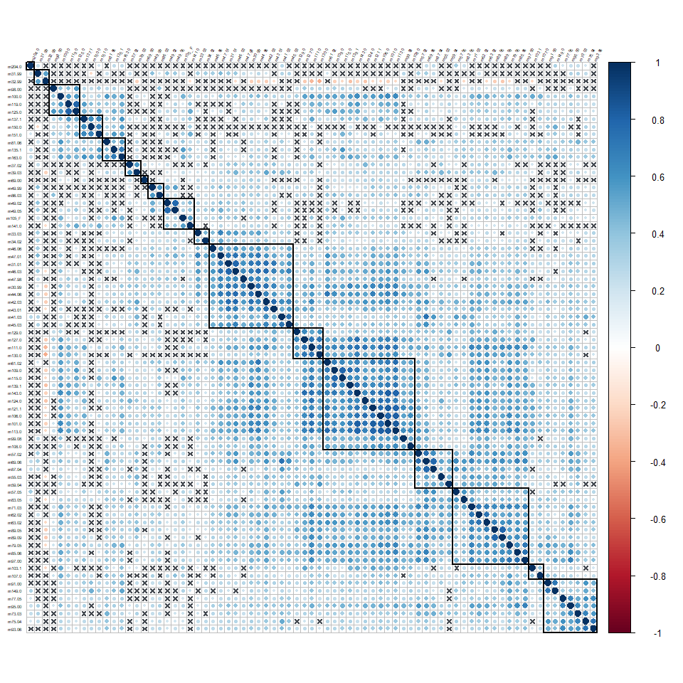<!-- -->

### MANOVA for vocs

    ##             Df  Pillai approx F num Df den Df    Pr(>F)    
    ## famid        1 0.13553   2.9051     17    315  0.000124 ***
    ## ssex         1 0.36451  10.6283     17    315 < 2.2e-16 ***
    ## famid:ssex   1 0.05939   1.1700     17    315  0.287615    
    ## Residuals  331                                             
    ## ---
    ## Signif. codes:  0 '***' 0.001 '**' 0.01 '*' 0.05 '.' 0.1 ' ' 1

    ##  Response clust_01 :
    ##              Df  Sum Sq Mean Sq F value    Pr(>F)    
    ## famid         1   0.251  0.2513  0.4561    0.4999    
    ## ssex          1  30.230 30.2300 54.8797 1.075e-12 ***
    ## famid:ssex    1   0.268  0.2676  0.4858    0.4863    
    ## Residuals   331 182.328  0.5508                      
    ## ---
    ## Signif. codes:  0 '***' 0.001 '**' 0.01 '*' 0.05 '.' 0.1 ' ' 1
    ## 
    ##  Response clust_02 :
    ##              Df  Sum Sq Mean Sq F value    Pr(>F)    
    ## famid         1   0.411  0.4111  0.5539 0.4572722    
    ## ssex          1   8.310  8.3096 11.1956 0.0009142 ***
    ## famid:ssex    1   1.173  1.1732  1.5807 0.2095527    
    ## Residuals   331 245.676  0.7422                      
    ## ---
    ## Signif. codes:  0 '***' 0.001 '**' 0.01 '*' 0.05 '.' 0.1 ' ' 1
    ## 
    ##  Response clust_03 :
    ##              Df  Sum Sq Mean Sq F value    Pr(>F)    
    ## famid         1   0.529  0.5293  0.7832    0.3768    
    ## ssex          1  18.511 18.5107 27.3902 2.959e-07 ***
    ## famid:ssex    1   0.160  0.1602  0.2371    0.6267    
    ## Residuals   331 223.695  0.6758                      
    ## ---
    ## Signif. codes:  0 '***' 0.001 '**' 0.01 '*' 0.05 '.' 0.1 ' ' 1
    ## 
    ##  Response clust_04 :
    ##              Df  Sum Sq Mean Sq F value    Pr(>F)    
    ## famid         1   0.648  0.6480  0.8830    0.3481    
    ## ssex          1  19.281 19.2809 26.2754 5.045e-07 ***
    ## famid:ssex    1   0.286  0.2864  0.3904    0.5325    
    ## Residuals   331 242.887  0.7338                      
    ## ---
    ## Signif. codes:  0 '***' 0.001 '**' 0.01 '*' 0.05 '.' 0.1 ' ' 1
    ## 
    ##  Response clust_05 :
    ##              Df  Sum Sq Mean Sq F value Pr(>F)    
    ## famid         1   0.820   0.820  1.7166 0.1910    
    ## ssex          1  40.835  40.835 85.4899 <2e-16 ***
    ## famid:ssex    1   0.117   0.117  0.2442 0.6215    
    ## Residuals   331 158.105   0.478                   
    ## ---
    ## Signif. codes:  0 '***' 0.001 '**' 0.01 '*' 0.05 '.' 0.1 ' ' 1
    ## 
    ##  Response clust_06 :
    ##              Df  Sum Sq Mean Sq F value   Pr(>F)    
    ## famid         1   6.810  6.8099  9.1669 0.002658 ** 
    ## ssex          1   9.839  9.8390 13.2445 0.000317 ***
    ## famid:ssex    1   0.555  0.5550  0.7471 0.388014    
    ## Residuals   331 245.891  0.7429                     
    ## ---
    ## Signif. codes:  0 '***' 0.001 '**' 0.01 '*' 0.05 '.' 0.1 ' ' 1
    ## 
    ##  Response clust_07 :
    ##              Df  Sum Sq Mean Sq F value    Pr(>F)    
    ## famid         1   6.701  6.7005 11.8475 0.0006514 ***
    ## ssex          1  18.201 18.2015 32.1831 3.063e-08 ***
    ## famid:ssex    1   0.245  0.2452  0.4335 0.5107100    
    ## Residuals   331 187.201  0.5656                      
    ## ---
    ## Signif. codes:  0 '***' 0.001 '**' 0.01 '*' 0.05 '.' 0.1 ' ' 1
    ## 
    ##  Response clust_08 :
    ##              Df  Sum Sq Mean Sq F value    Pr(>F)    
    ## famid         1   8.918  8.9184 16.4839 6.129e-05 ***
    ## ssex          1  10.674 10.6743 19.7294 1.218e-05 ***
    ## famid:ssex    1   0.626  0.6257  1.1565     0.283    
    ## Residuals   331 179.083  0.5410                      
    ## ---
    ## Signif. codes:  0 '***' 0.001 '**' 0.01 '*' 0.05 '.' 0.1 ' ' 1
    ## 
    ##  Response clust_09 :
    ##              Df  Sum Sq Mean Sq F value    Pr(>F)    
    ## famid         1   4.201  4.2007  6.7213  0.009949 ** 
    ## ssex          1  11.967 11.9673 19.1484 1.623e-05 ***
    ## famid:ssex    1   0.208  0.2078  0.3325  0.564566    
    ## Residuals   331 206.867  0.6250                      
    ## ---
    ## Signif. codes:  0 '***' 0.001 '**' 0.01 '*' 0.05 '.' 0.1 ' ' 1
    ## 
    ##  Response clust_10 :
    ##              Df Sum Sq Mean Sq F value  Pr(>F)  
    ## famid         1   0.06  0.0612  0.0620 0.80350  
    ## ssex          1   4.29  4.2852  4.3419 0.03795 *
    ## famid:ssex    1   2.97  2.9745  3.0138 0.08349 .
    ## Residuals   331 326.68  0.9869                  
    ## ---
    ## Signif. codes:  0 '***' 0.001 '**' 0.01 '*' 0.05 '.' 0.1 ' ' 1
    ## 
    ##  Response clust_11 :
    ##              Df  Sum Sq Mean Sq F value    Pr(>F)    
    ## famid         1   1.580  1.5801  2.9935   0.08453 .  
    ## ssex          1  19.566 19.5657 37.0669 3.161e-09 ***
    ## famid:ssex    1   0.910  0.9096  1.7232   0.19019    
    ## Residuals   331 174.718  0.5278                      
    ## ---
    ## Signif. codes:  0 '***' 0.001 '**' 0.01 '*' 0.05 '.' 0.1 ' ' 1
    ## 
    ##  Response clust_12 :
    ##              Df  Sum Sq Mean Sq F value    Pr(>F)    
    ## famid         1   2.300   2.300  3.8942   0.04928 *  
    ## ssex          1  37.602  37.602 63.6561 2.447e-14 ***
    ## famid:ssex    1   1.600   1.600  2.7086   0.10076    
    ## Residuals   331 195.526   0.591                      
    ## ---
    ## Signif. codes:  0 '***' 0.001 '**' 0.01 '*' 0.05 '.' 0.1 ' ' 1
    ## 
    ##  Response clust_13 :
    ##              Df  Sum Sq Mean Sq F value    Pr(>F)    
    ## famid         1  10.772 10.7718 17.6554 3.409e-05 ***
    ## ssex          1  11.604 11.6042 19.0197 1.730e-05 ***
    ## famid:ssex    1   0.187  0.1868  0.3061    0.5804    
    ## Residuals   331 201.948  0.6101                      
    ## ---
    ## Signif. codes:  0 '***' 0.001 '**' 0.01 '*' 0.05 '.' 0.1 ' ' 1
    ## 
    ##  Response clust_14 :
    ##              Df  Sum Sq Mean Sq F value    Pr(>F)    
    ## famid         1   1.166  1.1662  1.7898    0.1819    
    ## ssex          1  18.551 18.5510 28.4717 1.767e-07 ***
    ## famid:ssex    1   0.000  0.0000  0.0000    0.9959    
    ## Residuals   331 215.666  0.6516                      
    ## ---
    ## Signif. codes:  0 '***' 0.001 '**' 0.01 '*' 0.05 '.' 0.1 ' ' 1
    ## 
    ##  Response clust_15 :
    ##              Df  Sum Sq Mean Sq F value  Pr(>F)    
    ## famid         1   8.333  8.3329 11.8223 0.00066 ***
    ## ssex          1   4.089  4.0894  5.8018 0.01656 *  
    ## famid:ssex    1   2.114  2.1141  2.9994 0.08423 .  
    ## Residuals   331 233.304  0.7048                    
    ## ---
    ## Signif. codes:  0 '***' 0.001 '**' 0.01 '*' 0.05 '.' 0.1 ' ' 1
    ## 
    ##  Response clust_16 :
    ##              Df  Sum Sq Mean Sq F value    Pr(>F)    
    ## famid         1   0.850  0.8497  1.2479   0.26477    
    ## ssex          1  25.291 25.2906 37.1421 3.054e-09 ***
    ## famid:ssex    1   2.928  2.9281  4.3003   0.03888 *  
    ## Residuals   331 225.383  0.6809                      
    ## ---
    ## Signif. codes:  0 '***' 0.001 '**' 0.01 '*' 0.05 '.' 0.1 ' ' 1
    ## 
    ##  Response clust_17 :
    ##              Df Sum Sq Mean Sq F value    Pr(>F)    
    ## famid         1   1.12  1.1193  1.1619 0.2818489    
    ## ssex          1  13.99 13.9869 14.5196 0.0001654 ***
    ## famid:ssex    1   0.04  0.0381  0.0395 0.8424895    
    ## Residuals   331 318.86  0.9633                      
    ## ---
    ## Signif. codes:  0 '***' 0.001 '**' 0.01 '*' 0.05 '.' 0.1 ' ' 1

## Cluster boxplots for males and females

From the MANOVA results, all of these clusters show sexual
dimorphism.

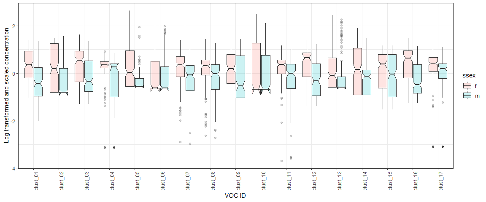<!-- -->

# Correlation matrices for all traits

## Side by side males and females

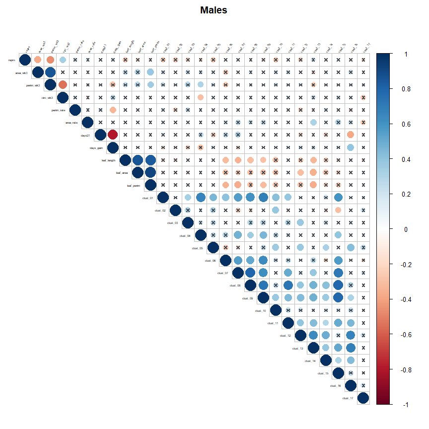<!-- --><!-- -->

## males on one axis, females on the other

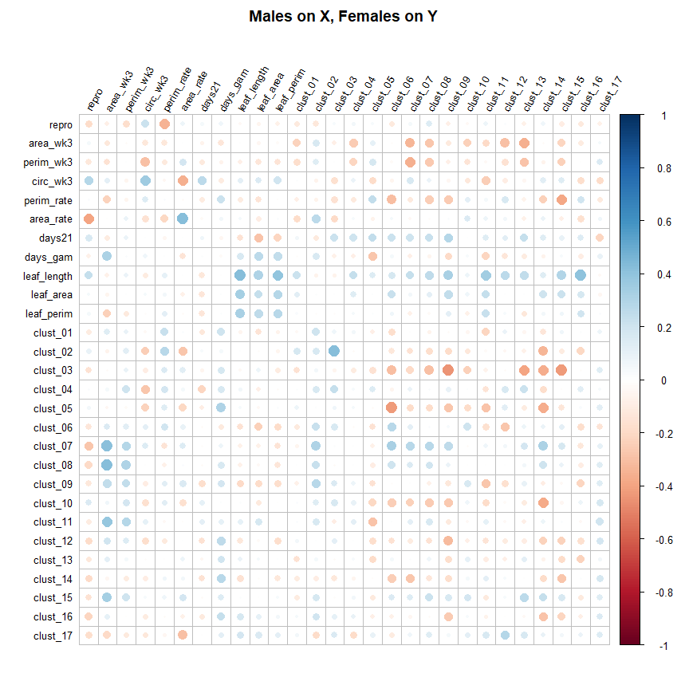<!-- -->

### Highlight the diagonal with transparencies

To get fancy with these plots we need to switch over to ggplot.

#### Option 1

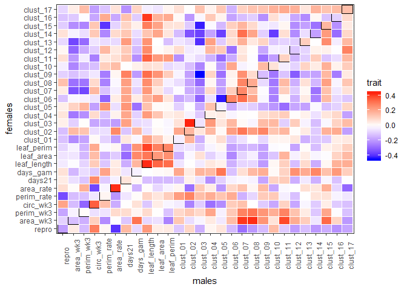<!-- -->

#### Option 2

I think the transparencies are misleading because it makes you think
that there is no correlation…

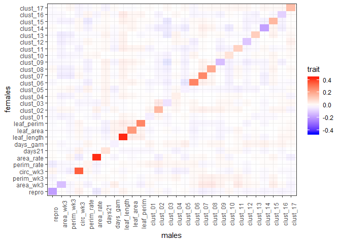<!-- -->

## Subtracted matrix

Basically, taking the trait correlation matrix for males and subtracting
the values of the female correlation matrix. So, the result is not
really a correlation matrix, it is showing differences in correlation
coefficients between males and females.

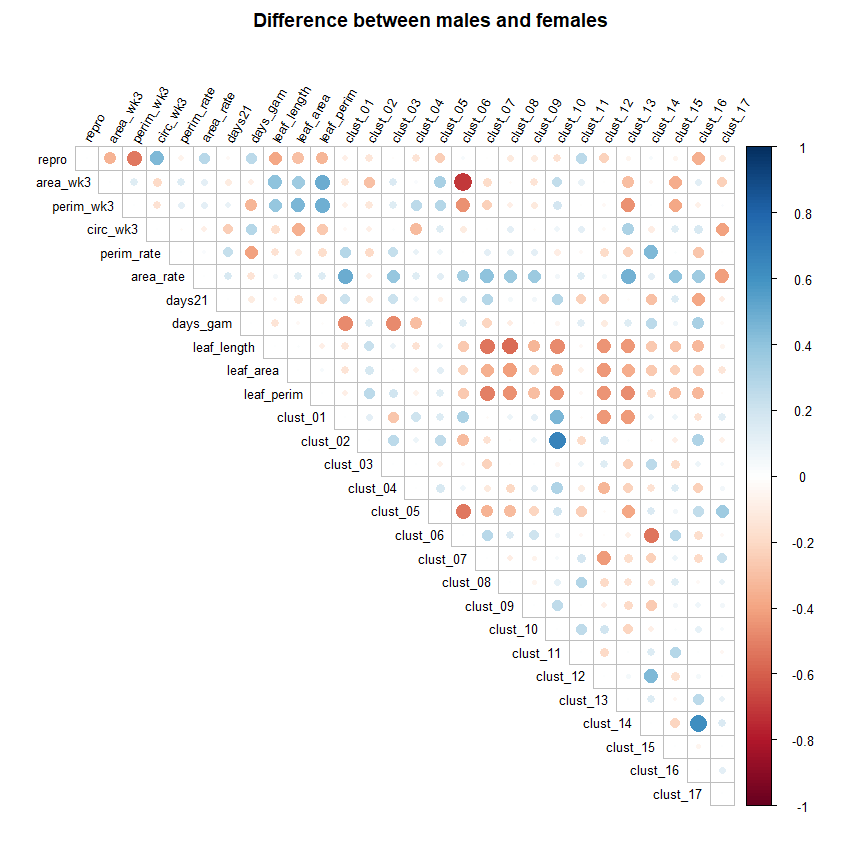<!-- -->

Also can do it with ggplot
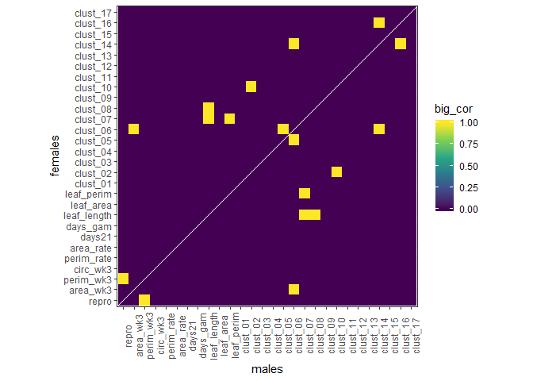<!-- -->

# Relationship between VOC clusters and the life history traits

## Males

1.  Cluster 6 and area at week 3
    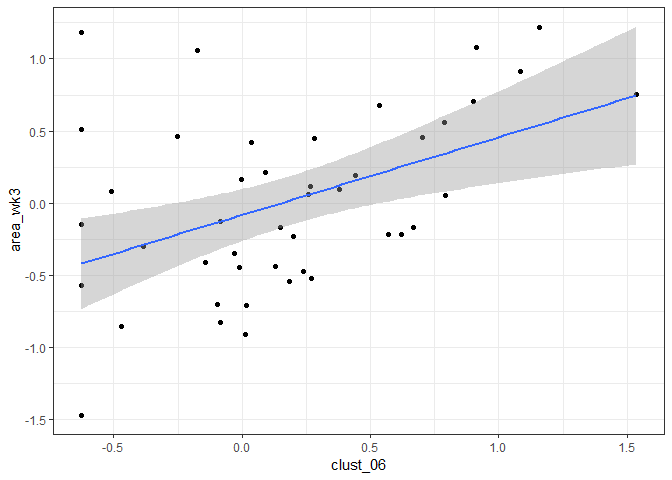<!-- -->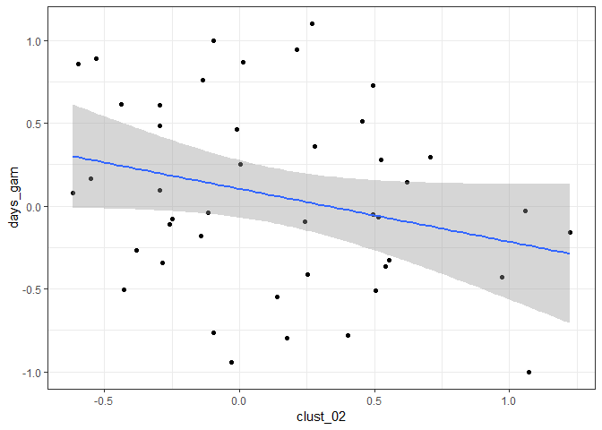<!-- -->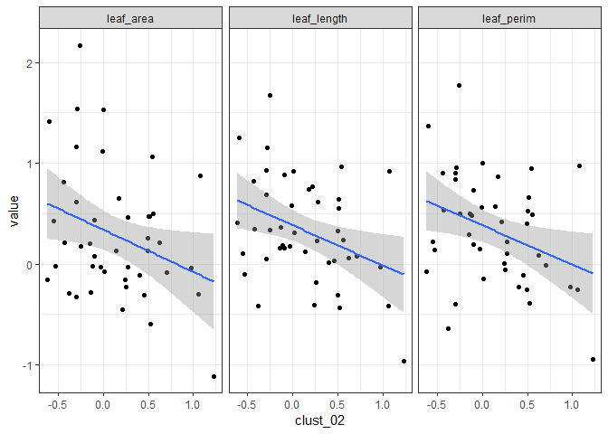<!-- -->

Figure for
males

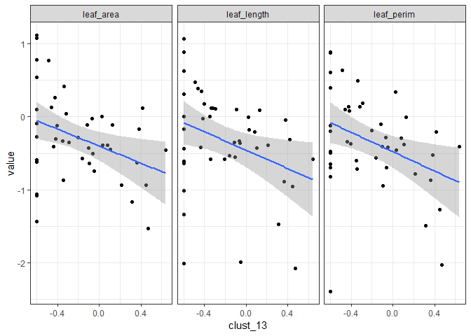<!-- -->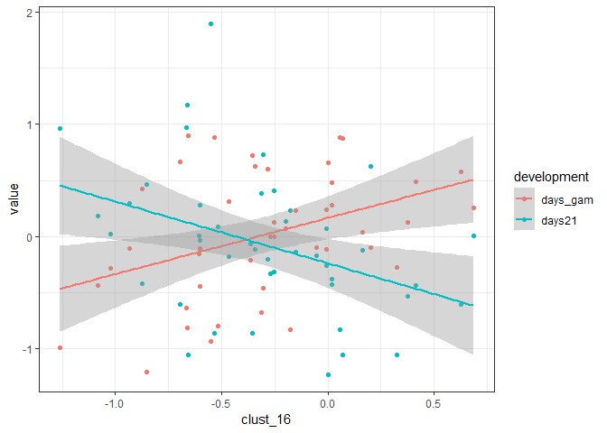<!-- -->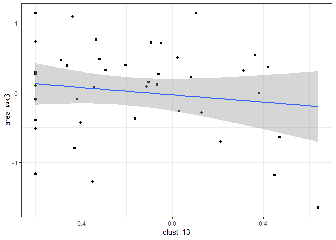<!-- -->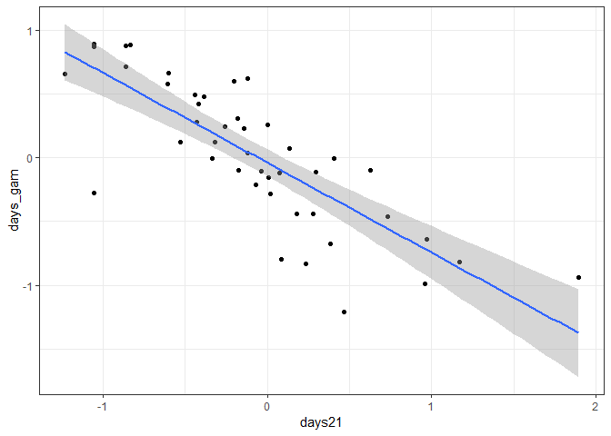<!-- -->
