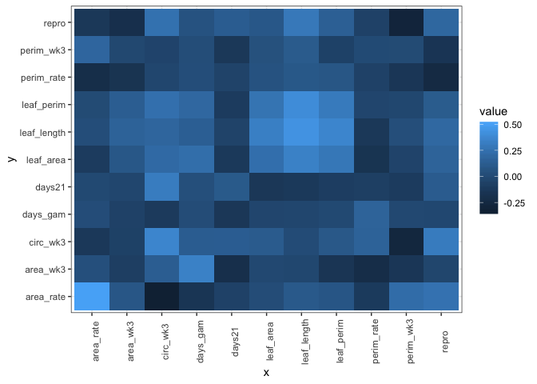

G matrix - brute force
================

-   [Data transformation](#data-transformation)
-   [JUST TRAITS](#just-traits)
-   [Just VOCs](#just-vocs)
-   [ALL STUFF](#all-stuff)

    ## Warning: package 'tidyr' was built under R version 3.5.2

    ## Classes 'tbl_df', 'tbl' and 'data.frame':    335 obs. of  18 variables:
    ##  $ sampid  : chr  "P_1_2_1" "P_1_2_10" "P_1_2_11" "P_1_2_2" ...
    ##  $ famid   : int  1 1 1 1 2 2 2 2 2 2 ...
    ##  $ ssex    : chr  "m" "f" "f" "f" ...
    ##  $ clust_01: num  6.53e-08 1.24e-07 1.35e-07 3.47e-09 4.14e-06 ...
    ##  $ clust_02: num  0.00 2.06e-08 0.00 1.86e-10 2.94e-07 ...
    ##  $ clust_03: num  0.0 1.2e-08 0.0 0.0 0.0 ...
    ##  $ clust_04: num  0.00 0.00 3.28e-06 7.67e-07 1.76e-06 ...
    ##  $ clust_05: num  1.42e-07 2.75e-07 1.06e-07 1.85e-07 9.10e-07 ...
    ##  $ clust_06: num  0.00 3.96e-10 0.00 3.36e-10 2.35e-08 ...
    ##  $ clust_07: num  1.36e-07 1.62e-07 5.14e-07 1.63e-08 6.51e-07 ...
    ##  $ clust_08: num  5.43e-08 1.32e-07 8.30e-08 1.17e-07 1.12e-07 ...
    ##  $ clust_09: num  8.64e-09 4.31e-09 7.79e-09 4.70e-09 1.99e-08 ...
    ##  $ clust_10: num  6.21e-08 0.00 0.00 0.00 0.00 ...
    ##  $ clust_11: num  3.84e-09 6.73e-10 7.56e-09 0.00 2.48e-08 ...
    ##  $ clust_12: num  2.90e-09 1.09e-09 1.14e-09 2.09e-10 3.51e-09 ...
    ##  $ clust_13: num  0.00 3.35e-10 1.01e-09 2.32e-10 0.00 ...
    ##  $ clust_14: num  1.39e-09 5.39e-09 2.51e-09 8.22e-09 0.00 ...
    ##  $ clust_15: num  7.53e-10 5.61e-10 1.73e-09 2.37e-09 1.39e-09 ...

Data transformation
===================

There are NAs in the data since some traits weren't measured. These are a problem when we do a log transformation. In my opinion, I wouldn't do a log transformation, just scale the variables. Specially for the days21 variable, we have lots of zeroes and will probably run into trouble there.

If we scale the variables, they all look normal, except for days 21 and days gam. Which makes sense because these are different variables, they are not measurements, they are time to an event.

    ## Warning: attributes are not identical across measure variables;
    ## they will be dropped

    ## Warning: attributes are not identical across measure variables;
    ## they will be dropped

JUST TRAITS
===========

Just VOCs
=========

ALL STUFF
=========

