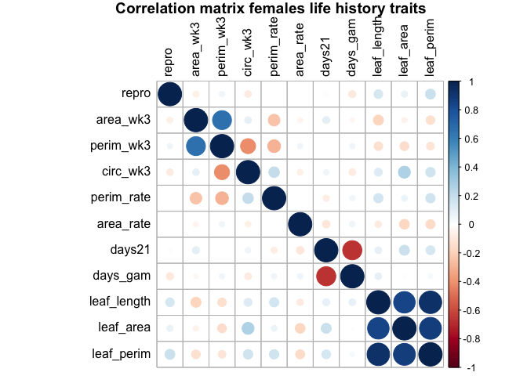
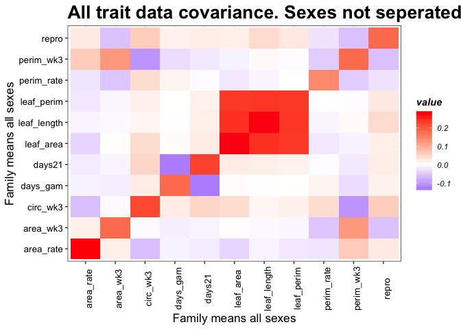
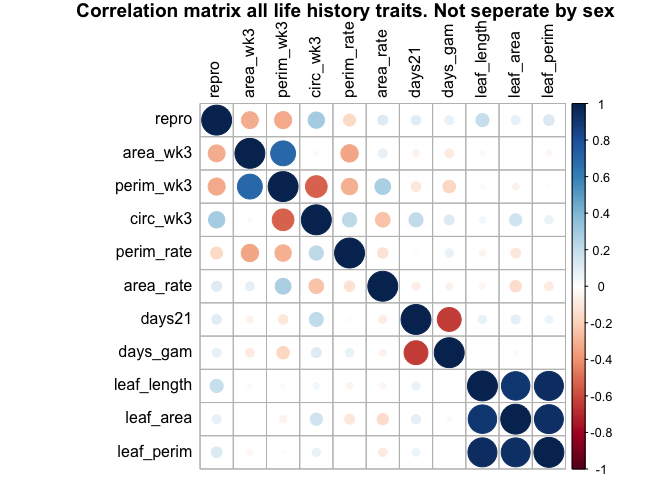
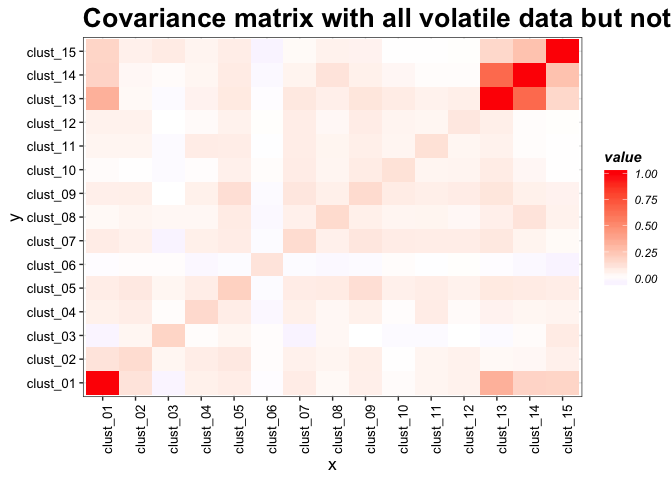
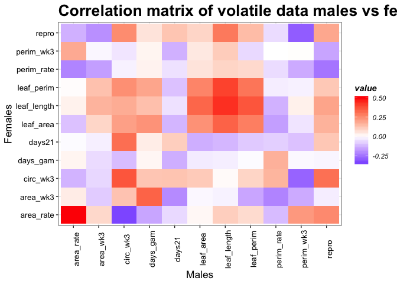
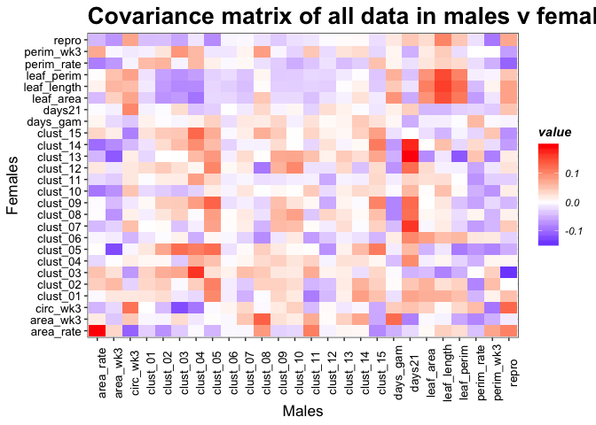
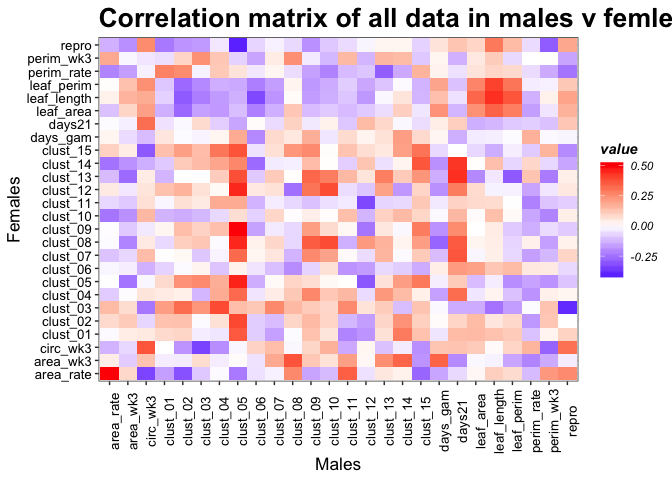

G matrix - brute force
================

-   [Data transformation](#data-transformation)
-   [Scaling volatile data](#scaling-volatile-data)
-   [Scaling traits](#scaling-traits)
-   [JUST TRAITS DATA](#just-traits-data)
-   [ALL TRAIT DATA COVARIANCE MATRIX but not seperated by sex.](#all-trait-data-covariance-matrix-but-not-seperated-by-sex.)
-   [All traits by filtering with only families shared between males and females. Plotted males vs females](#all-traits-by-filtering-with-only-families-shared-between-males-and-females.-plotted-males-vs-females)
-   [Just VOCs](#just-vocs)
-   [All data not female vs male](#all-data-not-female-vs-male)
-   [All vocs filtered by those with Male and female families. Plot M v F](#all-vocs-filtered-by-those-with-male-and-female-families.-plot-m-v-f)
-   [Combined life history and volatile data](#combined-life-history-and-volatile-data)
-   [All data for males](#all-data-for-males)
-   [All data but not filtered by sex](#all-data-but-not-filtered-by-sex)
-   [ALl data filtered by males v females](#all-data-filtered-by-males-v-females)

    ## Warning: package 'tidyr' was built under R version 3.5.2

    ## Classes 'tbl_df', 'tbl' and 'data.frame':    335 obs. of  18 variables:
    ##  $ sampid  : chr  "P_1_2_1" "P_1_2_10" "P_1_2_11" "P_1_2_2" ...
    ##  $ famid   : int  1 1 1 1 2 2 2 2 2 2 ...
    ##  $ ssex    : chr  "m" "f" "f" "f" ...
    ##  $ clust_01: num  6.53e-08 1.24e-07 1.35e-07 3.47e-09 4.14e-06 ...
    ##  $ clust_02: num  0.00 2.06e-08 0.00 1.86e-10 2.94e-07 ...
    ##  $ clust_03: num  0.0 1.2e-08 0.0 0.0 0.0 ...
    ##  $ clust_04: num  0.00 0.00 3.28e-06 7.67e-07 1.76e-06 ...
    ##  $ clust_05: num  1.42e-07 2.75e-07 1.06e-07 1.85e-07 9.10e-07 ...
    ##  $ clust_06: num  0.00 3.96e-10 0.00 3.36e-10 2.35e-08 ...
    ##  $ clust_07: num  1.36e-07 1.62e-07 5.14e-07 1.63e-08 6.51e-07 ...
    ##  $ clust_08: num  5.43e-08 1.32e-07 8.30e-08 1.17e-07 1.12e-07 ...
    ##  $ clust_09: num  8.64e-09 4.31e-09 7.79e-09 4.70e-09 1.99e-08 ...
    ##  $ clust_10: num  6.21e-08 0.00 0.00 0.00 0.00 ...
    ##  $ clust_11: num  3.84e-09 6.73e-10 7.56e-09 0.00 2.48e-08 ...
    ##  $ clust_12: num  2.90e-09 1.09e-09 1.14e-09 2.09e-10 3.51e-09 ...
    ##  $ clust_13: num  0.00 3.35e-10 1.01e-09 2.32e-10 0.00 ...
    ##  $ clust_14: num  1.39e-09 5.39e-09 2.51e-09 8.22e-09 0.00 ...
    ##  $ clust_15: num  7.53e-10 5.61e-10 1.73e-09 2.37e-09 1.39e-09 ...

Data transformation
===================

There are NAs in the data since some traits weren't measured. These are a problem when we do a log transformation. In my opinion, I wouldn't do a log transformation, just scale the variables. Specially for the days21 variable, we have lots of zeroes and will probably run into trouble there.

If we scale the variables, they all look normal, except for days 21 and days gam. Which makes sense because these are different variables, they are not measurements, they are time to an event.

    ## Warning: attributes are not identical across measure variables;
    ## they will be dropped

Scaling volatile data
=====================

    ## Warning: attributes are not identical across measure variables;
    ## they will be dropped

Scaling traits
==============

We only scaled the traits for all correlation and covariance matrices. We did not transform any of the data.

JUST TRAITS DATA
================

-We could potentially combine the leaf data into one varialbe. -Leaf length is highly correlataed with leaf area and perimeter. -Trade offs for days till gametophores and number of gametophores. The longer it takes you to produce gametophores the less you produce -Slight covariance between leaf area and circularity. -Very slight covariance between days till gam were produced and leaf area 

Correlation matrix females life history traits

MALE TRAIT COVARIANCE MATRIX -Leaf measurements covary with area and perimeter -reproductive measurement negattively correlated with reproductive perimeter. -Growth measurements and reproductive traits do not correlate the same with reproductive traits while the growth measurements are all correlated. -positive with circularity -negative with perimeter 

Correlation matrix males life history traits 

ALL TRAIT DATA COVARIANCE MATRIX but not seperated by sex.
==========================================================

Correlation matrix for all life history traits 

All traits by filtering with only families shared between males and females. Plotted males vs females
=====================================================================================================

All traits filtered males v females covariance 

All traits filtered males v females correlation -Lots of interesting data. Now how to explain it...

Just VOCs
=========

Female volatiles covariance plot

Female volatiles correlation plot 

Male volatile covariance matrix 

Male volatile correlation matrix 

All data not female vs male
===========================

Male volatile correlation matrix 

All vocs filtered by those with Male and female families. Plot M v F
====================================================================

Male vs female covariance

Male vs female correlation 

Combined life history and volatile data
=======================================

Female all covariance 

    ##                repro    area_wk3  perim_wk3    circ_wk3    perim_rate
    ## repro       0.296211 -0.02342986 0.01703939 -0.02658897  0.0002267623
    ## area_wk3          NA  0.38609462 0.23711858  0.03024976 -0.0950080966
    ## perim_wk3         NA          NA 0.33987862 -0.13839357 -0.1070962500
    ## circ_wk3          NA          NA         NA  0.33149218  0.0731554448
    ## perim_rate        NA          NA         NA          NA  0.3770271928
    ## area_rate         NA          NA         NA          NA            NA
    ## days21            NA          NA         NA          NA            NA
    ## days_gam          NA          NA         NA          NA            NA
    ## leaf_length       NA          NA         NA          NA            NA
    ## leaf_area         NA          NA         NA          NA            NA
    ## leaf_perim        NA          NA         NA          NA            NA
    ## clust_01          NA          NA         NA          NA            NA
    ## clust_02          NA          NA         NA          NA            NA
    ## clust_03          NA          NA         NA          NA            NA
    ## clust_04          NA          NA         NA          NA            NA
    ## clust_05          NA          NA         NA          NA            NA
    ## clust_06          NA          NA         NA          NA            NA
    ## clust_07          NA          NA         NA          NA            NA
    ## clust_08          NA          NA         NA          NA            NA
    ## clust_09          NA          NA         NA          NA            NA
    ## clust_10          NA          NA         NA          NA            NA
    ## clust_11          NA          NA         NA          NA            NA
    ## clust_12          NA          NA         NA          NA            NA
    ## clust_13          NA          NA         NA          NA            NA
    ## clust_14          NA          NA         NA          NA            NA
    ## clust_15          NA          NA         NA          NA            NA
    ##                area_rate       days21    days_gam leaf_length    leaf_area
    ## repro       -0.001225194  0.005328598 -0.03120501  0.04248901  0.025907226
    ## area_wk3    -0.018057993  0.033531045 -0.01431298 -0.06454516 -0.022686151
    ## perim_wk3    0.018726859 -0.001010732  0.01912621 -0.04430766 -0.055639955
    ## circ_wk3    -0.021067421  0.019432896 -0.02971385  0.03801795  0.099400386
    ## perim_rate   0.003183866 -0.024679343  0.02071168  0.05454769  0.026795363
    ## area_rate    0.337876593 -0.035522156  0.02065206 -0.02638702 -0.066798324
    ## days21                NA  0.327921033 -0.22994949  0.02827038  0.069812391
    ## days_gam              NA           NA  0.35951887  0.02770981  0.004568518
    ## leaf_length           NA           NA          NA  0.30943434  0.308930944
    ## leaf_area             NA           NA          NA          NA  0.433385420
    ## leaf_perim            NA           NA          NA          NA           NA
    ## clust_01              NA           NA          NA          NA           NA
    ## clust_02              NA           NA          NA          NA           NA
    ## clust_03              NA           NA          NA          NA           NA
    ## clust_04              NA           NA          NA          NA           NA
    ## clust_05              NA           NA          NA          NA           NA
    ## clust_06              NA           NA          NA          NA           NA
    ## clust_07              NA           NA          NA          NA           NA
    ## clust_08              NA           NA          NA          NA           NA
    ## clust_09              NA           NA          NA          NA           NA
    ## clust_10              NA           NA          NA          NA           NA
    ## clust_11              NA           NA          NA          NA           NA
    ## clust_12              NA           NA          NA          NA           NA
    ## clust_13              NA           NA          NA          NA           NA
    ## clust_14              NA           NA          NA          NA           NA
    ## clust_15              NA           NA          NA          NA           NA
    ##              leaf_perim     clust_01     clust_02    clust_03     clust_04
    ## repro        0.05681348 -0.039707050 -0.093918107 -0.05020030  0.011539942
    ## area_wk3    -0.04972753  0.046918513  0.095034763  0.06784670  0.061139820
    ## perim_wk3   -0.03734561  0.006935949  0.011174689  0.05688547  0.023128136
    ## circ_wk3     0.05437215  0.021588982  0.037460762 -0.03493392 -0.011720955
    ## perim_rate   0.05690153 -0.092738554 -0.068344935  0.01137299 -0.006891999
    ## area_rate   -0.05081225 -0.141502548 -0.088890825  0.04768672 -0.046766890
    ## days21       0.04789027 -0.025305992  0.013269730  0.03110338  0.051467294
    ## days_gam     0.01242774  0.073318633 -0.006335042 -0.07665298 -0.047772572
    ## leaf_length  0.29468946  0.059918064  0.024962688 -0.09839900 -0.009039706
    ## leaf_area    0.33001423  0.049444310  0.016083620 -0.08885101 -0.012660596
    ## leaf_perim   0.32927386  0.019005784 -0.017218788 -0.08743721 -0.025173260
    ## clust_01             NA  0.604619908  0.542495015 -0.15940122  0.212874680
    ## clust_02             NA           NA  0.579531946 -0.03790882  0.221583787
    ## clust_03             NA           NA           NA  0.26996218 -0.043037228
    ## clust_04             NA           NA           NA          NA  0.201450467
    ## clust_05             NA           NA           NA          NA           NA
    ## clust_06             NA           NA           NA          NA           NA
    ## clust_07             NA           NA           NA          NA           NA
    ## clust_08             NA           NA           NA          NA           NA
    ## clust_09             NA           NA           NA          NA           NA
    ## clust_10             NA           NA           NA          NA           NA
    ## clust_11             NA           NA           NA          NA           NA
    ## clust_12             NA           NA           NA          NA           NA
    ## clust_13             NA           NA           NA          NA           NA
    ## clust_14             NA           NA           NA          NA           NA
    ## clust_15             NA           NA           NA          NA           NA
    ##                 clust_05     clust_06    clust_07     clust_08
    ## repro       -0.023258766 -0.086602636  0.05826075 -0.003241503
    ## area_wk3     0.105709717  0.009640958 -0.01409393  0.010497105
    ## perim_wk3    0.060973785 -0.059313997 -0.05536254 -0.029603811
    ## circ_wk3    -0.042680411  0.134777947  0.04186112  0.038000599
    ## perim_rate   0.020826141  0.060338044 -0.05634927 -0.044990479
    ## area_rate   -0.041160744 -0.015492789 -0.07904673 -0.047910038
    ## days21       0.003852486 -0.019943467  0.02689652  0.040885490
    ## days_gam     0.022424312 -0.046475507 -0.03063593 -0.025262132
    ## leaf_length  0.012947394  0.004199042  0.03022505  0.010000140
    ## leaf_area    0.013522184 -0.007208844  0.02611541  0.015606231
    ## leaf_perim  -0.008608688  0.012008267  0.00361786  0.005591990
    ## clust_01     0.330614910 -0.012841568  0.35749556  0.141382036
    ## clust_02     0.312221198  0.050500125  0.30695149  0.115710805
    ## clust_03    -0.084414949  0.036963212 -0.12741904 -0.055089289
    ## clust_04     0.205468822 -0.035195858  0.18408312  0.099029118
    ## clust_05     0.576165079 -0.024966273  0.28431122  0.184999463
    ## clust_06              NA  0.446891859 -0.03883317  0.001505660
    ## clust_07              NA           NA  0.45819862  0.182588578
    ## clust_08              NA           NA          NA  0.265834513
    ## clust_09              NA           NA          NA           NA
    ## clust_10              NA           NA          NA           NA
    ## clust_11              NA           NA          NA           NA
    ## clust_12              NA           NA          NA           NA
    ## clust_13              NA           NA          NA           NA
    ## clust_14              NA           NA          NA           NA
    ## clust_15              NA           NA          NA           NA
    ##                 clust_09     clust_10     clust_11     clust_12
    ## repro       -0.012483732  0.042901966 -0.002340132 -0.059199583
    ## area_wk3     0.002962193  0.033571478  0.033372326  0.024798882
    ## perim_wk3   -0.002786902 -0.006801557  0.022710526 -0.031086744
    ## circ_wk3    -0.016605732  0.041042296 -0.003054629  0.025108963
    ## perim_rate  -0.006566884 -0.007454118  0.012711275 -0.074939468
    ## area_rate   -0.058433788 -0.041510803 -0.014631413 -0.098851577
    ## days21      -0.000153875 -0.005347771 -0.023845615  0.026577922
    ## days_gam     0.008935537  0.022517074 -0.002281759 -0.062809197
    ## leaf_length  0.035047940  0.037495709  0.009161110  0.006412633
    ## leaf_area    0.009025518  0.091354040  0.017115538 -0.021615621
    ## leaf_perim   0.008553768  0.027548317 -0.011991830 -0.027888726
    ## clust_01     0.367900854  0.059833177  0.217502157  0.292618668
    ## clust_02     0.334590333  0.018189198  0.232402224  0.292830191
    ## clust_03    -0.098760789 -0.036785406 -0.058208497 -0.048147907
    ## clust_04     0.207650174  0.072892010  0.144310501  0.132166715
    ## clust_05     0.463505236  0.163876979  0.286092863  0.221982355
    ## clust_06    -0.027021961  0.021575346  0.040576714  0.067383553
    ## clust_07     0.405458748  0.164146559  0.208499284  0.315045232
    ## clust_08     0.197575588  0.069810844  0.104461468  0.163900623
    ## clust_09     0.544781627  0.176135402  0.265880307  0.332405486
    ## clust_10              NA  0.330581783  0.105863322  0.077846960
    ## clust_11              NA           NA  0.300182551  0.179892241
    ## clust_12              NA           NA           NA  0.411001194
    ## clust_13              NA           NA           NA           NA
    ## clust_14              NA           NA           NA           NA
    ## clust_15              NA           NA           NA           NA
    ##                 clust_13    clust_14      clust_15
    ## repro        0.065486877  0.09784179 -0.0247752283
    ## area_wk3     0.018246205 -0.02031882 -0.0192622776
    ## perim_wk3    0.005024459  0.01065541 -0.0495765890
    ## circ_wk3    -0.030829942 -0.01768340  0.0061230563
    ## perim_rate  -0.038598305 -0.03868192 -0.0182680038
    ## area_rate   -0.093911304 -0.08815623  0.0339099991
    ## days21       0.006010944 -0.01617186  0.0244095137
    ## days_gam     0.022039522  0.04698933  0.0137195598
    ## leaf_length  0.001401685  0.02843515 -0.0244943719
    ## leaf_area    0.001504668  0.03046304  0.0077787774
    ## leaf_perim   0.013913095  0.03727235 -0.0374781636
    ## clust_01     0.198823820  0.13350163  0.1010509529
    ## clust_02     0.141407840  0.06832218  0.1462209169
    ## clust_03    -0.079824554 -0.09058487  0.0949989928
    ## clust_04     0.153191760  0.10810590  0.0460343906
    ## clust_05     0.273409369  0.17679886  0.0744343642
    ## clust_06     0.013472408 -0.03387500 -0.0677493148
    ## clust_07     0.278367414  0.15793367  0.0704378524
    ## clust_08     0.194207180  0.20888402 -0.0008530611
    ## clust_09     0.305240519  0.16476942  0.0883650589
    ## clust_10     0.176112233  0.09513112  0.0157229576
    ## clust_11     0.127902216  0.06496593 -0.0003506296
    ## clust_12     0.188557955  0.02501657 -0.0131017301
    ## clust_13     0.421856898  0.25604403 -0.0141041947
    ## clust_14              NA  0.37745788  0.0369965184
    ## clust_15              NA          NA  0.2677199521

Female all correlation 

All data for males
==================

male all correlation 

All data but not filtered by sex
================================

All data covariance 

all data correlation 

ALl data filtered by males v females
====================================

Covariance for males v female for all data 

Correlation for all data for males vs females 
