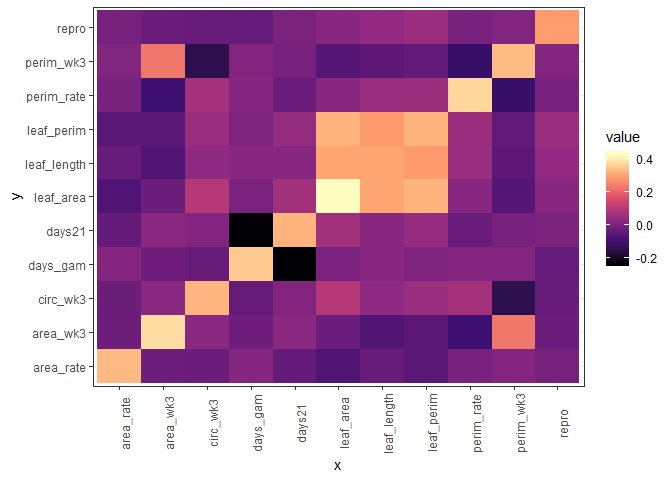

G matrix - brute force
================

  - [Data transformation](#data-transformation)

# Data transformation

There are NAs in the data since some traits weren’t measured. These are
a problem when we do a log transformation. In my opinion, I wouldn’t do
a log transformation, just scale the variables. Specially for the days21
variable, we have lots of zeroes and will probably run into trouble
there.

<!-- -->

If we scale the variables, they all look normal, except for days 21 and
days gam. Which makes sense because these are different variables, they
are not measurements, they are time to an event.

    ## Warning: attributes are not identical across measure variables;
    ## they will be dropped

<!-- -->

    ## Warning: attributes are not identical across measure variables;
    ## they will be dropped

<!-- -->

<!-- -->

<!-- -->

<!-- -->

<!-- -->
