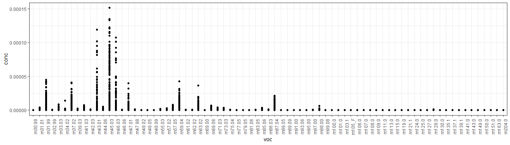
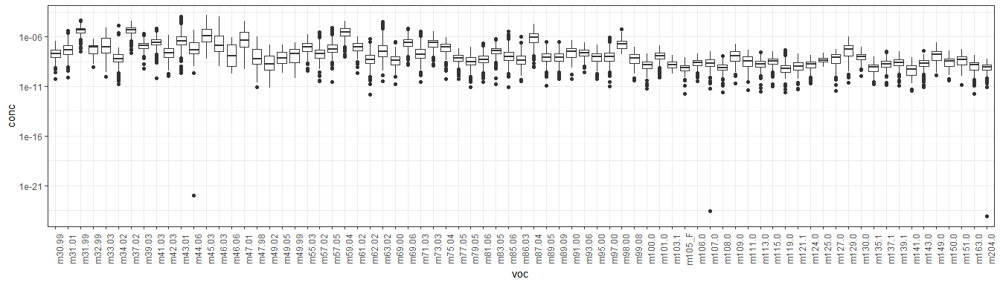
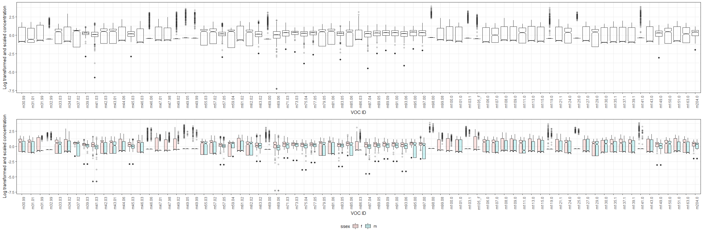
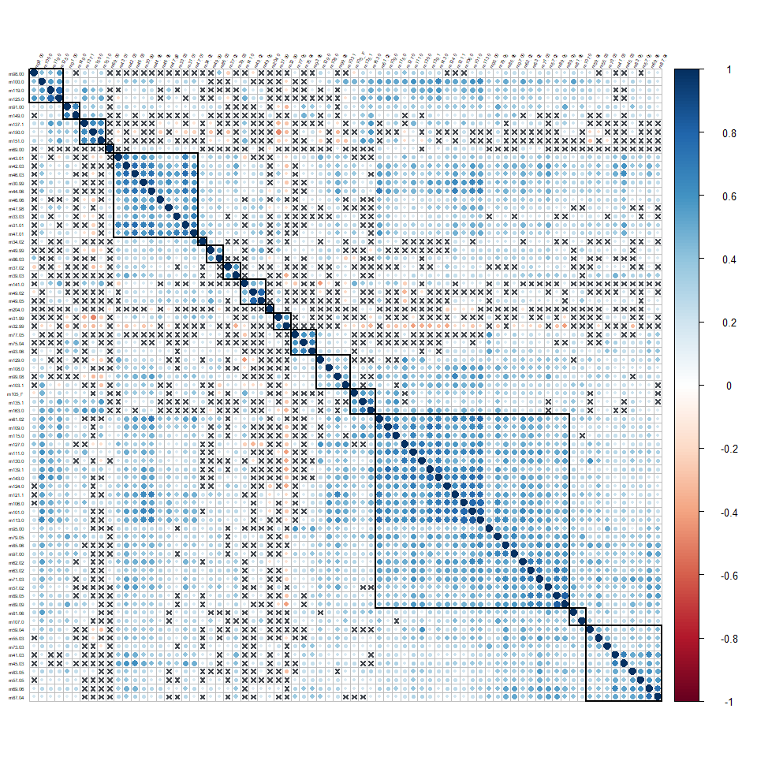
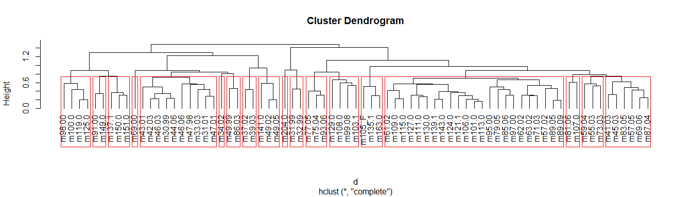
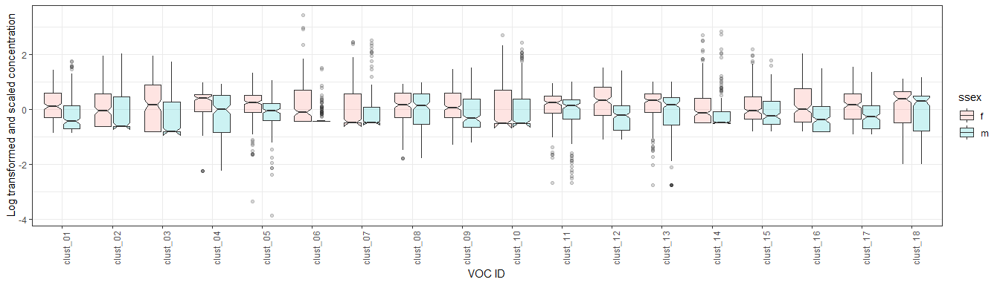

VOC\_data cleanup - keeping clones
================
Javiera Rudolph
6/17/2019

``` r
library(tidyverse)
library(vegan)
library(plotly)
library(corrplot)
library(ggpubr)
library(Hmisc)

theme_set(theme_bw())
```

We are going to be working with the VOC data and make the clusters but
using the clones.

``` r
# Read in the raw data
rawdata <- read.csv("rawdata/LK_master.csv", stringsAsFactors = FALSE)
```

# Base cleaning

  - Remove other traits  
  - Remove NAs at the end  
  - Change names  
  - Standardize sampleID names (no special characters)

<!-- end list -->

``` r
# Just keep volatile data and identifiers
# Also, remove the NAs, there's a lot at the end
# Remove '(2)' notation from sample ids

#names(rawdata)
voc_raw <- rawdata[,c(1,2,4,5, 20:109)] %>% 
  rename(famid = `Fam..`,
         sampid = Sample.Name,
         ssex = Sample_Sex) %>% 
  drop_na() %>% 
  mutate(sampid = str_replace_all(sampid, "\\(.*\\)", ""),
         sampid = str_trim(sampid, side = "both"))

#' Shorten voc names
oldnames <- names(voc_raw)
names(voc_raw)[5:94] <- stringr::str_trunc(oldnames[5:94], width = 6, side = "right", ellipsis = "")
```

There was an issue with the notation in one of the compounds, so we
check that and fix the notation so that R can recognize the values as
numbers.

``` r
#str(voc_raw)
#' m111.0 is a character
#voc_raw$m111.0
#' The notation is different, using a capital E
voc_raw$m111.0 <- as.numeric(str_replace(voc_raw$m111.0, "E", "e"))
```

    ## Warning: NAs introduced by coercion

# May 30

Removing samples from May 30. These were off, and you can check the
figures from the EDA\_clean\_master.Rmd which includes all the figures
about it. Here, we are also making any negative values be equal to zero.

``` r
voc_raw %>% 
  filter(Date.PTR != "30-May") %>%
  mutate_if(is.numeric, list(~ ifelse(. < 0, 0, .))) %>% 
  arrange(sampid, .by_group = TRUE) %>% 
  dplyr::select(-Date.PTR) -> vocs
```

# 10% threshold

``` r
# Create a dataset with only the compounds for which at least 10% of the observations show it.
vocs %>% 
  select(-famid, -sampid, -ssex) %>% 
  mutate_if(is.numeric, function(x) ifelse(x > 0, 1, 0)) %>% 
  colSums() %>% 
  data.frame() %>% 
  rownames_to_column() %>%
  setNames(., c("voc", "count")) %>% 
  mutate(prcnt = count/nrow(vocs)) %>% 
  filter(prcnt >= 0.1) -> voc_filter

vocs %>% 
  select(famid, sampid, ssex, c(voc_filter$voc)) %>% 
  mutate(ssex = str_to_lower(as.character(ssex))) -> voc_data
```

# Exploration with clones

``` r
long_voc_data <- voc_data %>% 
  gather(., key = "voc", value = "conc", -c(famid, sampid, ssex)) %>% 
  mutate(voc = factor(voc, levels = unique(voc)))


long_voc_data %>%
  ggplot(aes(x = voc, y = conc)) +
  geom_point() +
  theme_bw() +
  theme(axis.text.x = element_text(angle = 90))
```

<!-- -->

``` r
long_voc_data %>% 
  filter(conc > 0) %>%
  ggplot(aes(x = voc, y = conc)) + 
  geom_boxplot() +
  theme_bw() + 
  theme(axis.text.x = element_text(angle = 90)) +
  scale_y_log10()
```

<!-- -->

We see that there are three big outliers. The values are so small and
over the machine’s detection thresold, so we will make them equal to
zero.

``` r
# Making these outliers be zero
voc_data[voc_data < 1e-15 & voc_data>0] <- 0

long_voc_data <- voc_data %>% 
  gather(., key = "voc", value = "conc", -c(famid, sampid, ssex)) %>% 
  mutate(voc = factor(voc, levels = unique(voc)))
```

``` r
long_voc_data %>% 
  ggplot(aes(x = voc, y = conc)) + 
  geom_boxplot() +
  theme_bw() + 
  lims(y = c(1e-13, 1e-05)) +
  theme(axis.text.x = element_text(angle = 90)) +
  scale_y_log10()
```

## Transformation and scaling

Based on PTR machines detection threshold, any values smaller than
`1e-12` are equivalent to zero. Then we will standardize the data.

``` r
log_vocs <- voc_data %>% 
  mutate_at(vars(starts_with("m")), list(~ log10(. + 1e-12)))

st_log_vocs <- log_vocs %>% 
  mutate_at(vars(starts_with("m")), scale)

# This is the data scaled and transformed with clone information
saveRDS(st_log_vocs, file = "cleandata/VOC_transf_unclust_wclones_Jun17.RDS")

long_vocs <- st_log_vocs %>% 
  gather(., key = "voc", value = "conc", -c(famid, sampid, ssex)) %>% 
  mutate(voc = factor(voc, levels = unique(voc)))
```

    ## Warning: attributes are not identical across measure variables;
    ## they will be dropped

This is how the transformed data looks like now, with a visual
differentiation between males and females. Recall that the data for VOCs
here has been log transfomed and scaled.

``` r
ggarrange(long_vocs %>% 
  ggplot(aes(x = voc, y = conc)) +
  geom_boxplot(notch = TRUE, alpha = 0.2) +
  labs(x = "VOC ID",
       y = "Log transformed and scaled concentration") +
  theme(axis.text.x = element_text(angle = 90)),
  long_vocs %>% 
  ggplot(aes(x = voc, y = conc, fill = ssex)) +
  geom_boxplot(notch = TRUE, alpha = 0.2) +
  labs(x = "VOC ID",
       y = "Log transformed and scaled concentration") +
  theme(axis.text.x = element_text(angle = 90),
        legend.position = "bottom"), nrow = 2)
```

<!-- -->

#### Correlations

I would be careful with these correlations, because they are taking each
sample/clone as an independent observation. However, we know that these
clones are not genetically independent. There should be a way to
constrain or account for that relationship in this correlation.

``` r
cor_data <- as.matrix(st_log_vocs[,4:78])

cor_res <- rcorr(x = cor_data, type = "pearson")

saveRDS(cor_res, "cleandata/data_for_figs/voc_correlation_data.RDS")
corrplot(cor_res$r, p.mat = cor_res$P, sig.level = 0.001, insig = "pch", tl.col = "black", tl.srt = 60, tl.cex = .4, order = "hclust", pch.cex = 0.8, pch.col = "#43484f", addrect = 17)
```

<!-- -->

#### Clustering

Haven’t found a good reasoning to come up with a specific number of
clusters. However, by making these clusters using the correlation
matrix, we can see how variables (in this case compounds) are grouped
together.

``` r
d <- as.dist(1-cor_res$r)
hr <- hclust(d)
#names(hr)
plot(hr, hang = -1)
rect.hclust(hr, h = max(hr$height)/2)
```

<!-- -->

Using the clustering to create a new data frame

**Making the clusters with the data that was already transformed and
scaled** I think it makes more sense to use this one, since this is the
data we actually used to create the clusters. Our correlations and
everything else is based on this transformed data, so this is probably
what we should use to create the new dataset of clustered
VOCs.

``` r
# This one gets the clustered data by getting the mean using the transformed and scaled data.
voc_clusters <- data.frame(clust = cutree(hr, h = max(hr$height)/2)) %>% 
  rownames_to_column(var = "voc") 


long_vocs %>% 
  left_join(voc_clusters) %>% 
  group_by(sampid, clust, famid, ssex) %>% 
  summarise(voc_value = mean(conc)) %>% 
  mutate(voc_clust = str_pad(clust, width = 2, side = "left", pad = 0),
         voc_clust = paste0("clust_", voc_clust)) %>% 
  ungroup() %>% 
  select(-clust) -> clustered_long_vocs2
```

    ## Warning: Column `voc` joining factor and character vector, coercing into
    ## character vector

``` r
clustered_long_vocs2 %>% 
  spread(key = voc_clust, value = voc_value) -> clustered_voc_data2

clustered_long_vocs2 %>% 
  ggplot(aes(x = voc_clust, y = voc_value, fill = ssex)) +
  geom_boxplot(notch = TRUE, alpha = 0.2) +
  labs(x = "VOC ID",
       y = "Log transformed and scaled concentration") +
  theme(axis.text.x = element_text(angle = 90))
```

<!-- -->

These are the clusters and the compounds in each cluster

| Cluster | Compound |
| ------: | :------- |
|       1 | m30.99   |
|       1 | m31.01   |
|       1 | m33.03   |
|       1 | m42.03   |
|       1 | m43.01   |
|       1 | m44.06   |
|       1 | m46.03   |
|       1 | m46.06   |
|       1 | m47.01   |
|       1 | m47.98   |
|       2 | m31.99   |
|       2 | m32.99   |
|       3 | m34.02   |
|       4 | m37.02   |
|       4 | m39.03   |
|       5 | m41.03   |
|       5 | m45.03   |
|       5 | m57.05   |
|       5 | m69.06   |
|       5 | m83.05   |
|       5 | m87.04   |
|       6 | m49.02   |
|       6 | m49.05   |
|       6 | m141.0   |
|       7 | m49.99   |
|       7 | m86.03   |
|       8 | m55.03   |
|       8 | m59.04   |
|       8 | m73.03   |
|       9 | m57.02   |
|       9 | m61.02   |
|       9 | m62.02   |
|       9 | m63.02   |
|       9 | m71.03   |
|       9 | m79.05   |
|       9 | m85.06   |
|       9 | m89.05   |
|       9 | m89.09   |
|       9 | m95.00   |
|       9 | m97.00   |
|       9 | m101.0   |
|       9 | m106.0   |
|       9 | m109.0   |
|       9 | m111.0   |
|       9 | m113.0   |
|       9 | m115.0   |
|       9 | m121.1   |
|       9 | m124.0   |
|       9 | m127.0   |
|       9 | m130.0   |
|       9 | m139.1   |
|       9 | m143.0   |
|      10 | m69.00   |
|      11 | m75.04   |
|      11 | m77.05   |
|      11 | m93.06   |
|      12 | m81.06   |
|      12 | m107.0   |
|      13 | m91.00   |
|      13 | m149.0   |
|      14 | m98.00   |
|      14 | m100.0   |
|      14 | m119.0   |
|      14 | m125.0   |
|      15 | m99.08   |
|      15 | m103.1   |
|      15 | m108.0   |
|      15 | m129.0   |
|      16 | m105\_F  |
|      16 | m135.1   |
|      16 | m163.0   |
|      17 | m137.1   |
|      17 | m150.0   |
|      17 | m151.0   |
|      18 | m204.0   |
