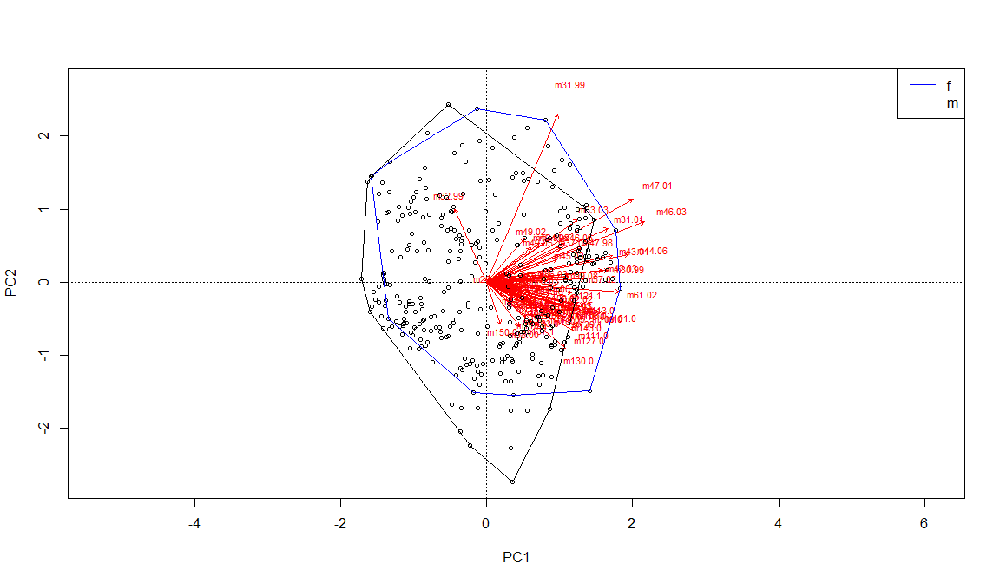
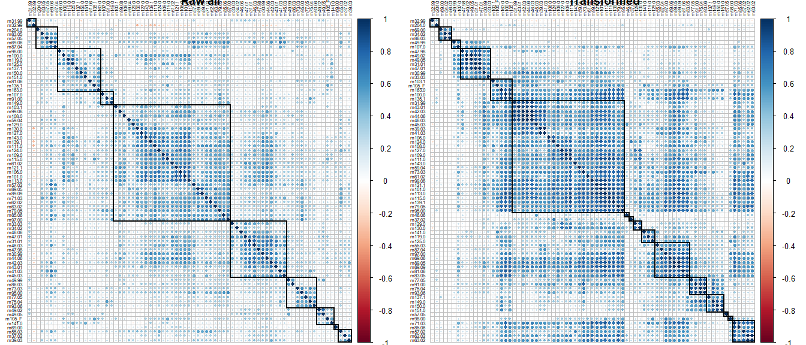

Volatile organic compounds clustering/ordination
================

  - [Data exploration](#data-exploration)
  - [Data transformation](#data-transformation)
  - [Ordination](#ordination)
  - [NMDS](#nmds)
  - [Correlations](#correlations)

The clean RDS data file should be available locally after you run the
`master_cleanup.R` file.This will take the master csv data file and
output the RDS we use here. The data we will be using has no duplicates
and uses a 10% threshold. This threshold establishes the minimum number
of samples that would show a given compound for that compound to be
included in the analysis.

## Data exploration

We know we are working with very small numbers and this influences how
we will manage the data and what sort of clustering we can do for it.
With a quick check, we see that the numbers are very small and that
different compounds have very different ranges as well.  
<!-- -->

We also know that there are a significant number of zeros in the data,
and if we visualize it without the zeroes, it can give us some insight
regarding the abundant compounds which we are actually interested in.
However, when you compare these two figures, they don’t seem too
different

<!-- -->

We might want to get a hint of what the data looks like for males and
females and how these might differ by family.

<!-- -->

<!-- -->

## Data transformation

With these figures it is very clear that the compounds are at different
scales, so we might want to log transform them and check the result, to
compare with the first figure. I have chosen not to include the zeroes
here since log10(0) = -inf. This actually makes it easy to see that
there are some outliers that should probably just be considered a zero.
It is pretty clear that most of the compounds we are interested in are
in a range.

<!-- -->

With the information, we can clean the data again and remove these
outliers.
<!-- -->

<!-- --> Ok,
this is good\! and now we have a better idea of the data and how we can
work with it for any ordination type of analysis. I am thinking that we
can log transform the data, and add a really small value, a couple of
orders of magnitude from the minimum value in the data set. Once it is
in a log scale we can shift the values so that they are not negative but
are on the positive side of the spectrum. This is not taking the
absolute value but shifting with a sum so that the biggest values
correspond to the largest concentrations of the compounds and smaller
values correspond to smaller concentrations. If we were to take the
absolute value this concept would be inverse and less intuitive. The
following histograms are examples of these transformations using the
data for compound
    **m87.04**

    ## [1] 0.00000e+00 0.00000e+00 0.00000e+00 2.04956e-09 1.30857e-08 2.25496e-08

    ## Warning: Removed 3 rows containing non-finite values (stat_bin).

<!-- -->

## Ordination

We will start with a PCA, since the goal of that is to reduce the number
of dimensions and see what compounds might be acting in a similar way.
The hulls show something we were able to see before, and it’s that the
males and females overlap on their volatile profiles.

This is how the transformed data looks now.

<!-- -->

<!-- -->

We can try running a detrended correspondence analysis, but it shows
pretty much a similar trend on how the volatiles show up together. It
seems to have some influence with their mass, which is kind of
intuitive.

<!-- -->

## NMDS

We can try an NMDS following the process Leslie had done in the past,
which still doesn’t show convergence.

    ## Wisconsin double standardization
    ## Run 0 stress 0.1117267 
    ## Run 1 stress 0.1223089 
    ## Run 2 stress 0.4184264 
    ## Run 3 stress 0.1205834 
    ## Run 4 stress 0.1182784 
    ## Run 5 stress 0.1238578 
    ## Run 6 stress 0.123495 
    ## Run 7 stress 0.1250602 
    ## Run 8 stress 0.1241651 
    ## Run 9 stress 0.1252151 
    ## Run 10 stress 0.1229182 
    ## Run 11 stress 0.1257116 
    ## Run 12 stress 0.1250563 
    ## Run 13 stress 0.1185858 
    ## Run 14 stress 0.4185372 
    ## Run 15 stress 0.1228607 
    ## Run 16 stress 0.1210912 
    ## Run 17 stress 0.124908 
    ## Run 18 stress 0.1198849 
    ## Run 19 stress 0.1181746 
    ## Run 20 stress 0.1279723 
    ## *** No convergence -- monoMDS stopping criteria:
    ##      3: no. of iterations >= maxit
    ##     17: stress ratio > sratmax

<!-- -->

The hulls by sex

<!-- -->

## Correlations

For all of them
<!-- -->

For males
<!-- -->

For females
<!-- -->
