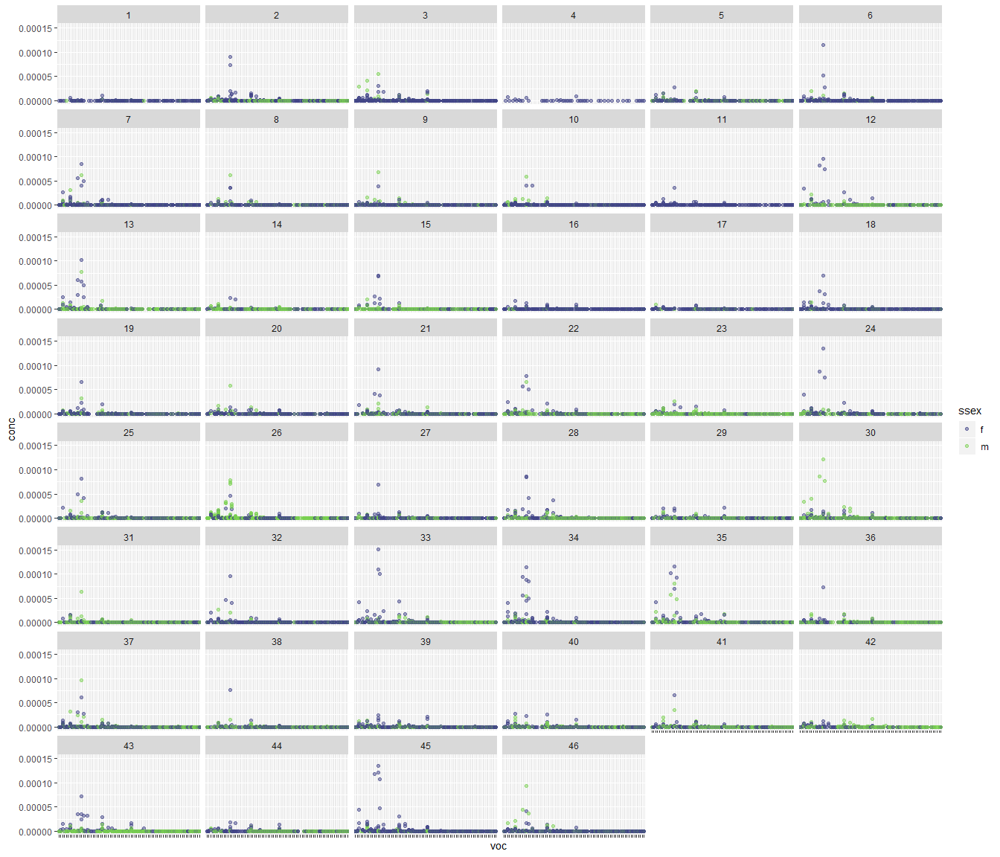

Volatile organic compounds clustering/ordination
================

The clean RDS data file should be available locally after you run the
`master_cleanup.R` file.This will take the master csv data file and
output the RDS we use here. The data we will be using has no duplicates
and uses a 10% threshold. This threshold establishes the minimum number
of samples that would show a given compound for that compound to be
included in the analysis.

## Data exploration

We know we are working with very small numbers and this influences how
we will manage the data and what sort of clustering we can do for it.
With a quick check, we see that the numbers are very small and that
different compounds have very different ranges as well.  
<!-- -->

We also know that there are a significant number of zeros in the data,
and if we visualize it without the zeroes, it can give us some insight
regarding the abundant compounds which we are actually interested in.

<!-- -->

We might want to get a hint of what the data looks like for males and
females and how these might differ by family.

<!-- -->

<!-- -->

With these figures it is very clear that the compounds are at different
scales, so we might want to log transform them and check the result, to
compare with the first figure. I have chosen not to include the zeroes
here since log10(0) = -inf. This actually makes it easy to see that
there are some outliers that should probably just be considered a zero.
It is pretty clear that most of the compounds we are interested in are
in the range of

<!-- -->

I am thinking that we can log transform the data, and add a really small
value, a couple of orders of magnitude from the minimum value in the
data set. Once it is in a log scale we can shift the values so that they
are not negative but are on the positive side of the spectrum. This is
not taking the absolute value but shifting with a sum so that the
biggest values correspond to the largest concentrations of the compounds
and smaller values correspond to smaller concentrations. If we were to
take the absolute value this concept would be inverse and less
intuitive.
