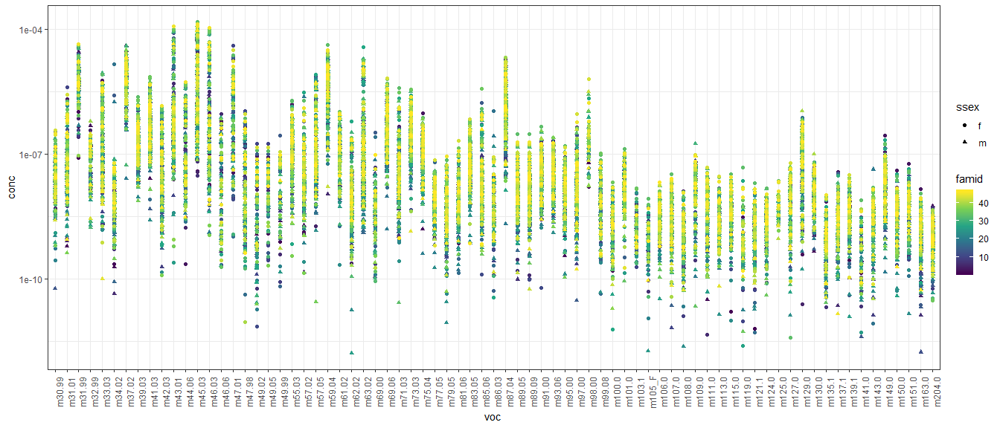
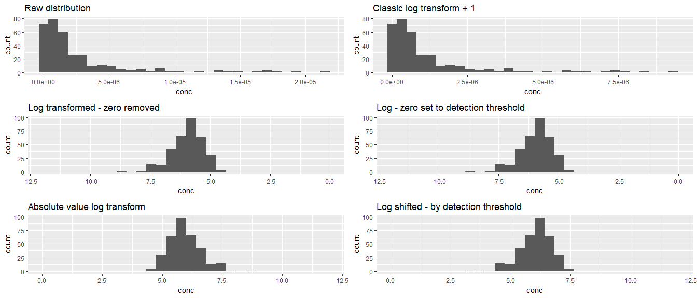
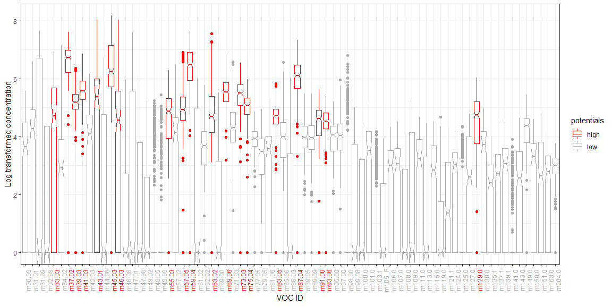
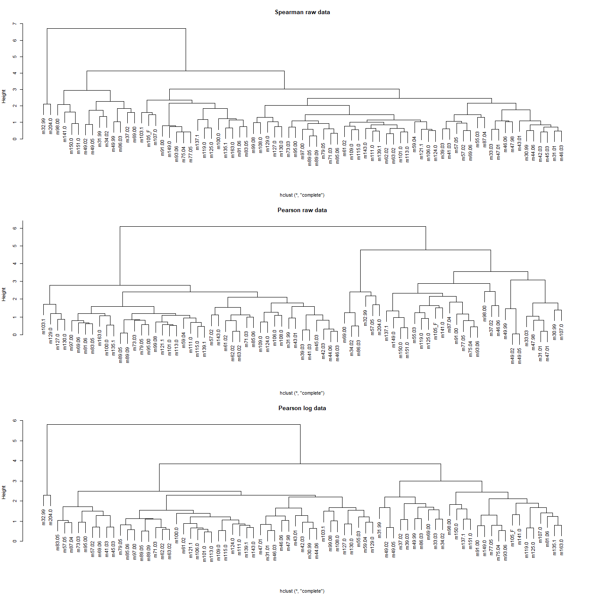

Volatile organic compounds clustering/ordination
================

  - [Data exploration](#data-exploration)
  - [Log data](#log-data)
  - [Data transformation](#data-transformation)
      - [Ordination](#ordination)
      - [NMDS](#nmds)
      - [Correlations](#correlations)
  - [Clustering](#clustering)

The clean RDS data file should be available locally after you run the
`master_cleanup.R` file.This will take the master csv data file and
output the RDS we use here. The data we will be using has no duplicates
and uses a 10% threshold. This threshold establishes the minimum number
of samples that would show a given compound for that compound to be
included in the analysis. The reason why we don’t use a higher threshold
is that since we are comparing males and females, we basically assume
there’s only a 50% chance of a given volatile to be present.

## Data exploration

We know we are working with very small numbers and this influences how
we will manage the data and what sort of clustering we can do for it.
With a quick check, we see that the numbers are very small and that
different compounds have very different ranges as well.  
<!-- -->

Several of these compounds have a measure of zero, which kind of throws
off the scaling and transformations:

<!-- -->

We might want to get a hint of what the data looks like for males and
females and how these might differ by family. Which, overall it seems
like data between males and females isn’t too different, but seems like
differences between families might be a thing.

<!-- -->

<!-- -->

## Log data

With these figures it is very clear that the compounds are at different
scales, so we might want to log transform them and check the result, to
compare with the first figure. I have chosen not to include the zeroes
here since log10(0) = -inf. This actually makes it easy to see that
there are some outliers that should probably just be considered a zero.
It is pretty clear that most of the compounds we are interested in are
in a range.

<!-- -->

With the information, we can clean the data again and remove these
outliers.
<!-- -->

<!-- --> Ok,
this is good\! and now we have a better idea of the data and how we can
work with it for any ordination type of analysis.

# Data transformation

I am thinking that we can log transform the data, and add a really small
value, probably set to the detection threshold of the instrument. Once
it is in a log scale we can shift the values so that they are not
negative but are on the positive side of the spectrum. This is not
taking the absolute value but shifting with a sum so that the biggest
values correspond to the largest concentrations of the compounds and
smaller values correspond to smaller concentrations. If we were to take
the absolute value this concept would be inverse and less intuitive. The
following histograms are examples of these transformations using the
data for compound
    **m87.04**

    ## [1] 0.00000e+00 0.00000e+00 0.00000e+00 2.04956e-09 1.30857e-08 2.25496e-08

    ## Warning: Removed 3 rows containing non-finite values (stat_bin).

    ## Warning: Removed 2 rows containing missing values (geom_bar).
    
    ## Warning: Removed 2 rows containing missing values (geom_bar).
    
    ## Warning: Removed 2 rows containing missing values (geom_bar).
    
    ## Warning: Removed 2 rows containing missing values (geom_bar).

<!-- -->

This is how the transformed data looks now. Zeroes really screw
everything up. I’m wondering if we need to think of using rank-based
estimators for the correlations, this way the zeros wouldn’t affect it
so much. We might look into Spearman correlation or Kendall’s tau

<!-- -->

## Ordination

We will start with a PCA, since the goal of that is to reduce the number
of dimensions and see what compounds might be acting in a similar way.
The hulls show something we were able to see before, and it’s that the
males and females overlap on their volatile profiles.

<!-- -->

We can try running a detrended correspondence analysis, which seems to
show a bit more separation between compounds and perhaps some sort of
grouping. But remember that this is doing the ordination by considering
each sample.

<!-- -->

## NMDS

We can try an NMDS following the process Leslie had done in the past,
which still doesn’t show convergence. However, we can see that again,
that the sexes very much overlap. If we do this by family they overlap
as well.

    ## Run 0 stress 0.1517006 
    ## Run 1 stress 0.1669731 
    ## Run 2 stress 0.161971 
    ## Run 3 stress 0.1564156 
    ## Run 4 stress 0.1685735 
    ## Run 5 stress 0.1601002 
    ## Run 6 stress 0.1689283 
    ## Run 7 stress 0.1648361 
    ## Run 8 stress 0.1654474 
    ## Run 9 stress 0.1617609 
    ## Run 10 stress 0.1668672 
    ## Run 11 stress 0.1665423 
    ## Run 12 stress 0.1617102 
    ## Run 13 stress 0.1693507 
    ## Run 14 stress 0.1590808 
    ## Run 15 stress 0.1776819 
    ## Run 16 stress 0.1733823 
    ## Run 17 stress 0.1712307 
    ## Run 18 stress 0.1642263 
    ## Run 19 stress 0.1719256 
    ## Run 20 stress 0.1650716 
    ## *** No convergence -- monoMDS stopping criteria:
    ##      1: no. of iterations >= maxit
    ##     18: stress ratio > sratmax
    ##      1: scale factor of the gradient < sfgrmin

<!-- -->

## Correlations

These correlation matrices are using all of the data, not separated by
sexes. We can see that using the rank-based correlation, the values are
not affected by the transformation. These correlation matrices are
clustered by the correlation coefficients. Based on this, I would rather
use a Spearman correlation on the raw data to determine the clustering
groups. Based on those clustering groups we can combine them and create
a new data frame with the raw data that we can later transform using the
same log-shift tranformation.

<!-- -->

# Clustering

Enough of visualizing things. So now let’s get some clustering going so
we can determine what groups can go together. A question with this is
the effect of a transformation on the data and the clustering. And with
that, also considering whether we want to take a weighted average of the
raw data or the transformed data for each cluster.

We could compare the clusters by the spearman vs pearson correlation
coefficients.

<!-- -->

We can set the number of clusters, but I don’t have any good reasoning
for this number yet. But this is how those three methods are clustering
the volatiles based on their distance matrices. The visualization is not
great and not very intuitive, but overall, I am inclined to use the
spearman clustering on raw data to calculate the grouped voc data frame.

<!-- -->
