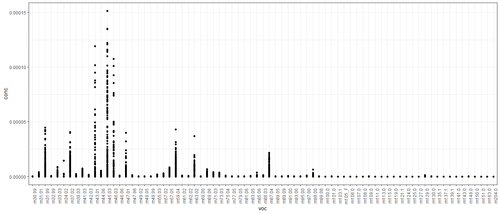
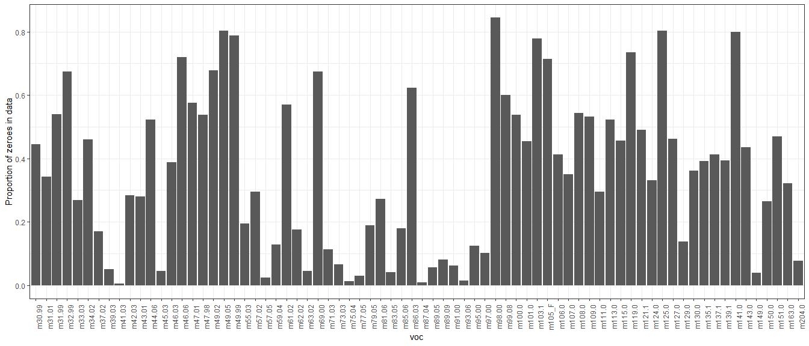

Volatile organic compounds clustering/ordination
================

The clean RDS data file should be available locally after you run the
`master_cleanup.R` file.This will take the master csv data file and
output the RDS we use here. The data we will be using has no duplicates
and uses a 10% threshold. This threshold establishes the minimum number
of samples that would show a given compound for that compound to be
included in the analysis.

## Data exploration

We know we are working with very small numbers and this influences how
we will manage the data and what sort of clustering we can do for it.
With a quick check, we see that the numbers are very small and that
different compounds have very different ranges as well.  
<!-- -->

<!-- -->

I am thinking that we can log transform the data, and add a really small
value, a couple of orders of magnitude from the minimum value in the
data set. Once it is in a log scale we can shift the values so that they
are not negative but are on the positive side of the spectrum.
