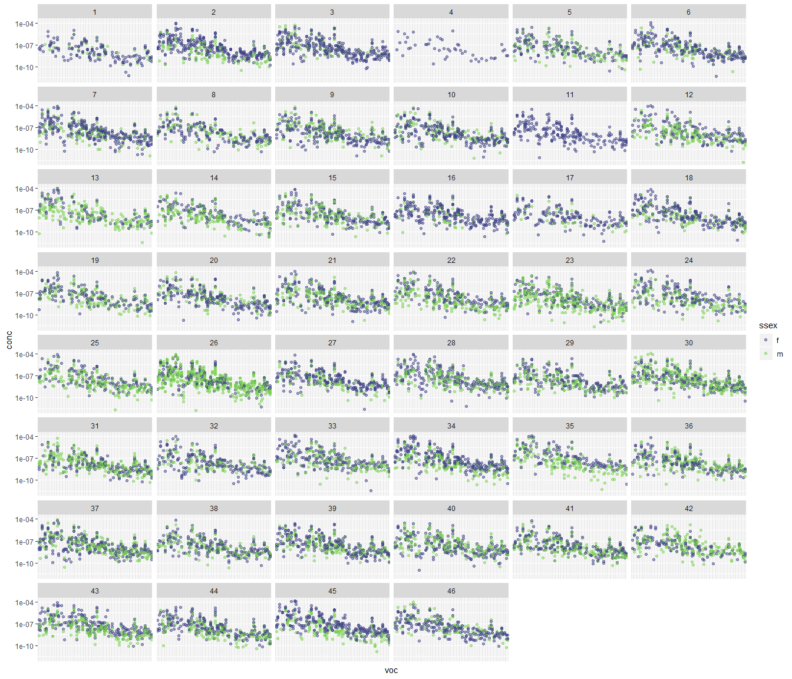

Volatile organic compounds clustering/ordination
================

  - [Data exploration](#data-exploration)
  - [Data transformation](#data-transformation)
  - [Ordination](#ordination)
  - [NMDS](#nmds)
  - [Correlations](#correlations)

The clean RDS data file should be available locally after you run the
`master_cleanup.R` file.This will take the master csv data file and
output the RDS we use here. The data we will be using has no duplicates
and uses a 10% threshold. This threshold establishes the minimum number
of samples that would show a given compound for that compound to be
included in the analysis. The reason why we don’t use a higher threshold
is that since we are comparing males and females, we basically assume
there’s only a 50% chance of a given volatile to be present.

## Data exploration

We know we are working with very small numbers and this influences how
we will manage the data and what sort of clustering we can do for it.
With a quick check, we see that the numbers are very small and that
different compounds have very different ranges as well.  
<!-- -->

Several of these compounds have a measure of zero, which kind of throws
off the scaling and transformations:

<!-- -->

We might want to get a hint of what the data looks like for males and
females and how these might differ by family. Which, overall it seems
like data between males and females isn’t too different, but seems like
differences between families might be a thing.

<!-- -->

 <i> Facet Plots </i>

<!-- --> 

## Data transformation

With these figures it is very clear that the compounds are at different
scales, so we might want to log transform them and check the result, to
compare with the first figure. I have chosen not to include the zeroes
here since log10(0) = -inf. This actually makes it easy to see that
there are some outliers that should probably just be considered a zero.
It is pretty clear that most of the compounds we are interested in are
in a range.

<!-- -->

With the information, we can clean the data again and remove these
outliers.
<!-- -->

<!-- --> Ok,
this is good\! and now we have a better idea of the data and how we can
work with it for any ordination type of analysis. I am thinking that we
can log transform the data, and add a really small value, a couple of
orders of magnitude from the minimum value in the data set. Once it is
in a log scale we can shift the values so that they are not negative but
are on the positive side of the spectrum. This is not taking the
absolute value but shifting with a sum so that the biggest values
correspond to the largest concentrations of the compounds and smaller
values correspond to smaller concentrations. If we were to take the
absolute value this concept would be inverse and less intuitive. The
following histograms are examples of these transformations using the
data for compound
    **m87.04**

    ## [1] 0.00000e+00 0.00000e+00 0.00000e+00 2.04956e-09 1.30857e-08 2.25496e-08

    ## Warning: Removed 3 rows containing non-finite values (stat_bin).

<!-- -->

## Ordination

We will start with a PCA, since the goal of that is to reduce the number
of dimensions and see what compounds might be acting in a similar way.
The hulls show something we were able to see before, and it’s that the
males and females overlap on their volatile profiles.

This is how the transformed data looks now.

<!-- -->

<!-- -->

We can try running a detrended correspondence analysis, but it shows
pretty much a similar trend on how the volatiles show up together. It
seems to have some influence with their mass, which is kind of
intuitive.

<!-- -->

## NMDS

We can try an NMDS following the process Leslie had done in the past,
which still doesn’t show convergence.

    ## Wisconsin double standardization
    ## Run 0 stress 0.1115093 
    ## Run 1 stress 0.1196349 
    ## Run 2 stress 0.1198012 
    ## Run 3 stress 0.1267598 
    ## Run 4 stress 0.1186576 
    ## Run 5 stress 0.1216793 
    ## Run 6 stress 0.1256203 
    ## Run 7 stress 0.1234117 
    ## Run 8 stress 0.1192148 
    ## Run 9 stress 0.1177543 
    ## Run 10 stress 0.1289244 
    ## Run 11 stress 0.1271547 
    ## Run 12 stress 0.12603 
    ## Run 13 stress 0.1194855 
    ## Run 14 stress 0.1250388 
    ## Run 15 stress 0.1259852 
    ## Run 16 stress 0.1200902 
    ## Run 17 stress 0.1279017 
    ## Run 18 stress 0.1201084 
    ## Run 19 stress 0.1267098 
    ## Run 20 stress 0.1198467 
    ## *** No convergence -- monoMDS stopping criteria:
    ##      1: no. of iterations >= maxit
    ##     19: stress ratio > sratmax

<!-- -->

The hulls by sex

<!-- -->

## Correlations

These side by side correlations are donw for all of them, then by sex.
The first panel will show the correlations organized by mass, whereas
the second panel will use a clustering algorithm. The first set of
correlation matrices is using the transformed data.
<!-- --><!-- --><!-- -->

This next set of correlation matrices is using the raw data, without any
transformation
<!-- --><!-- --><!-- -->

We can tell there are some compounds that can be grouped, this compares
the transformed data and the original raw data
<!-- -->

Comparing these two correlation matrices is equivalent to comparing
these two datasets:

<!-- -->

Enough of visualizing things. So now let’s get some clustering going so
we can determine what groups can go together. A question with this is
the effect of a transformation on the data and the clustering. And with
that, also considering whether we want to take a weighted average of the
raw data or the transformed data for each cluster. I would suggest
taking the weighted average of the raw data, and with this is probably
following the cluster analysis on raw data. The reasoning behind this is
that if we take a weighted average we would be going around the issue of
having zeroes. They would just get mixed into the averaging process. On
the other hand, if some clusters have only 2 or 3 compounds, a zero
would have a big effect on the output, but then again, that’s why we
would be doing weighted averages.

After giving it a little more thought, maybe we want to consider the
transformed data instead. If you focus on the cluster from the
visualization, it seems like the big cluster from the raw data might
just be those compounds that have really small concentrations. So then,
these clusters are really just based on the concentrations, so obviously
the ones that have super low concentrations might group together. By
transforming the data is like we have all the compounds on a similar
scale and we can actually compare them to each other and have
correlations that make sense on a unified scale.

<!-- -->

It seems like that is clustering the samples, not the volatiles. So
maybe the focus is with correlation matrix and then calculate the
distance

<!-- -->

Now, I need to use the clusters given in the dendrogram to group the
volatiles and calculate weighted averages for each sample.
