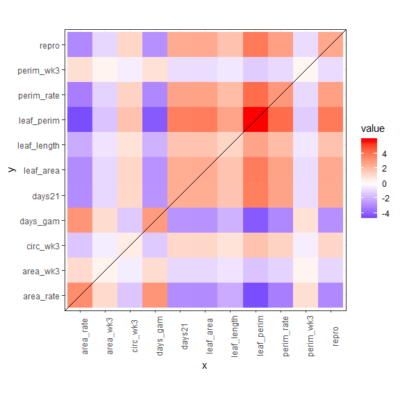
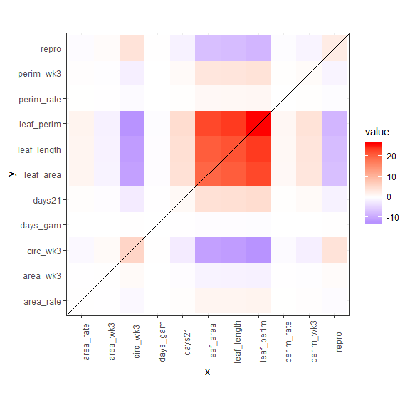
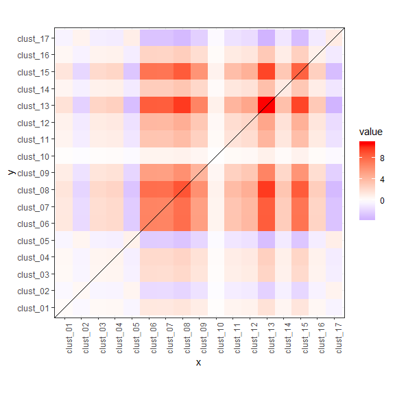
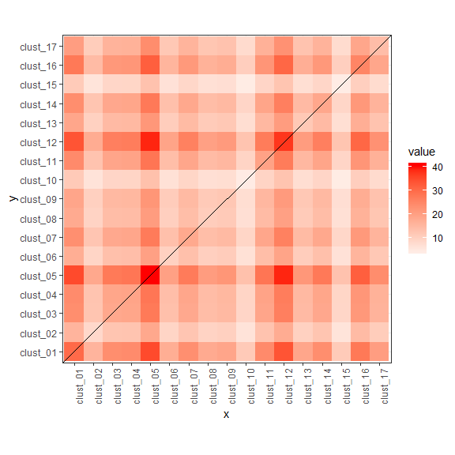
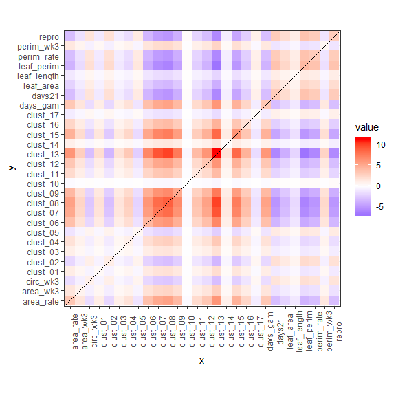
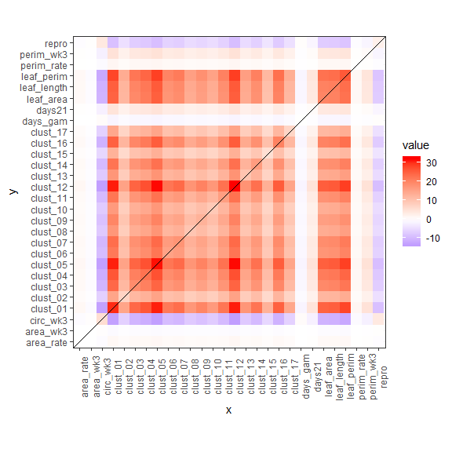
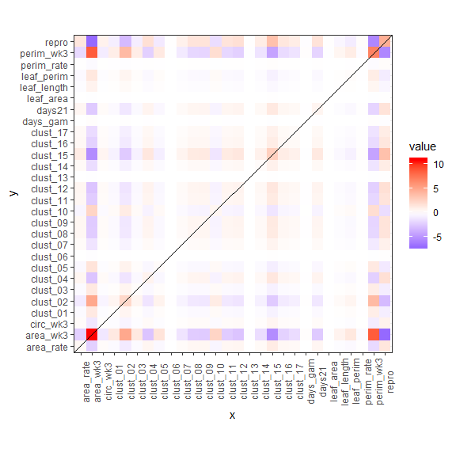

Not sure yet: manovas, correlations, G matrix stuff
================

  - [MANOVA](#manova)
      - [Traits](#traits)
      - [VOCs](#vocs)
      - [Can you do both?](#can-you-do-both)

``` r
library(tidyverse)
library(vegan)
library(corrplot)
library(ggpubr)
library(Hmisc)

theme_set(theme_bw())
```

``` r
master <- readRDS("cleandata/clean_master.RDS")
```

# MANOVA

## Traits

``` r
traits <- master[,c(1,3, 5:15)] %>% 
  drop_na()
traits.manova <- manova(cbind(repro, area_wk3, perim_wk3, circ_wk3, perim_rate, area_rate, days21, days_gam, leaf_length, leaf_area, leaf_perim) ~ famid + ssex + famid:ssex, data = traits)

sum.manova <- summary(traits.manova)
sum.manova
```

    ##             Df   Pillai approx F num Df den Df    Pr(>F)    
    ## famid        1 0.080123   2.0667     11    261   0.02309 *  
    ## ssex         1 0.139328   3.8410     11    261 3.833e-05 ***
    ## famid:ssex   1 0.085278   2.2121     11    261   0.01424 *  
    ## Residuals  271                                              
    ## ---
    ## Signif. codes:  0 '***' 0.001 '**' 0.01 '*' 0.05 '.' 0.1 ' ' 1

Which ones?

``` r
summary.aov(traits.manova)
```

    ##  Response repro :
    ##              Df  Sum Sq Mean Sq F value  Pr(>F)  
    ## famid         1   2.593  2.5927  2.4906 0.11569  
    ## ssex          1   2.590  2.5898  2.4879 0.11589  
    ## famid:ssex    1   4.086  4.0863  3.9254 0.04857 *
    ## Residuals   271 282.103  1.0410                  
    ## ---
    ## Signif. codes:  0 '***' 0.001 '**' 0.01 '*' 0.05 '.' 0.1 ' ' 1
    ## 
    ##  Response area_wk3 :
    ##              Df  Sum Sq Mean Sq F value    Pr(>F)    
    ## famid         1   0.373  0.3725  0.3977 0.5288101    
    ## ssex          1   0.094  0.0937  0.1000 0.7520190    
    ## famid:ssex    1  12.713 12.7125 13.5709 0.0002773 ***
    ## Residuals   271 253.859  0.9367                      
    ## ---
    ## Signif. codes:  0 '***' 0.001 '**' 0.01 '*' 0.05 '.' 0.1 ' ' 1
    ## 
    ##  Response perim_wk3 :
    ##              Df  Sum Sq Mean Sq F value   Pr(>F)   
    ## famid         1   0.276  0.2762  0.2791 0.597727   
    ## ssex          1   0.580  0.5800  0.5862 0.444577   
    ## famid:ssex    1   7.922  7.9216  8.0052 0.005013 **
    ## Residuals   271 268.170  0.9896                    
    ## ---
    ## Signif. codes:  0 '***' 0.001 '**' 0.01 '*' 0.05 '.' 0.1 ' ' 1
    ## 
    ##  Response circ_wk3 :
    ##              Df  Sum Sq Mean Sq F value  Pr(>F)  
    ## famid         1   0.582  0.5816  0.6118 0.43481  
    ## ssex          1   5.713  5.7128  6.0088 0.01487 *
    ## famid:ssex    1   0.198  0.1981  0.2084 0.64839  
    ## Residuals   271 257.652  0.9507                  
    ## ---
    ## Signif. codes:  0 '***' 0.001 '**' 0.01 '*' 0.05 '.' 0.1 ' ' 1
    ## 
    ##  Response perim_rate :
    ##              Df  Sum Sq Mean Sq F value  Pr(>F)  
    ## famid         1   3.052 3.05202  2.9053 0.08944 .
    ## ssex          1   0.043 0.04345  0.0414 0.83900  
    ## famid:ssex    1   0.005 0.00474  0.0045 0.94647  
    ## Residuals   271 284.687 1.05051                  
    ## ---
    ## Signif. codes:  0 '***' 0.001 '**' 0.01 '*' 0.05 '.' 0.1 ' ' 1
    ## 
    ##  Response area_rate :
    ##              Df  Sum Sq Mean Sq F value  Pr(>F)  
    ## famid         1   3.347  3.3473  3.4598 0.06396 .
    ## ssex          1   0.094  0.0941  0.0972 0.75540  
    ## famid:ssex    1   0.350  0.3499  0.3616 0.54811  
    ## Residuals   271 262.189  0.9675                  
    ## ---
    ## Signif. codes:  0 '***' 0.001 '**' 0.01 '*' 0.05 '.' 0.1 ' ' 1
    ## 
    ##  Response days21 :
    ##              Df  Sum Sq Mean Sq F value Pr(>F)
    ## famid         1   2.426 2.42584  2.4546 0.1183
    ## ssex          1   0.852 0.85220  0.8623 0.3539
    ## famid:ssex    1   0.701 0.70125  0.7096 0.4003
    ## Residuals   271 267.822 0.98827               
    ## 
    ##  Response days_gam :
    ##              Df  Sum Sq Mean Sq F value  Pr(>F)  
    ## famid         1   2.921 2.92120  2.9238 0.08843 .
    ## ssex          1   0.004 0.00391  0.0039 0.95018  
    ## famid:ssex    1   0.003 0.00255  0.0026 0.95972  
    ## Residuals   271 270.760 0.99912                  
    ## ---
    ## Signif. codes:  0 '***' 0.001 '**' 0.01 '*' 0.05 '.' 0.1 ' ' 1
    ## 
    ##  Response leaf_length :
    ##              Df  Sum Sq Mean Sq F value    Pr(>F)    
    ## famid         1   1.274  1.2735  1.4275    0.2332    
    ## ssex          1  21.698 21.6977 24.3216 1.423e-06 ***
    ## famid:ssex    1   0.686  0.6863  0.7693    0.3812    
    ## Residuals   271 241.764  0.8921                      
    ## ---
    ## Signif. codes:  0 '***' 0.001 '**' 0.01 '*' 0.05 '.' 0.1 ' ' 1
    ## 
    ##  Response leaf_area :
    ##              Df  Sum Sq Mean Sq F value    Pr(>F)    
    ## famid         1   2.468  2.4678  2.5408    0.1121    
    ## ssex          1  19.746 19.7457 20.3302 9.709e-06 ***
    ## famid:ssex    1   0.239  0.2385  0.2456    0.6206    
    ## Residuals   271 263.209  0.9713                      
    ## ---
    ## Signif. codes:  0 '***' 0.001 '**' 0.01 '*' 0.05 '.' 0.1 ' ' 1
    ## 
    ##  Response leaf_perim :
    ##              Df  Sum Sq Mean Sq F value    Pr(>F)    
    ## famid         1   5.741  5.7410  6.6484   0.01045 *  
    ## ssex          1  26.139 26.1395 30.2710 8.698e-08 ***
    ## famid:ssex    1   0.667  0.6674  0.7728   0.38012    
    ## Residuals   271 234.013  0.8635                      
    ## ---
    ## Signif. codes:  0 '***' 0.001 '**' 0.01 '*' 0.05 '.' 0.1 ' ' 1

Visualize H matrix

``` r
h.mat <- sum.manova$SS[1]$famid

h.mat %>% 
  as.data.frame() %>% 
  rownames_to_column(var = "x") %>% 
  gather(key = "y", value = "value", -x) %>% 
  ggplot(aes(x = x, y = y, fill = value)) +
  geom_tile() +
  scale_fill_gradient2(low = "#0000FF", mid = "#FFFFFF", high ="#FF0000")+
  theme(axis.text.x = element_text(angle = 90)) +
  coord_equal() +
  geom_abline(slope = 1)
```

<!-- -->

Visualize E matrix

``` r
e.mat <- sum.manova$SS[2]$ssex

e.mat %>% 
  as.data.frame() %>% 
  rownames_to_column(var = "x") %>% 
  gather(key = "y", value = "value", -x) %>% 
  ggplot(aes(x = x, y = y, fill = value)) +
  geom_tile() +
  scale_fill_gradient2(low = "#0000FF", mid = "#FFFFFF", high ="#FF0000")+
  theme(axis.text.x = element_text(angle = 90)) +
  coord_equal()+
  geom_abline(slope = 1)
```

<!-- -->

## VOCs

``` r
vocs <- master[,c(1,3, 16:32)] %>% 
  drop_na()

vocs.manova <- manova(cbind(clust_01, clust_02, clust_03, clust_04,
                            clust_05, clust_06, clust_07, clust_08,
                            clust_09, clust_10, clust_11, clust_12,
                            clust_13, clust_14, clust_15, clust_16,
                            clust_17) ~ famid + ssex + famid:ssex, data = vocs)

sum.vocs.manova <- summary(vocs.manova)
sum.vocs.manova
```

    ##             Df  Pillai approx F num Df den Df    Pr(>F)    
    ## famid        1 0.13553   2.9051     17    315  0.000124 ***
    ## ssex         1 0.36451  10.6283     17    315 < 2.2e-16 ***
    ## famid:ssex   1 0.05939   1.1700     17    315  0.287615    
    ## Residuals  331                                             
    ## ---
    ## Signif. codes:  0 '***' 0.001 '**' 0.01 '*' 0.05 '.' 0.1 ' ' 1

Which ones?

``` r
summary.aov(vocs.manova)
```

    ##  Response clust_01 :
    ##              Df  Sum Sq Mean Sq F value    Pr(>F)    
    ## famid         1   0.251  0.2513  0.4561    0.4999    
    ## ssex          1  30.230 30.2300 54.8797 1.075e-12 ***
    ## famid:ssex    1   0.268  0.2676  0.4858    0.4863    
    ## Residuals   331 182.328  0.5508                      
    ## ---
    ## Signif. codes:  0 '***' 0.001 '**' 0.01 '*' 0.05 '.' 0.1 ' ' 1
    ## 
    ##  Response clust_02 :
    ##              Df  Sum Sq Mean Sq F value    Pr(>F)    
    ## famid         1   0.411  0.4111  0.5539 0.4572722    
    ## ssex          1   8.310  8.3096 11.1956 0.0009142 ***
    ## famid:ssex    1   1.173  1.1732  1.5807 0.2095527    
    ## Residuals   331 245.676  0.7422                      
    ## ---
    ## Signif. codes:  0 '***' 0.001 '**' 0.01 '*' 0.05 '.' 0.1 ' ' 1
    ## 
    ##  Response clust_03 :
    ##              Df  Sum Sq Mean Sq F value    Pr(>F)    
    ## famid         1   0.529  0.5293  0.7832    0.3768    
    ## ssex          1  18.511 18.5107 27.3902 2.959e-07 ***
    ## famid:ssex    1   0.160  0.1602  0.2371    0.6267    
    ## Residuals   331 223.695  0.6758                      
    ## ---
    ## Signif. codes:  0 '***' 0.001 '**' 0.01 '*' 0.05 '.' 0.1 ' ' 1
    ## 
    ##  Response clust_04 :
    ##              Df  Sum Sq Mean Sq F value    Pr(>F)    
    ## famid         1   0.648  0.6480  0.8830    0.3481    
    ## ssex          1  19.281 19.2809 26.2754 5.045e-07 ***
    ## famid:ssex    1   0.286  0.2864  0.3904    0.5325    
    ## Residuals   331 242.887  0.7338                      
    ## ---
    ## Signif. codes:  0 '***' 0.001 '**' 0.01 '*' 0.05 '.' 0.1 ' ' 1
    ## 
    ##  Response clust_05 :
    ##              Df  Sum Sq Mean Sq F value Pr(>F)    
    ## famid         1   0.820   0.820  1.7166 0.1910    
    ## ssex          1  40.835  40.835 85.4899 <2e-16 ***
    ## famid:ssex    1   0.117   0.117  0.2442 0.6215    
    ## Residuals   331 158.105   0.478                   
    ## ---
    ## Signif. codes:  0 '***' 0.001 '**' 0.01 '*' 0.05 '.' 0.1 ' ' 1
    ## 
    ##  Response clust_06 :
    ##              Df  Sum Sq Mean Sq F value   Pr(>F)    
    ## famid         1   6.810  6.8099  9.1669 0.002658 ** 
    ## ssex          1   9.839  9.8390 13.2445 0.000317 ***
    ## famid:ssex    1   0.555  0.5550  0.7471 0.388014    
    ## Residuals   331 245.891  0.7429                     
    ## ---
    ## Signif. codes:  0 '***' 0.001 '**' 0.01 '*' 0.05 '.' 0.1 ' ' 1
    ## 
    ##  Response clust_07 :
    ##              Df  Sum Sq Mean Sq F value    Pr(>F)    
    ## famid         1   6.701  6.7005 11.8475 0.0006514 ***
    ## ssex          1  18.201 18.2015 32.1831 3.063e-08 ***
    ## famid:ssex    1   0.245  0.2452  0.4335 0.5107100    
    ## Residuals   331 187.201  0.5656                      
    ## ---
    ## Signif. codes:  0 '***' 0.001 '**' 0.01 '*' 0.05 '.' 0.1 ' ' 1
    ## 
    ##  Response clust_08 :
    ##              Df  Sum Sq Mean Sq F value    Pr(>F)    
    ## famid         1   8.918  8.9184 16.4839 6.129e-05 ***
    ## ssex          1  10.674 10.6743 19.7294 1.218e-05 ***
    ## famid:ssex    1   0.626  0.6257  1.1565     0.283    
    ## Residuals   331 179.083  0.5410                      
    ## ---
    ## Signif. codes:  0 '***' 0.001 '**' 0.01 '*' 0.05 '.' 0.1 ' ' 1
    ## 
    ##  Response clust_09 :
    ##              Df  Sum Sq Mean Sq F value    Pr(>F)    
    ## famid         1   4.201  4.2007  6.7213  0.009949 ** 
    ## ssex          1  11.967 11.9673 19.1484 1.623e-05 ***
    ## famid:ssex    1   0.208  0.2078  0.3325  0.564566    
    ## Residuals   331 206.867  0.6250                      
    ## ---
    ## Signif. codes:  0 '***' 0.001 '**' 0.01 '*' 0.05 '.' 0.1 ' ' 1
    ## 
    ##  Response clust_10 :
    ##              Df Sum Sq Mean Sq F value  Pr(>F)  
    ## famid         1   0.06  0.0612  0.0620 0.80350  
    ## ssex          1   4.29  4.2852  4.3419 0.03795 *
    ## famid:ssex    1   2.97  2.9745  3.0138 0.08349 .
    ## Residuals   331 326.68  0.9869                  
    ## ---
    ## Signif. codes:  0 '***' 0.001 '**' 0.01 '*' 0.05 '.' 0.1 ' ' 1
    ## 
    ##  Response clust_11 :
    ##              Df  Sum Sq Mean Sq F value    Pr(>F)    
    ## famid         1   1.580  1.5801  2.9935   0.08453 .  
    ## ssex          1  19.566 19.5657 37.0669 3.161e-09 ***
    ## famid:ssex    1   0.910  0.9096  1.7232   0.19019    
    ## Residuals   331 174.718  0.5278                      
    ## ---
    ## Signif. codes:  0 '***' 0.001 '**' 0.01 '*' 0.05 '.' 0.1 ' ' 1
    ## 
    ##  Response clust_12 :
    ##              Df  Sum Sq Mean Sq F value    Pr(>F)    
    ## famid         1   2.300   2.300  3.8942   0.04928 *  
    ## ssex          1  37.602  37.602 63.6561 2.447e-14 ***
    ## famid:ssex    1   1.600   1.600  2.7086   0.10076    
    ## Residuals   331 195.526   0.591                      
    ## ---
    ## Signif. codes:  0 '***' 0.001 '**' 0.01 '*' 0.05 '.' 0.1 ' ' 1
    ## 
    ##  Response clust_13 :
    ##              Df  Sum Sq Mean Sq F value    Pr(>F)    
    ## famid         1  10.772 10.7718 17.6554 3.409e-05 ***
    ## ssex          1  11.604 11.6042 19.0197 1.730e-05 ***
    ## famid:ssex    1   0.187  0.1868  0.3061    0.5804    
    ## Residuals   331 201.948  0.6101                      
    ## ---
    ## Signif. codes:  0 '***' 0.001 '**' 0.01 '*' 0.05 '.' 0.1 ' ' 1
    ## 
    ##  Response clust_14 :
    ##              Df  Sum Sq Mean Sq F value    Pr(>F)    
    ## famid         1   1.166  1.1662  1.7898    0.1819    
    ## ssex          1  18.551 18.5510 28.4717 1.767e-07 ***
    ## famid:ssex    1   0.000  0.0000  0.0000    0.9959    
    ## Residuals   331 215.666  0.6516                      
    ## ---
    ## Signif. codes:  0 '***' 0.001 '**' 0.01 '*' 0.05 '.' 0.1 ' ' 1
    ## 
    ##  Response clust_15 :
    ##              Df  Sum Sq Mean Sq F value  Pr(>F)    
    ## famid         1   8.333  8.3329 11.8223 0.00066 ***
    ## ssex          1   4.089  4.0894  5.8018 0.01656 *  
    ## famid:ssex    1   2.114  2.1141  2.9994 0.08423 .  
    ## Residuals   331 233.304  0.7048                    
    ## ---
    ## Signif. codes:  0 '***' 0.001 '**' 0.01 '*' 0.05 '.' 0.1 ' ' 1
    ## 
    ##  Response clust_16 :
    ##              Df  Sum Sq Mean Sq F value    Pr(>F)    
    ## famid         1   0.850  0.8497  1.2479   0.26477    
    ## ssex          1  25.291 25.2906 37.1421 3.054e-09 ***
    ## famid:ssex    1   2.928  2.9281  4.3003   0.03888 *  
    ## Residuals   331 225.383  0.6809                      
    ## ---
    ## Signif. codes:  0 '***' 0.001 '**' 0.01 '*' 0.05 '.' 0.1 ' ' 1
    ## 
    ##  Response clust_17 :
    ##              Df Sum Sq Mean Sq F value    Pr(>F)    
    ## famid         1   1.12  1.1193  1.1619 0.2818489    
    ## ssex          1  13.99 13.9869 14.5196 0.0001654 ***
    ## famid:ssex    1   0.04  0.0381  0.0395 0.8424895    
    ## Residuals   331 318.86  0.9633                      
    ## ---
    ## Signif. codes:  0 '***' 0.001 '**' 0.01 '*' 0.05 '.' 0.1 ' ' 1

Visualize H matrix

``` r
h.mat <- sum.vocs.manova$SS[1]$famid

h.mat %>% 
  as.data.frame() %>% 
  rownames_to_column(var = "x") %>% 
  gather(key = "y", value = "value", -x) %>% 
  ggplot(aes(x = x, y = y, fill = value)) +
  geom_tile() +
  scale_fill_gradient2(low = "#0000FF", mid = "#FFFFFF", high ="#FF0000")+
  theme(axis.text.x = element_text(angle = 90)) +
  coord_equal() +
  geom_abline(slope = 1)
```

<!-- -->

Visualize E matrix

``` r
e.mat <- sum.vocs.manova$SS[2]$ssex

e.mat %>% 
  as.data.frame() %>% 
  rownames_to_column(var = "x") %>% 
  gather(key = "y", value = "value", -x) %>% 
  ggplot(aes(x = x, y = y, fill = value)) +
  geom_tile() +
  scale_fill_gradient2(low = "#0000FF", mid = "#FFFFFF", high ="#FF0000")+
  theme(axis.text.x = element_text(angle = 90)) +
  coord_equal()+
  geom_abline(slope = 1)
```

<!-- -->

## Can you do both?

``` r
all.manova <- master %>% 
  drop_na()

master.manova <- manova(cbind(repro, area_wk3, perim_wk3, circ_wk3, perim_rate, area_rate, days21, days_gam, leaf_length, leaf_area, leaf_perim, clust_01, clust_02, clust_03, clust_04,clust_05, clust_06, clust_07, clust_08,clust_09, clust_10, clust_11, clust_12,clust_13, clust_14, clust_15, clust_16,clust_17) ~ famid + ssex + famid:ssex, data = all.manova)

sum.master.manova <- summary(master.manova)
sum.master.manova
```

    ##             Df  Pillai approx F num Df den Df    Pr(>F)    
    ## famid        1 0.25011   2.7754     28    233 1.496e-05 ***
    ## ssex         1 0.49181   8.0532     28    233 < 2.2e-16 ***
    ## famid:ssex   1 0.12578   1.1973     28    233    0.2346    
    ## Residuals  260                                             
    ## ---
    ## Signif. codes:  0 '***' 0.001 '**' 0.01 '*' 0.05 '.' 0.1 ' ' 1

Which ones?

``` r
summary.aov(master.manova)
```

    ##  Response repro :
    ##              Df  Sum Sq Mean Sq F value  Pr(>F)  
    ## famid         1   2.982  2.9821  2.8280 0.09384 .
    ## ssex          1   2.488  2.4876  2.3590 0.12577  
    ## famid:ssex    1   4.597  4.5975  4.3598 0.03777 *
    ## Residuals   260 274.172  1.0545                  
    ## ---
    ## Signif. codes:  0 '***' 0.001 '**' 0.01 '*' 0.05 '.' 0.1 ' ' 1
    ## 
    ##  Response area_wk3 :
    ##              Df  Sum Sq Mean Sq F value  Pr(>F)    
    ## famid         1   0.715  0.7150  0.7433 0.38940    
    ## ssex          1   0.015  0.0152  0.0158 0.90017    
    ## famid:ssex    1  10.873 10.8734 11.3034 0.00089 ***
    ## Residuals   260 250.109  0.9620                    
    ## ---
    ## Signif. codes:  0 '***' 0.001 '**' 0.01 '*' 0.05 '.' 0.1 ' ' 1
    ## 
    ##  Response perim_wk3 :
    ##              Df  Sum Sq Mean Sq F value   Pr(>F)   
    ## famid         1   0.568  0.5683  0.5585 0.455560   
    ## ssex          1   0.769  0.7689  0.7555 0.385529   
    ## famid:ssex    1   6.881  6.8806  6.7612 0.009849 **
    ## Residuals   260 264.591  1.0177                    
    ## ---
    ## Signif. codes:  0 '***' 0.001 '**' 0.01 '*' 0.05 '.' 0.1 ' ' 1
    ## 
    ##  Response circ_wk3 :
    ##              Df  Sum Sq Mean Sq F value  Pr(>F)  
    ## famid         1   0.874  0.8736  0.9113 0.34065  
    ## ssex          1   5.547  5.5467  5.7860 0.01685 *
    ## famid:ssex    1   0.116  0.1159  0.1209 0.72836  
    ## Residuals   260 249.244  0.9586                  
    ## ---
    ## Signif. codes:  0 '***' 0.001 '**' 0.01 '*' 0.05 '.' 0.1 ' ' 1
    ## 
    ##  Response perim_rate :
    ##              Df  Sum Sq Mean Sq F value  Pr(>F)  
    ## famid         1   3.045 3.04527  2.8970 0.08994 .
    ## ssex          1   0.073 0.07253  0.0690 0.79301  
    ## famid:ssex    1   0.005 0.00502  0.0048 0.94497  
    ## Residuals   260 273.309 1.05119                  
    ## ---
    ## Signif. codes:  0 '***' 0.001 '**' 0.01 '*' 0.05 '.' 0.1 ' ' 1
    ## 
    ##  Response area_rate :
    ##              Df  Sum Sq Mean Sq F value Pr(>F)  
    ## famid         1   3.337  3.3371  3.3611 0.0679 .
    ## ssex          1   0.052  0.0523  0.0527 0.8187  
    ## famid:ssex    1   0.429  0.4287  0.4318 0.5117  
    ## Residuals   260 258.145  0.9929                 
    ## ---
    ## Signif. codes:  0 '***' 0.001 '**' 0.01 '*' 0.05 '.' 0.1 ' ' 1
    ## 
    ##  Response days21 :
    ##              Df  Sum Sq Mean Sq F value  Pr(>F)  
    ## famid         1   3.080 3.07956  3.1535 0.07693 .
    ## ssex          1   0.703 0.70267  0.7195 0.39708  
    ## famid:ssex    1   0.564 0.56431  0.5779 0.44784  
    ## Residuals   260 253.904 0.97655                  
    ## ---
    ## Signif. codes:  0 '***' 0.001 '**' 0.01 '*' 0.05 '.' 0.1 ' ' 1
    ## 
    ##  Response days_gam :
    ##              Df  Sum Sq Mean Sq F value  Pr(>F)  
    ## famid         1   3.279  3.2785  3.3507 0.06832 .
    ## ssex          1   0.070  0.0699  0.0715 0.78942  
    ## famid:ssex    1   0.001  0.0012  0.0012 0.97206  
    ## Residuals   260 254.402  0.9785                  
    ## ---
    ## Signif. codes:  0 '***' 0.001 '**' 0.01 '*' 0.05 '.' 0.1 ' ' 1
    ## 
    ##  Response leaf_length :
    ##              Df  Sum Sq Mean Sq F value    Pr(>F)    
    ## famid         1   0.372  0.3718  0.4366    0.5094    
    ## ssex          1  20.884 20.8840 24.5257 1.321e-06 ***
    ## famid:ssex    1   0.041  0.0408  0.0479    0.8270    
    ## Residuals   260 221.394  0.8515                      
    ## ---
    ## Signif. codes:  0 '***' 0.001 '**' 0.01 '*' 0.05 '.' 0.1 ' ' 1
    ## 
    ##  Response leaf_area :
    ##              Df  Sum Sq Mean Sq F value    Pr(>F)    
    ## famid         1   1.371  1.3713  1.4152    0.2353    
    ## ssex          1  19.924 19.9243 20.5623 8.817e-06 ***
    ## famid:ssex    1   0.000  0.0003  0.0004    0.9851    
    ## Residuals   260 251.933  0.9690                      
    ## ---
    ## Signif. codes:  0 '***' 0.001 '**' 0.01 '*' 0.05 '.' 0.1 ' ' 1
    ## 
    ##  Response leaf_perim :
    ##              Df  Sum Sq Mean Sq F value    Pr(>F)    
    ## famid         1   4.194  4.1935  4.8461   0.02859 *  
    ## ssex          1  25.959 25.9595 29.9992 1.019e-07 ***
    ## famid:ssex    1   0.161  0.1611  0.1862   0.66645    
    ## Residuals   260 224.988  0.8653                      
    ## ---
    ## Signif. codes:  0 '***' 0.001 '**' 0.01 '*' 0.05 '.' 0.1 ' ' 1
    ## 
    ##  Response clust_01 :
    ##              Df  Sum Sq Mean Sq F value    Pr(>F)    
    ## famid         1   0.366  0.3663  0.7073    0.4011    
    ## ssex          1  30.494 30.4942 58.8754 3.386e-13 ***
    ## famid:ssex    1   0.139  0.1393  0.2689    0.6045    
    ## Residuals   260 134.666  0.5179                      
    ## ---
    ## Signif. codes:  0 '***' 0.001 '**' 0.01 '*' 0.05 '.' 0.1 ' ' 1
    ## 
    ##  Response clust_02 :
    ##              Df  Sum Sq Mean Sq F value   Pr(>F)   
    ## famid         1   1.107  1.1067  1.5055 0.220944   
    ## ssex          1   7.415  7.4151 10.0868 0.001674 **
    ## famid:ssex    1   2.216  2.2160  3.0145 0.083709 . 
    ## Residuals   260 191.135  0.7351                    
    ## ---
    ## Signif. codes:  0 '***' 0.001 '**' 0.01 '*' 0.05 '.' 0.1 ' ' 1
    ## 
    ##  Response clust_03 :
    ##              Df  Sum Sq Mean Sq F value    Pr(>F)    
    ## famid         1   0.285  0.2853  0.4317    0.5117    
    ## ssex          1  18.877 18.8774 28.5687 1.979e-07 ***
    ## famid:ssex    1   0.147  0.1469  0.2223    0.6377    
    ## Residuals   260 171.801  0.6608                      
    ## ---
    ## Signif. codes:  0 '***' 0.001 '**' 0.01 '*' 0.05 '.' 0.1 ' ' 1
    ## 
    ##  Response clust_04 :
    ##              Df  Sum Sq Mean Sq F value    Pr(>F)    
    ## famid         1   0.904  0.9041  1.2508    0.2644    
    ## ssex          1  22.728 22.7281 31.4443 5.237e-08 ***
    ## famid:ssex    1   0.678  0.6782  0.9383    0.3336    
    ## Residuals   260 187.929  0.7228                      
    ## ---
    ## Signif. codes:  0 '***' 0.001 '**' 0.01 '*' 0.05 '.' 0.1 ' ' 1
    ## 
    ##  Response clust_05 :
    ##              Df  Sum Sq Mean Sq F value    Pr(>F)    
    ## famid         1   0.506   0.506  1.0759    0.3006    
    ## ssex          1  31.755  31.755 67.5030 9.985e-15 ***
    ## famid:ssex    1   0.221   0.221  0.4688    0.4942    
    ## Residuals   260 122.312   0.470                      
    ## ---
    ## Signif. codes:  0 '***' 0.001 '**' 0.01 '*' 0.05 '.' 0.1 ' ' 1
    ## 
    ##  Response clust_06 :
    ##              Df  Sum Sq Mean Sq F value    Pr(>F)    
    ## famid         1   4.259  4.2587  5.5724   0.01898 *  
    ## ssex          1  15.458 15.4576 20.2257 1.038e-05 ***
    ## famid:ssex    1   0.001  0.0005  0.0007   0.97884    
    ## Residuals   260 198.706  0.7643                      
    ## ---
    ## Signif. codes:  0 '***' 0.001 '**' 0.01 '*' 0.05 '.' 0.1 ' ' 1
    ## 
    ##  Response clust_07 :
    ##              Df  Sum Sq Mean Sq F value    Pr(>F)    
    ## famid         1   7.807  7.8065 15.9605 8.426e-05 ***
    ## ssex          1  17.714 17.7140 36.2165 5.978e-09 ***
    ## famid:ssex    1   0.141  0.1410  0.2883    0.5918    
    ## Residuals   260 127.170  0.4891                      
    ## ---
    ## Signif. codes:  0 '***' 0.001 '**' 0.01 '*' 0.05 '.' 0.1 ' ' 1
    ## 
    ##  Response clust_08 :
    ##              Df  Sum Sq Mean Sq F value    Pr(>F)    
    ## famid         1   8.964  8.9641 17.2031 4.552e-05 ***
    ## ssex          1   9.712  9.7121 18.6385 2.248e-05 ***
    ## famid:ssex    1   0.505  0.5047  0.9686    0.3259    
    ## Residuals   260 135.480  0.5211                      
    ## ---
    ## Signif. codes:  0 '***' 0.001 '**' 0.01 '*' 0.05 '.' 0.1 ' ' 1
    ## 
    ##  Response clust_09 :
    ##              Df  Sum Sq Mean Sq F value    Pr(>F)    
    ## famid         1   5.150  5.1499  8.6860  0.003498 ** 
    ## ssex          1  12.906 12.9061 21.7680 4.929e-06 ***
    ## famid:ssex    1   0.537  0.5370  0.9057  0.342133    
    ## Residuals   260 154.153  0.5929                      
    ## ---
    ## Signif. codes:  0 '***' 0.001 '**' 0.01 '*' 0.05 '.' 0.1 ' ' 1
    ## 
    ##  Response clust_10 :
    ##              Df  Sum Sq Mean Sq F value   Pr(>F)   
    ## famid         1   0.015  0.0150  0.0156 0.900778   
    ## ssex          1   9.123  9.1232  9.4564 0.002328 **
    ## famid:ssex    1   0.528  0.5276  0.5469 0.460272   
    ## Residuals   260 250.837  0.9648                    
    ## ---
    ## Signif. codes:  0 '***' 0.001 '**' 0.01 '*' 0.05 '.' 0.1 ' ' 1
    ## 
    ##  Response clust_11 :
    ##              Df  Sum Sq Mean Sq F value    Pr(>F)    
    ## famid         1   1.418  1.4181  2.7002    0.1015    
    ## ssex          1  16.120 16.1196 30.6935 7.398e-08 ***
    ## famid:ssex    1   0.506  0.5055  0.9626    0.3275    
    ## Residuals   260 136.546  0.5252                      
    ## ---
    ## Signif. codes:  0 '***' 0.001 '**' 0.01 '*' 0.05 '.' 0.1 ' ' 1
    ## 
    ##  Response clust_12 :
    ##              Df  Sum Sq Mean Sq F value   Pr(>F)    
    ## famid         1   3.391   3.391  6.1797  0.01355 *  
    ## ssex          1  32.110  32.110 58.5095 3.94e-13 ***
    ## famid:ssex    1   0.686   0.686  1.2492  0.26473    
    ## Residuals   260 142.686   0.549                     
    ## ---
    ## Signif. codes:  0 '***' 0.001 '**' 0.01 '*' 0.05 '.' 0.1 ' ' 1
    ## 
    ##  Response clust_13 :
    ##              Df  Sum Sq Mean Sq F value    Pr(>F)    
    ## famid         1  11.419 11.4192 18.4253 2.496e-05 ***
    ## ssex          1   9.879  9.8793 15.9407 8.510e-05 ***
    ## famid:ssex    1   0.000  0.0003  0.0005    0.9823    
    ## Residuals   260 161.137  0.6198                      
    ## ---
    ## Signif. codes:  0 '***' 0.001 '**' 0.01 '*' 0.05 '.' 0.1 ' ' 1
    ## 
    ##  Response clust_14 :
    ##              Df  Sum Sq Mean Sq F value    Pr(>F)    
    ## famid         1   0.228  0.2280  0.3827    0.5367    
    ## ssex          1  16.369 16.3692 27.4734 3.298e-07 ***
    ## famid:ssex    1   0.228  0.2277  0.3822    0.5370    
    ## Residuals   260 154.913  0.5958                      
    ## ---
    ## Signif. codes:  0 '***' 0.001 '**' 0.01 '*' 0.05 '.' 0.1 ' ' 1
    ## 
    ##  Response clust_15 :
    ##              Df  Sum Sq Mean Sq F value   Pr(>F)   
    ## famid         1   6.324  6.3242  9.6109 0.002147 **
    ## ssex          1   5.473  5.4733  8.3179 0.004254 **
    ## famid:ssex    1   2.699  2.6986  4.1011 0.043877 * 
    ## Residuals   260 171.085  0.6580                    
    ## ---
    ## Signif. codes:  0 '***' 0.001 '**' 0.01 '*' 0.05 '.' 0.1 ' ' 1
    ## 
    ##  Response clust_16 :
    ##              Df  Sum Sq Mean Sq F value    Pr(>F)    
    ## famid         1   1.804  1.8043  2.6838    0.1026    
    ## ssex          1  20.430 20.4301 30.3900 8.509e-08 ***
    ## famid:ssex    1   0.408  0.4076  0.6063    0.4369    
    ## Residuals   260 174.789  0.6723                      
    ## ---
    ## Signif. codes:  0 '***' 0.001 '**' 0.01 '*' 0.05 '.' 0.1 ' ' 1
    ## 
    ##  Response clust_17 :
    ##              Df  Sum Sq Mean Sq F value   Pr(>F)   
    ## famid         1   0.257  0.2568  0.2806 0.596754   
    ## ssex          1   7.043  7.0435  7.6969 0.005933 **
    ## famid:ssex    1   0.240  0.2403  0.2626 0.608746   
    ## Residuals   260 237.927  0.9151                    
    ## ---
    ## Signif. codes:  0 '***' 0.001 '**' 0.01 '*' 0.05 '.' 0.1 ' ' 1

Visualize Family matrix

``` r
h.mat <- sum.master.manova$SS[1]$famid

h.mat %>% 
  as.data.frame() %>% 
  rownames_to_column(var = "x") %>% 
  gather(key = "y", value = "value", -x) %>% 
  ggplot(aes(x = x, y = y, fill = value)) +
  geom_tile() +
  scale_fill_gradient2(low = "#0000FF", mid = "#FFFFFF", high ="#FF0000")+
  theme(axis.text.x = element_text(angle = 90)) +
  coord_equal() +
  geom_abline(slope = 1)
```

<!-- -->

Visualize Ssex

``` r
e.mat <- sum.master.manova$SS[2]$ssex

e.mat %>% 
  as.data.frame() %>% 
  rownames_to_column(var = "x") %>% 
  gather(key = "y", value = "value", -x) %>% 
  ggplot(aes(x = x, y = y, fill = value)) +
  geom_tile() +
  scale_fill_gradient2(low = "#0000FF", mid = "#FFFFFF", high ="#FF0000")+
  theme(axis.text.x = element_text(angle = 90)) +
  coord_equal()+
  geom_abline(slope = 1)
```

<!-- -->

``` r
d.mat <- sum.master.manova$SS[3]$`famid:ssex`

d.mat %>% 
  as.data.frame() %>% 
  rownames_to_column(var = "x") %>% 
  gather(key = "y", value = "value", -x) %>% 
  ggplot(aes(x = x, y = y, fill = value)) +
  geom_tile() +
  scale_fill_gradient2(low = "#0000FF", mid = "#FFFFFF", high ="#FF0000")+
  theme(axis.text.x = element_text(angle = 90)) +
  coord_equal()+
  geom_abline(slope = 1)
```

<!-- -->
